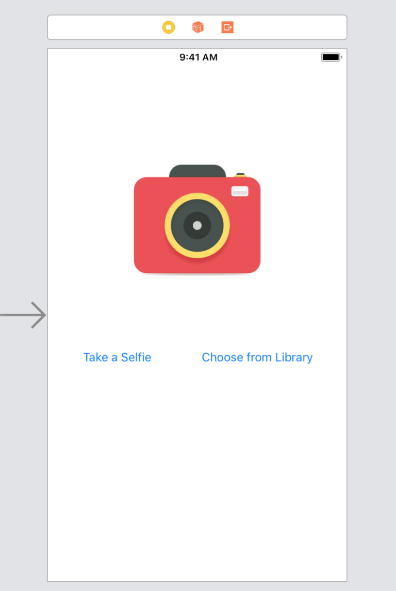
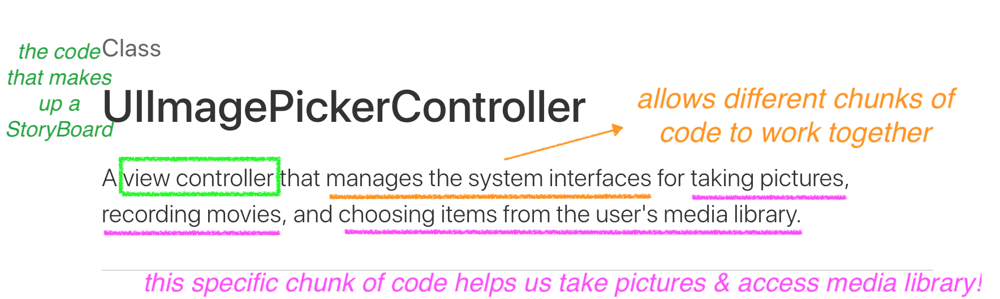
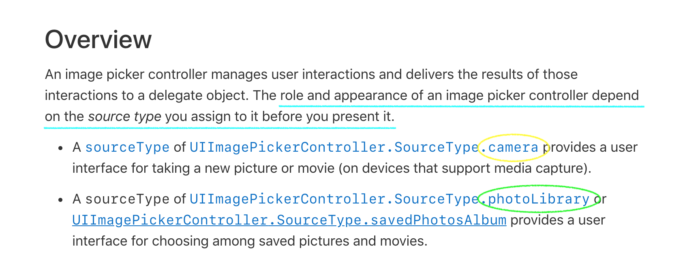
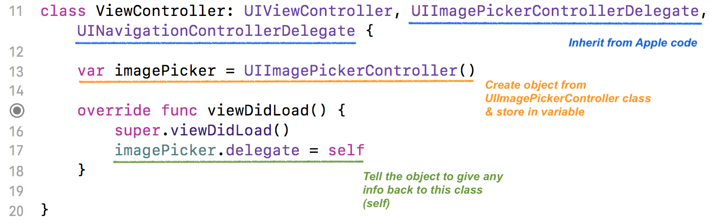
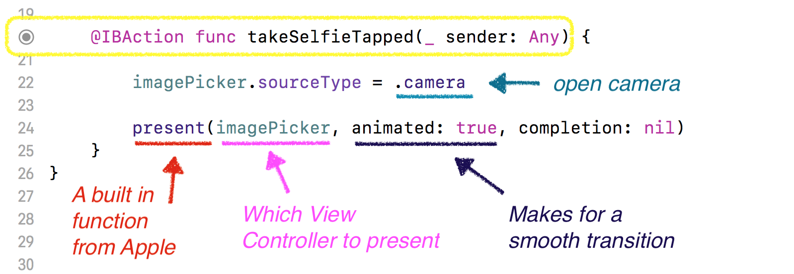
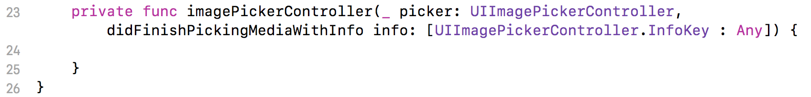
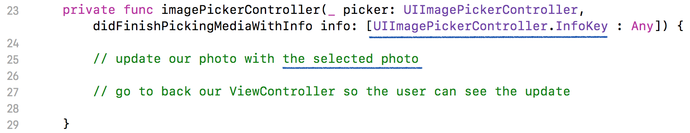
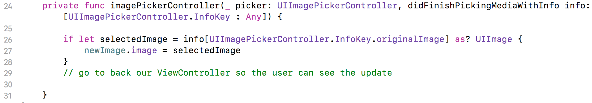
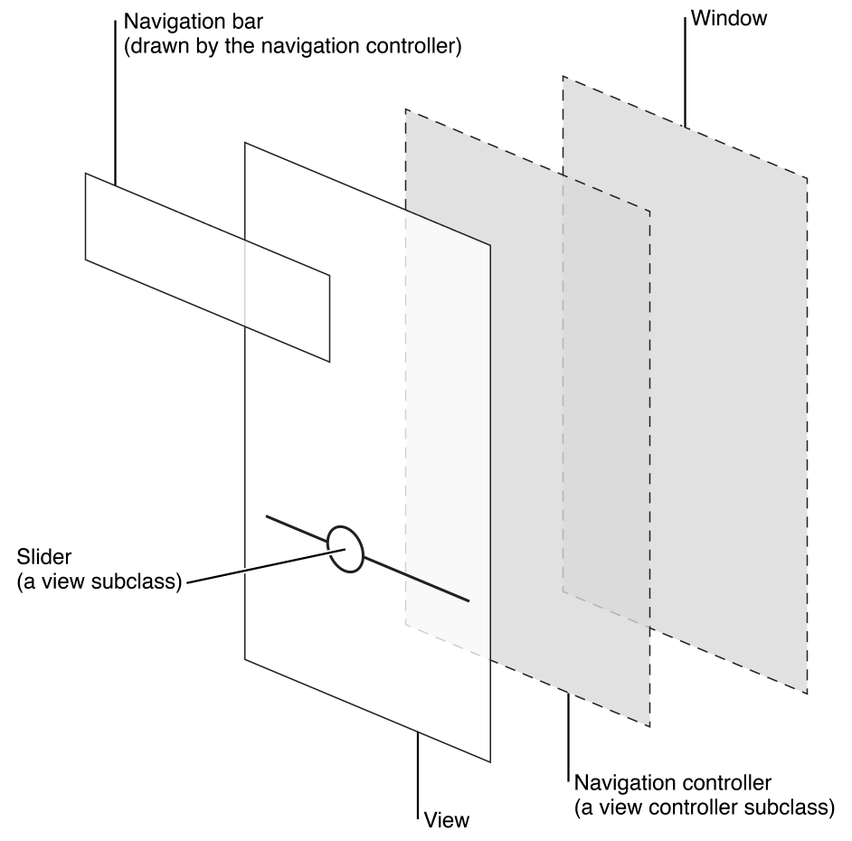

## Learning Goals

* Access a user's camera or photo library on an iOS device

## Technical Vocabulary


## Setup

If you plan to code-along for this lesson, you'll need a small project set up that looks similar to this:



It should have one `Image View` and two `button`s.

## Privacy

Have you ever had an app pause before you were able to use a certain feature and ask a question like this?


To access a user's data - whether it be from the microphone, camera, health info, etc., an app has to have the **permission** from a user. Apple designs the way these little boxes appear, provides us with the buttons, and handles them as necessary when tapped. But we have to go in and tell the app "Please get the users permission for XYZ" Today, we need to get the user's permission to access their camera and photo library.

<div class="try-it">
  <h2>Turn & Talk</h2>
  <p>What apps have you used that have asked for your permission to access your data?</p>
  <p class="to-do">EM: Could be a cool opportunity to connect with ethics in tech gear up a bit??? Like are you sure they always get your permission? how do you feel about that? Jusst some brain thoughts.</p>
</div>

### `Info.plist`

To tell the app that we want to ask for permission for the camera, we need to find the `Info.plist` file within our project on the Navigation Pane.


Click on the top row - `Information Property List`, click the small plus sign, and it will create a new row. Under Key, select `Privacy - Camera Usage ...`, then under Value, type in a short message explaining how the camera will be used.

Once you set this up in your project, it is set up forever and you should never need to some back to this page (unless you have other permissions to tell the app about!)

## UIImagePickerController

<div class="try-it">
  <h2>Google Research</h2>
  <p>Use your Google skills to find the Apple documentation for UIImagePickerController. Read through the overview:</p>
  <ul>
    <li>What is it?</li>
    <li>What does it help us with?</li>
  </ul>
</div>

Let's break the <a href="https://developer.apple.com/documentation/uikit/uiimagepickercontroller?changes=_8">documentation</a> down:



When we see this `view controller` - this tells us this a view controller, or the code behind a storyboard, in which Apple has already written all the code for. It's a 'freebie'!
`Manages the system interface` - interface is referring to anytime more than one program works together. We know that a program is just code, so this means that different pieces of code are coming together to make this view controller. `... for taking pictures, etc.` tells us what use this view controller has. The name `ImagePicker` should provide a hint, but reading the documentation carefully to make sure we are working with what we really want to work with is important.



Now we get a little more info: we get these code snippets that tell us what code we will need to write to use (interface with) the code apple gives us. This also shows how to specifically access the `camera` vs. the `photoLibrary`!

## Access the Camera - Setup

We need to do a little set up. Our class needs to `inherit`, or take in the information that two apple classes have - UIImagePickerControllerDelegate and UINavigationControllerDelegate.
We already know about UIImagePickerController. The Delegate added on tells the program, whenever I get information from the camera, this delegate class is the place I will send that information back to (information being the photo selected/taken). The UINavigationControllerDelegate is what allows us to navigate from our screen to the camera screen. Behind the scenes, it's a `seque`, just written with code rather than the segue's we've seen with the arrows on the storyboard.
> Step 1. Inherit from UIImagePickerControllerDelegate and UINavigationControllerDelegate (line 11/12)

Then, we need to create a property (variable) in this class. The value of it will store an object created from `UIImagePickerController`
> Step 2. Create an object from UIImagePickerController class, stored in variable (line 13)

Last, in the `viewDidLoad` function, which runs each time the view loads, we need to tell the `imagePicker`, or object from `UIImagePickerController` that it needs to send, or delegate, information back to this class (self).
> Step 3. Tell that instance to give it's information to this class (line 17)

<br>


## Access the Camera - Button Tap

Now, we need to establish an action and write some code so that when the `Take Selfie` and `Choose From Library` buttons are tapped, they take us to the camera and library, respectively.

Establish an action in the code.
> Step 1. Establish an action between the `Take Selfie` button and `ViewController.swift`

When we tap this button, our plan is that the camera will open up for our user to take a photo.
> Step 2. Tell the app to go into the camera (via sourceType)

> Step 3. Present the imagePicker!

The code will look like this:



On Line 22 in the screenshot above, we are giving the following directions: "go into the object from that `UIImagePickerController`, and select the `sourceType` of camera."

On line 24, we are giving the following directions: "stop showing whatever you are showing, and present (show) the view where the user can see their camera!" The `present` function is built in, and take three arguments:
1. What do you want me to show? In this case, `imagePicker`.
2. `animated`: Do you want a smooth animation? We will usually say yes here.
3. `completion`: Once this is complete, do you want me to do anything else? We will always say `nil` (meaning, no) here.

## Run on Device

Now is the moment of truth. Before you press play, make sure the device is plugged into the laptop and is selected as the device to run on.

Run the app. As a user, you should...

- See the permissions message
- Click `Take Selfie` and be taken into the camera
- Take a selfie
- Click select, or re-take and be able to re-take

**NOTE:** Occasionally, the permissions message doesn't appear (and it _only_ appears one time); if you don't see it, don't panic.

What happens once you select a picture?

<div class="try-it">
  <h2>Turn & Talk</h2>
  <p>What happens once you select a picture? Why?</p>
  <p>Look at the code - are we in any line of code, giving directions for the program to go back to our original page? Where do you think we might want to do this?</p>
</div>

We wrote code to access the camera when the `takeSelfieTapped` button was tapped, but we haven't provided the app with directions for what to do with the selected photo.

Before we move on to do that, make sure you can also access the Photo Library.

<div class="try-it">
  <h2>Turn & Talk</h2>
  <p>Establish an action between the "Choose from Library" button and the <code class="try-it-code">ViewController.swift</code> file.</p>
  <p>In that action/function, write code so that the user is taken to the Photo Library when they click the "Choose from Library" button. If you need a hint, scroll up to the <em>Overview</em> from the UIImagePickerController documentation that we annotated.</p>
</div>

## Displaying Photos

Like we've seen, we're able to access the camera and photo library. It's now time to write some code so that our user sees the photo they selected on that original screen!

### Create an Outlet

First, since that `Image` is an object that we want to _keep track of_, we need to create an outlet for it.

Now, we will use another built-in Swift function called `imagePickerController`. The cool thing about this function is that it will automatically run when the user selects a photo from the camera or library; we never have to call it.

We do however, need to write code inside of that function where we will need to provide the directions to display that photo that has been selected!



Pro-Tip: If you start typing `imagePickerController`, Xcode should auto-complete the whole setup of this function for you.

<div class="try-it">
  <h2>Turn & Talk</h2>
  <p>What do we want to tell the app to do at this point? If you're following along with code, write pseudocode comments. Otherwise, jot your thoughts down in a notebook.</p>
</div>

<p class="to-do"> put in teacher notes: We want to update that original photo on our main view controller with the photo that was selected by the user.
We want the user to be taken back to the screen where they can see their photo in that space from answer # 1.</p>

The two things that need to happen when this functions runs are:
1. Update our photo with the photo the user selected
2. Go to back our ViewController so the user can see the update

#### Update our photo with the photo the user selected



The blue annotations in the screen shot above point out how we will access the photo that was selected. The `imagePickerController` takes an argument, called `info`, which is a dictionary. That `info` dictionary holds the selected photo.

Check out the code below:



On line 26, we have an `if let` to unwrap the `UIImagePickerController.InfoKey.originalImage` value in the dictionary. That's really long, but what it's doing is accessing the photo the user selected.

On line 27, we are reassigning the `image` property on the `newImage` variable to the photo the user selected!

#### Go to back our ViewController

Our last step is to take the user back to our ViewController so they can actually see the updated photo!

What actually happened when the photo picker appeared, was that it slid in on top of our ViewController. So we need to slide it off, which will allow the user to see our ViewController again. You can think of it as layers, like this:



We need to `dismiss` the photo picker. Let's add the following to our action/function:

```swift
picker.dismiss(animated: true, completion: nil)
```

The `dismiss` function is another built-in function that Apple gives us. It takes an argument of `animated` and `completion`. Like we've done before, give `animated: true` and `completion: nil`. If you're wondering what animated does, try changing it to false and see what happens!

Now, let's run this is in the simulator or on a device - it should work!

<div class="practice">
  <h2>Practice: Accessing the Camera & Displaying Photos</h2>
  <p>Create a brand-new app that:</p>
  <ul>
    <li>Has 1 button (it can either access camera, library, or albums - you choose!)</li>
    <li>Has a placeholder image where you want the selected image to appear</li>
    <li>Will allow user to tap button, select an image, then see that image in place of placeholder</li>
  </ul>
</div>
