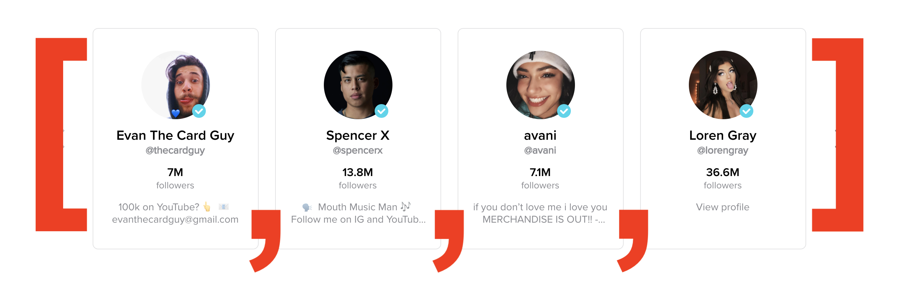
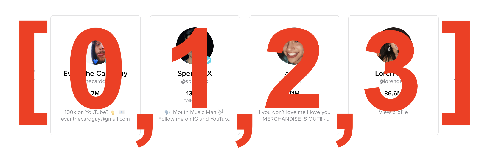
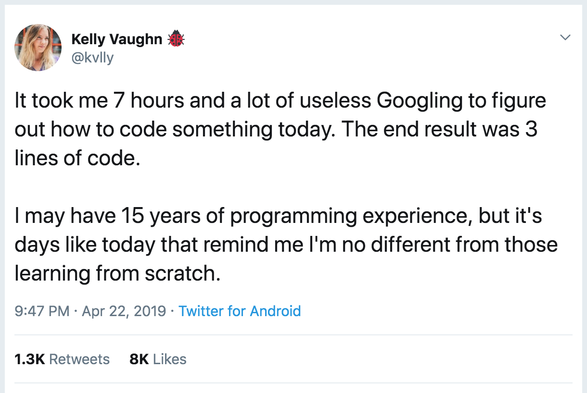

## Learning Goals

* Understand what an array is and why they are useful
* Create arrays and access data from them

## Technical Vocabulary

* Array
* Element
* Index
* Initialize

## Warm Up

In a Playground, declare a variable for every scholar in the room. The variable names should be something like `scholar1`, `scholar2`, etc. and the values should be strings of their first names.

## Collections

**Collections** are data types that hold _multiple things_ - think about your grandma’s cat statue collection - there is probably more than one, right?

In Swift, there are two types of collections: arrays and objects. In this lesson and during our time at camp, we will mainly focus on arrays.

## Arrays

An **array** is an ordered collection that stores multiple values. They are useful whenever you need to keep track of an ordered list of things. This is similar to how we keep track of lists in the real world. Think back to the Warm Up - if there are 15 or 20 scholars in the room, writing out a variable for each and every one can be time consuming. An array will allow us to store all scholar names in **one** variable!

An array can store any kind of element - from numbers to strings to ... other arrays. Usually, a single array holds a lot of items that are all of the _same type_.

<div class="try-it">
  <h2>Turn & Talk</h2>
  <p>Think about Instagram or TikTok - where might those applications use arrays?</p>
</div>

### Arrays IRL

It's very likely that every application you've used - on a phone or laptop - utilized arrays in the code that built it.

We can't see all the code that built every application, but there are some places where it's very clear that an array would be the best tool to use. Here are some examples from popular sites:

- [Instagram](https://www.instagram.com/alfie_the_alpaca_in_adelaide/) uses arrays to hold all the posts for a given user. Alfie the Alpaca has over 700 posts, so the array is over 700 elements long!
- [Twitch](https://www.twitch.tv/) has an array of recommended channels. They advertise these channels in the top left corner of their landing page.
- [TikTok](https://www.tiktok.com/discover?lang=en) has an array of trending creators stored in their program. TikTok shows the information of first four creators on the "Discover" page. When a user clicks the arrow to see more, TikTok shows the information of the second four trending creators, etc.


## Initializing Arrays

Now that we know a bit about arrays, we want to talk about how to create them. We can **initialize** them in 1 of 2 ways:

- Empty
- With data

### Creating an Empty Array

The code below shows the syntax to **initialize**, or create, an empty array. In the data types lesson, we talked about creating a variable before you know the value, and if you want to do that, you need to tell Swift what data type that variable will hold. We are using the same concept here:

```swift
var trending = [String]()

var followers = [Int]()
```

The examples above create empty arrays which can in the future hold strings and integers respectively.

If you've worked in other languages, you may have noticed that it's possible to hold different data types in an array. Swift has very strict rules, and doesn't allow this. The thinking behind this is - if we have a list of things that go together, they should be the same data type. Maybe this is a list of names (strings) or grades that one student got (integers).

### Creating an Array with Data

Instead of declaring an empty array, we can also declare an array that starts with data, like this:

```swift
// An array of strings:
var trending = ["@thecardguy", "@spencerx", "@avani", "@lorengray"]

// An array of numbers:
var followers = [7, 13.8, 7.1, 36.6]
```

We can think of each user as an element in an array:



This array is stored in the variable `trending`, so anytime we call this variable, we will get back this whole list!

```swift
trending
//-> ["@thecardguy", "@spencerx", "@avani", "@lorengray"]
```

Side note: The lines starting with `//->` indicate the return value of the previous code; it's just a way to notate what happens after writing some code.

<div class="try-it">
  <h2>Turn and Talk</h2>
  <p>With your partner, explain the following:</p>
  <ul>
    <li>What is an array?</li>
    <li>Why are they useful?</li>
    <li>How do you initialize an array?</li>
  </ul>
</div>

### Accessing Information

Each element in an array is automatically assigned a number called an **index**. This index can be used to access a specific element inside the array. Indices begin at 0 and count up. If we look back at our `trending` array, the following would be true:

```js
var trending = ["@thecardguy", "@spencerx", "@avani", "@lorengray"]
```
- "@thecardguy" has an index of 0
- "@spencerx" has an index of 1
- "@avani" has an index of 2
- "@lorengray" has an index of 3

By using the square brackets, we can use the index to access a specific value in an array.

Thinking back to the visual representation of our array, here's the index of each element:



```swift
var trending = ["@thecardguy", "@spencerx", "@avani", "@lorengray"]

trending[0]
//=> "@thecardguy"

trending[2]
//=> "@avani"
```

We can also check how many elements are in an array with the `.count` property to get the number of elements in a specific array:

```js
var trending = ["@thecardguy", "@spencerx", "@avani", "@lorengray"]
trending.count
//=> 4
 ```

<div class="try-it">
  <h2>Try It: Creating Arrays</h2>
  <p>In a new Playground, create a variable that stores an array of at least 4 strings - you choose what the content is about. The variable name should describe the type of data those 4 strings hold.</p>
  <p>Write a series of <code class="try-it-code">print</code> statements: print out the first element, the last element, and then the second element.</p>
</div>

### Updating Information

We can also update elements with the square bracket syntax we looked at earlier. We access the index value that we would like to change, and then reassign a new value for that index with a `=`.

```swift
var trending = ["@thecardguy", "@spencerx", "@avani", "@lorengray"]

trending[1] = "@cosette"

print(trending)
//=> ["@thecardguy", "@cosette", "@avani", "@lorengray"]
```

### Adding Information

A common way to add something to an already existing array is to use the `.append()` method - which will add an element to the end of the array.

```swift
var trending = ["@thecardguy", "@cosette", "@avani", "@lorengray"]
trending.append("@jamescharles")

print(trending)
//-> ["@thecardguy", "@cosette", "@avani", "@lorengray", "@jamescharles"]
```

In the code snippet above, `.append()` is called on the `trending` array. We give `.append()` an argument of the new element we want to be added on the array. In this case, it was the string of `@jamescharles`.

### Removing Information

A common way of removing elements is to use the remove(at:) method - which will remove an element at whatever index you type in after the `at:`.

```swift
var trending = ["@thecardguy", "@cosette", "@avani", "@lorengray", "@jamescharles"]
trending.remove(at: 0)

//-> ["@cosette", "@avani", "@lorengray", "@jamescharles"]
```
`.remove()` was called on the `trending` array, and we passed `0` as an argument, indicating that the element in the 0 index position should be removed.
<br>

<div class="try-it">
  <h2>Try It: Modifying Arrays</h2>
  <p>For this, you will use the array you wrote in the previous Try It.</p>
  <p>Practice accessing specific elements. Make sure to <code class="try-it-code">print</code> to verify you are accessing what you think you are.</p>
  <p>Now, add two new elements into your array. Use a <code class="try-it-code">print</code> statement to make sure they have been added.</p>
  <p>Lastly, remove at least two elements from your array. Again, make sure they have been successfully removed by printing to the console.</p>
</div>

### Random Elements

Sometimes, we want to pull an element out of an array at random - have any of your teachers ever used popsicle sticks to decide who to call on? That's a real life example. We can do the same thing with programming!

Swift gives us a tool called `Int.random()` which will help us do that!

Let's work on generating a random number between 1 and 20.

First, generate a random Integer:

```swift
var randomInt = Int.random(in: 1..<20)
//=> 7 (this number will vary)

var anotherRandomInt = Int.random(in: 1..<20)
//=> 19 (this number will vary)
```

In the code snippet above, `Int.random()` was given two pieces of information: `1..<20`. This defines the range within we want a random number selected. When `1..<20` is used, a number starting at 1 and less than 20 will be selected and stored in the variable.

Going back to `why would this be useful`? A teacher might have a program with an array of names, like this:

```swift
var students = ["Leta", "Ellen Mary", "Pam", "Megan", "Amy", "Sarah", "Robyn", "Courtney", "Rachel", "Allison", "Ruby", "Maile", "Julie", "Meg", "Christie", "Emmie", "Aurora", "Tori", "Juliana", "Kerry"]
```

Now, the teacher can write a `pickStudent` function:

```swift
func pickStudent() -> String {
  var random = Int.random(in: 1..<20)
  var student = students[random] // note about how this work below!
  return student
}

var randomStudent = pickStudent()
print(randomStudent)
//=> one random element from the array will print out
```

Instead of calling `students[0]` or `students[7]`, we called `students[random]`. Since we know that `random` is a variable that stores an Integer, the Integer it stores is substituted in for the variable name `random`, then the array looks for the element in that index.

<div class="try-it">
  <h2>Turn & Talk</h2>
  <p>Considering this section on selecting random elements from an array, answer the following questions with your partner:</p>
  <ul>
    <li>What does <code class="try-it-code">Int.random()</code> do?</li>
    <li>Why do we have to pass an argument, or put information inside the parenthesis for <code class="try-it-code">Int.random()</code>?</li>
    <li>How would you generate a number between 1 and 100? 300 and 350?</li>
    <li>Is it possible for the <code class="try-it-code">pickStudent</code> function to ever return the same number? Why or why not?</li>
  </ul>
</div>

## Putting It All Together

Arrays are a type of collection that developers use on a daily basis. It's important to have an understanding of their job and the ability to create and identify them. However, keep in mind that even professional developers can't remember it all and have to use their resources!



<div class="practice">
  <h2>Practice: Arrays</h2>
  <p>Declare a variable called <code class="try-it-code">hobbies</code> that stores an array of your top five favorite accounts to follow on social media, in strings.</p>
  <ul>
    <li>Change the value of at least one of the elements in the array</li>
    <li>Add a new account to the array</li>
    <li>Remove the last account from the array</li>
    <li>Print the value of the third element of the array</li>
    <li>Change the value of another element in the array</li>
    <li>Add another account to the array</li>
    <li>Print the value of the first element of the array</li>
    <li>Print one account to the console, at random.</li>
  </ul>
  <p><strong>Spicy Challenge:</strong> Write a function that takes in one argument, a string. If the string is "happy", output a randomly generated sentence about being happy. If the string is "ok", output a randomly generated sentence about being ok. If the string is "sad", output a randomly generated sentence to cheer someone up. <em>You will need to use a function, conditional, multiple arrays, and have to generate a random number.</em></p>
  <p><strong>Extension:</strong> There are several ways to add, remove, and modify values in an array. There is also a variety of other ways to iterate over arrays. Using Google and the Swift documentation, find a <em>different</em> way to do each of the following:</p>
  <ul>
    <li>add an element</li>
    <li>remove an element</li>
    <li>modify an element</li>
  </ul>
</div>

<!--
## Iterating Over Elements in an Array

When you need to perform an operation on all of an array's elements, you can **iterate** over the array.  The most common way to do this is to use a `for-in` loop. Looking back at our shopping list from earlier, we can use a `for-in` loop to print every value in the array.

Here is an example of the syntax:

```swift
var friendsOfKarlie = ["Michelle Obama", "Serena Williams", "T Swift", "Jimmy Fallon"]

for friend in friendsOfKarlie {
  print("👋 Hello \(friend)!")
}

//-> "👋 Hello Michelle Obama!"
//-> "👋 Hello Serena Williams!"
//-> "👋 Hello T Swift!"
//-> "👋 Hello Jimmy Fallon!"

```

The benefit of this is it saves us time. When we want do to the same thing for lots of items, we only have to write that command _once_. If we didn't use an array and use this `for-in` loop, our code would look like this:

```swift
print("👋 Hello \(friendsOfKarlie[0])")
print("👋 Hello \(friendsOfKarlie[1])")
print("👋 Hello \(friendsOfKarlie[2])")
print("👋 Hello \(friendsOfKarlie[3])")
```

Right now, this doesn't seem so bad. What if we had 100 friends? 1000? That's a lot of lines of code to write and a lot of places we would need to update it every time we added or removed someone.

<div class="try-it">
  <h2>Ink - Pair - Share: Arrays IRL</h2>
  <p>Think about Instagram or Facebook - where might those applications use arrays?</p>
  <p>Write a list, then compare notes with your partner.</p>
</div> -->
