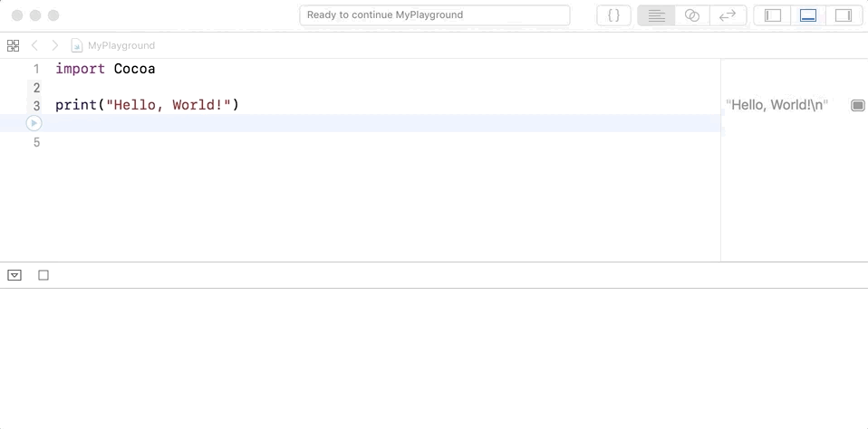

## Learning Goals

* Students will be able to differentiate strings, integers, floats and doubles
* Students will be able to create and modify variables
* Students will be able to use string interpolation to write a sentence using variables

## Technical Vocabulary

* String
* Integer
* Double
* Interpolation
* Variable
* Constant
* Keyword

**Note:** For all practice today, scholars will be working in Xcode Playgrounds.

## Strings

* A string is a series of characters
* This includes letters, numbers, and symbols. We are able to tell when something is a string because it's in between two quotation marks
* For example, `"Hello, world."` is a string. `"Puppies"` is also a string. And so is `"1234"`

## Variables

We use **variables** to store information that we're going to use in our programs. Why? They're kind of a shortcut. Let's say we were working with our address and it's a string, "1313 Mockingbird Lane". It would be annoying to have to type that in every time we wanted to use it.

The code below is telling the computer, "Please create a variable called address, and store in it the string, "1313 Mockingbird Lane". Every time I need to use my address, I only have to type the word `address`!

```swift
var address = "1313 Mockingbird Lane"
```

We use the `var` keyword here to tell the computer that in this following bit of code, we are going to declare a variable. We have to declare variables before we use them.

**Keywords** are special, reserved words in the language. Every programming language has them. We can't use them for any other purpose (variable or function or class name), only if it's in a string. Xcode is helpful because it shows all keywords in pink. If you tried to write this without the keyword `var` Xcode will throw an error!

After we declare a variable, we can change the contents of the variable at will. If we were to move from 1313 Mockingbird Lane to 254 Ocean Avenue, we would do this:

```swift
address = "254 Ocean Avenue"
```
Notice we did NOT use the keyword `var` this time - that's because we RE-assigned the variable

## Constants

If we want to store information that we know will NEVER change, use the `let` keyword to declare a **constant**.

```swift
let name = "Karlie"
```

We can still access the string "Karlie" anytime, we just **cannot change it**.

### A Note on Variables

In other languages you may have seen variables declared _without_ being assigned a value. To do that in Swift, we have to tell the program what data type it should be.

```swift
var name : String
```

Maybe I don't know the name yet, but I do know that it will be stored in a string. `var name` alone will NOT work.

## String Interpolation

* Interpolation allows us to put variables and strings together
* `"\(VARIABLE NAME HERE) any other words here"`
* I'd like to write a sentence that says "I am 15 years old", but using the age variable: `var age = 15`

The variable name should be written inside of `\( )`

```swift
var age = 15
"I am \(age) years old"
```

The computer reads anything inside of the `\()` as Swift code - it will look for a variable titled `age`.

<p>String values can be added together (or concatenated) with the addition operator (+) to create a new String value, can use interpolation with the <code>\()</code> syntax:</p>

```swift
let string1 = "hello"
let string2 = "there"
var welcome = "\(string1) \(string2)"
var anotherWelcome = string1 + " " string2
// welcome and anotherWelcome are both storing the string "hello there"
```

### A Note on Printing

To print values to the console, Swift gives us a handy `print()` function. Here's how it works:

```swift
print("Hello, World!")
```

We would write that line of code in the text editor (top) portion of Xcode Playgrounds, click the blue arrow on the left, then see the value printed in the console (bottom portion of the screen).



<div class="try-it">
  <h2>Try It: Strings</h2>

  <p>If you have the strings "Karlie" and "Kloss" in the following variables:</p>
  <code class="try-it-code">var first = "Karlie"</code><br>
  <code class="try-it-code">var last = "Kloss"</code><br>

  <p>Use <strong>only</strong> the "string interpolation" technique to complete the following:</p>
  <ol>
    <li>What code can you write to output the string <code class="try-it-code">"KarlieKloss"</code>?</li>
    <li>What code can you write to output the string <code class="try-it-code">"KlossKarlie"</code>?</li>
    <li>What code can you write to output the string <code class="try-it-code">"Karlie Kloss"</code>?</li>
    <li>What code can you write to output the string <code class="try-it-code">"Kloss Karlie Kloss Karlie"</code>?</li>
    <li>What code can you write to output the string <code class="try-it-code">"I love Karlie"</code>?</li>
  </ol>
</div>

## Numbers

We will use two kinds of numbers - Integers and Doubles. The math operations we use all the time can be used on both of these. Also, the Order of Operations applies to math in code!

### Integers

Integers are what we would think of as whole numbers. They can be positive or negative or zero. So, 1, 3, 4, -56 and 0 are all integers.

### Floats and Doubles

Swift gives you two data types with which to store numbers that have a decimals - Floats and Doubles. They can be positive or negative. Examples would be 1.1, 42.45, 3.14, -123786234.64

The TL;DR is that Doubles have more accuracy than Floats. If you ever need a decimal, **use a Double** because you'll get more accuracy that way.

### Good To Know

* Variables and constants can also stores numbers
* We can use math operations on:
  - an integer with another integer
  - a double with another double
* We CANNOT use math operations on a double and an integer. Why? They are technically different data types! Even though they all look like numbers to us - they are stored differently. To use math operations on an integer with a double, we would convert the integer into a double.

Example:

```swift
var integer = 4
var double = 5.0

integer * double --> ERROR
Double(integer) * double --> 20.0
```

<div class="try-it">
  <h2>Try It: Numbers</h2>
  <p>Start with these variables:</p>
  <code class="try-it-code">var a = 12</code><br>
  <code class="try-it-code">var b = 65</code><br>
  <code class="try-it-code">var c = 31</code><br>
  <code class="try-it-code">var d = 98</code>

  <ol>
    <li>Write code to find the average of these four numbers.</li>
    <li>Find the average yourself using paper or a calculator. Is your answer different than you found with Swift? Why?</li>
    <li>Say you have the operation <code class="try-it-code">a + b * c / d</code>. What result do you get out from Swift? What other outputs can you get out by adding one or more pairs of parentheses to the equation?</li>
  </ol>
</div>

## Swift Data Types

Let's take a few minutes to practice these fundamentals - we will use this knowledge every time we work on a project from here on out.

<div class="practice">
  <h2>Practice: Data Types</h2>

  <h3>Part 1: Variable or Constant?</h3>
  <p>For each item on the list, determine if it should be stored as a variable or constant. Be ready to explain your thinking.</p>

  <ul>
    <li>name</li>
    <li>address</li>
    <li>birthday</li>
    <li>gradeLevel</li>
    <li>age</li>
    <li>eyeColor</li>
    <li>favoriteColor</li>
  </ul>

  <h3>Part 2: How Much Do I Get Paid?</h3>
  <p>Find the answer to this problem <strong>using Swift</strong>:</p>
  <p>Karina earns $10.25 per hour at her job at Express. If she worked 20 hours last week, how much should she get paid?</p>

  <h3>Part 3: Happy Birthday</h3>
  <p>Let's sing Happy Birthday to our favorite celebrity. Their name should be stored in a variable, just in case you want to sing to someone else.</p>

  <h3>Extension: String Compression</h3>
  <p>There's a silly compression algorithm that outputs the first letter, the number of letters in the middle, and the last letter. So for the string <code>Klossy</code> it'd output <code>K4y</code> or <code>Scholar</code> would be <code>S5r</code>.</p>
  <p>Can you write code to implement that?</p>
</div>
