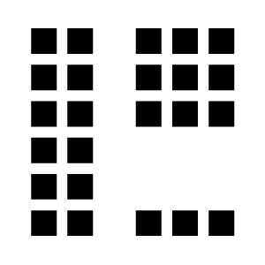
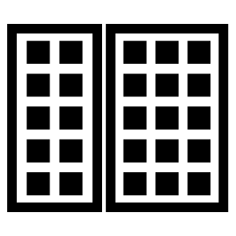
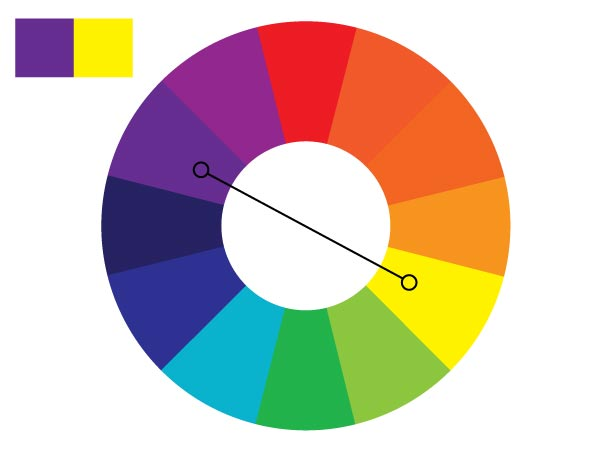
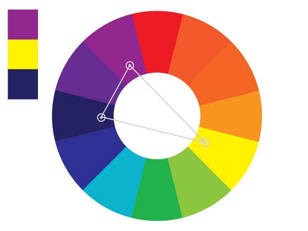
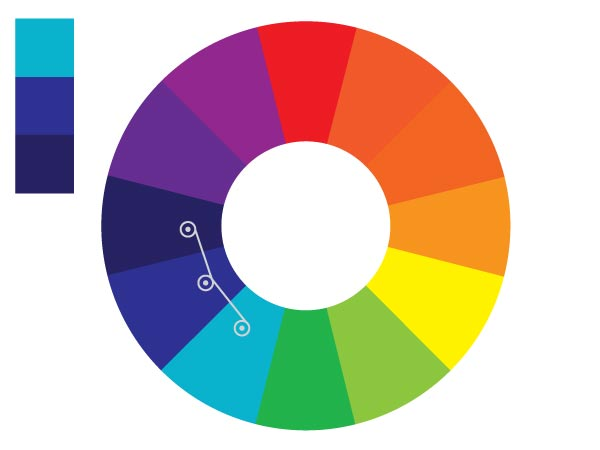
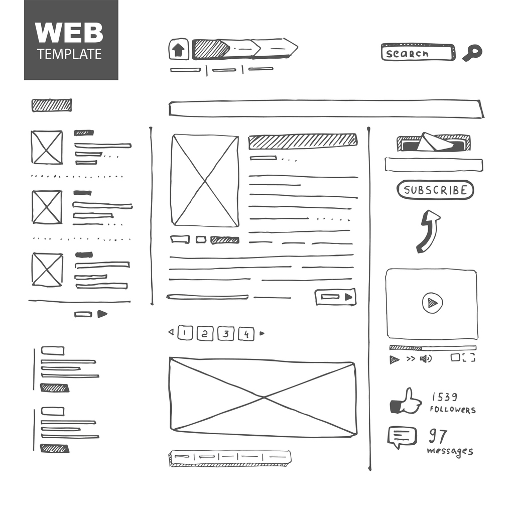
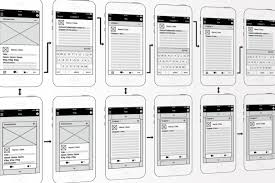

## Learning Goals

* Identify design principals in applications
* Identify color choice in applications and create palettes with appropriate contrast
* Create wireframes taking design principals into consideration

## Technical Vocabulary

- Proximity
- Enclosure
- Similarity
- User Experience
- Complementary Colors
- Split Complementary Colors
- Analogous Colors
- Wireframes

## Design Principals

Gestalt Psychology is a concept used to describe how we perceive the world around us as complete units and patterns vs. a series of unrelated parts. "Gestalt" means "shape" or "form". Humans are hard-wired to see patterns and apply structures to quickly understand their surroundings.

The Gestalt psychologists developed 7 laws, or principals, to explain the way smaller objects are organized and grouped to form larger, complete objects. These principals can be thought of as mental shortcuts for visual problem solving. Today, we will look at 3 of them.

### Law of Proximity

Elements next to each other tend to be grouped together. Even though this is made up of unrelated elements, we see a column on the left, a square to the upper right, and a short row on the lower right

### Law of Enclosure

Items that are enclosed in a border or with a background color tend to be grouped together. A figure will be perceived as separate from it's background. A border provides a separation.

### Law of Similarity

Elements that look similar will be perceived as part of the same form. Despite the similar scale and distribution of shapes, we see columns of squares and circles

  <h2>Try It: Laws of Design</h2>
  
Go to a few of your favorite websites. Find an example of each of the three laws we just learned about. Be ready to share out!

## Color

> "Color is a powerful form of communication. We are so attracted to color and so repelled by it that even if the coolest design were presented to us, if we didn't like the color, we wouldn't like it at all." - Joanne Chang, from Hack Design's "Building Color Confidence"

Whether or not we consciously realize it, colors carry meaning. The exact meaning can be subjective but can be swayed by other design choices and context, but it is often heavily influenced by the culture someone grew up in. Therefore, it is important to be aware that colors can have very different connotations and associations based on different cultural traditions, countries, and religious beliefs. Take white, for example. White often symbolizes purity, fulfillment, and brightness. However, in some cultures it is more closely associated with death, is often used as a color of mourning, and is frequently used in funerals. One color, two vastly different meanings.

### Emotions

There are three groupings that colors fall into: warm, cool, and neutral. The colors inside of these groups tend to share similar meanings: warm colors are generally positive and energetic, cool colors are calmer and relaxing, and neutral colors are more conservative.

### Contrast

Contrast is the difference between two colors. You usually want a high contrast might be alarming or unsettling. Black and white create the highest contrast possible. Usually, when you think you see black/white combinations on pages, it's a very light grey and/or very dark grey.

It's important to provide a contrast for your page to be pleasant, but it's essential that you do so for users who may be colorblind or have limited vision. This is an <a href="https://colorable.jxnblk.com/b25e06/213338">awesome tool</a> that allows you to enter two color and get an analysis on if the contrast is acceptable.

### Combinations

There are many ways we can choose to select colors. One common color pairing is **Complementary Colors**, or opposite on the color wheel:

These are two colors that sit directly across from each other on the color wheel. They complement each other and often have the most contrast, but that doesn't always mean they make for the nicest pairings.

An alternative:

**Split Complimentary Colors** start with one color and then instead of going straight across the color wheel to the complimentary color, go to either the left of right a couple of colors. This softens the contrast and often gives a nicer, more visually appealing pairing.

Another common combination:

**Analogous Colors** are group of colors that are close to each other on the color wheel. They have enough contrast to be clearly distinguishable from one another, but because they are very similar they form a harmonious group.

  <h2>Try It: Colors</h2>
  
Visit a few of the award-winning websites below. Try to identify what type of color combinations make these site clean and appealing.

  <ul>
    <li><a href="https://builtbybuffalo.com/">Built By Buffalo</a></li>
    <li><a href="https://www.miukimiu.com/">Miuki Miu</a></li>
    <li><a href="http://adayinbigdata.com/">A Day In Big Data</a></li>
    <li><a href="https://www.teachersguild.org/">Teachers Guild</a></li>
  </ul>
  

It's important to note that front-end developers do not need to be design experts. If selecting colors "isn't your thing" - that's ok! There are some awesome tools out there like <a href="http://colormind.io/">Color Mind</a>, <a href="https://www.canva.com/colors/color-palette-generator/">Canva</a> and <a href="https://colorhunt.co/">Color Hunt</a> that can help you make a great choice.

## Wireframing

The best apps and websites require an incredible amount of planning and thought. Designers spend hours and hours building out a user experience, color palettes, and more. A great idea can be built into an app, but with poor design - it might go nowhere.

One part of that planning process is making wireframes. The wireframe is a visual guide of the content and functionality on a page, taking into account the user experience. It should be treated as a roadmap - it's completely planned before starting a trip, it is referenced throughout the trip, and at the end, the final destination should look a lot like where the map was supposed to take you.

Here are some examples of wireframes other people have drawn up before starting to build their app:

Things to consider as you wireframe:
- If the site is responsive, what will it look like on each device size?
- If the user moves between pages, how will they navigate? What will that flow be like?
- What Design Principals are being utilized so the page is clear and understandable?
- Get user feedback. Ask someone who wasn't involved in the design process for their opinion.

  <h2>Practice: Design & UX</h2>
  
You've been contracted to design an app for a dog-walking business. Select a color palette, and draw out a wireframe, keeping in mind the Design Principals  we've learned about!

  
Be ready to share your design and thinking behind it.

