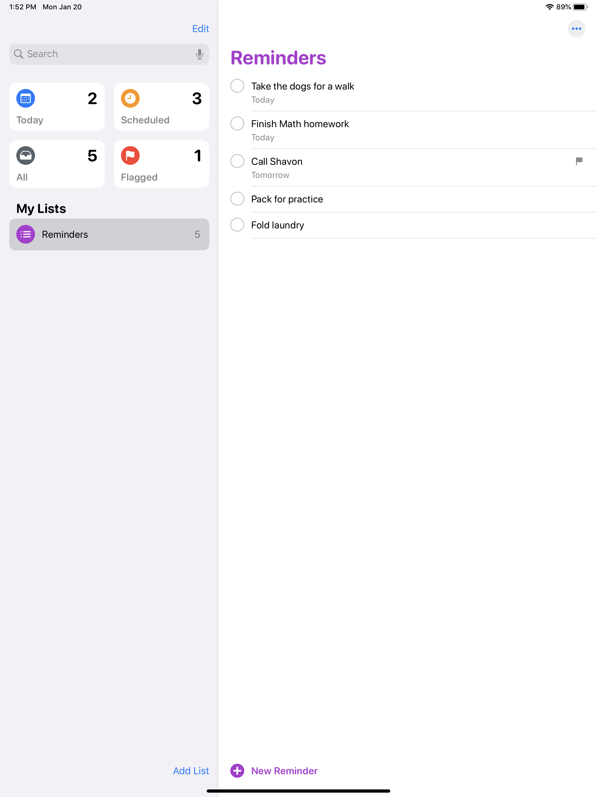
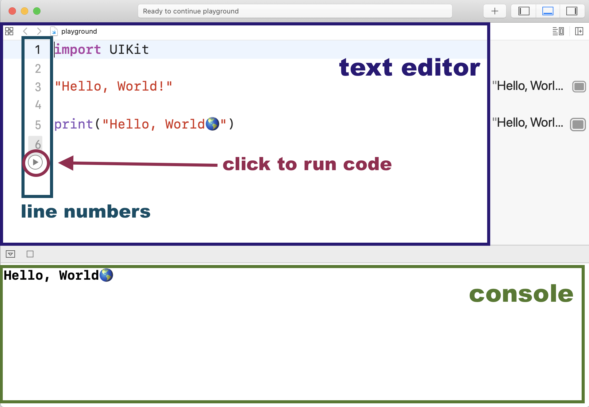
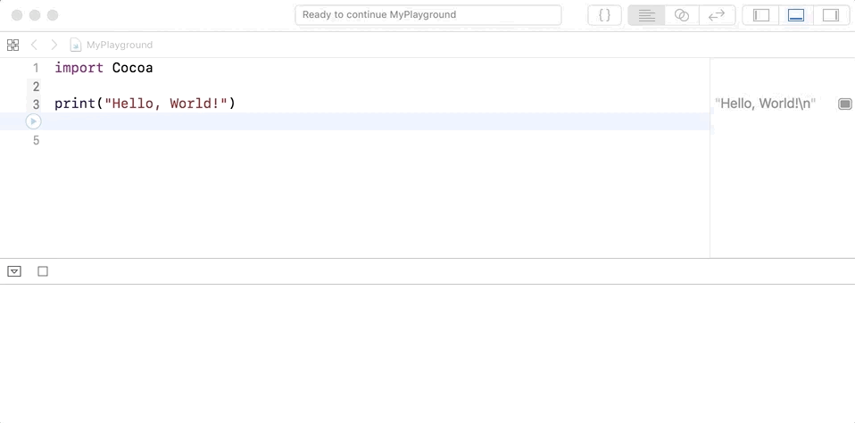

## Learning Goals

* Differentiate strings, integers, and doubles
* Create and modify variables
* Use string interpolation to write a sentence using variables

## Technical Vocabulary

* Constant
* Double
* Integer
* Interpolation
* Keyword
* String
* Variable

**Note:** For all practice today, scholars will be working in Xcode Playgrounds.

## Warm Up

Create a list of items you need to complete on the Reminders App on your iPad. This can be a list for today, the week, or the whole summer! Explore the `Today`, `Scheduled`, and `Flagged` features as well.



## What is Swift?

Swift is a programming language developed by Apple, specifically for writing applications to be used on iOS devices. It is responsible for allowing an app to respond to user interaction.

<div class="try-it">
  <h2>Turn & Talk</h2>
  <p>Think back to Reminders App that you explored in the Warm Up, and feel free to reference it while answering these questions.</p>
  <ul>
    <li><strong>When</strong> do things change on the screen?</li>
    <li>As a user, are the changes that happen predictable? Why or why not?</li>
    <li>Does more than one thing ever happen at a time?</li>
  </ul>
</div>

Takeaways:
- Some of the behaviors of the app: creates a list and as many items in the list as we want, flags specific list items as important or with a specific due date
- Behaviors all happen _after_ the user has interacted - tapping the empty area to open up keyboard, swiping a list item left to get the option to flag or delete, etc.
- Some actions result in more than one outcome - when a list item is deleted, it is removed and the number next to `All` decreases by one
- All of the behaviors on this app were built by someone who wrote code in the Swift language!

## Strings

You can think of strings as a series of characters (alpha, numeric, spaces, and special characters) between two double quote marks, like so:

```swift
"Hello, World!"
```

In Swift, we **must** use double quotes around any characters that we want included in the string.

In order to experiment with things, we'll open a Swift Playground. A playground is a term that developers use for a place where we can write code just to learn or experiment. The code we write today won't directly contribute towards building an app, but it will help us build an understanding of the foundations.



<div class="try-it">
  <h2>Try It: Strings</h2>
  <p>In your Playground, type <code class="try-it-code">"your first name"</code>. Instead of the words "your first name", type your actual name. You <strong>do</strong> need to include the quotes.</p>
  <p>Type <code class="try-it-code">"your age"</code>.</p>
  <p>Type <code class="try-it-code">"your full name"</code>.</p>
  <p>Type anything you want - try to use some characters from your keyboard that are not numbers or letters. Make sure your text is enclosed in double quotes.</p>
  <p>Run the code. If there are any errors in the code you wrote, that line will be highlighted in a light red color, and an error message will appear. Read it and try to understand what the problem is. If you can't resolve it, as another scholar or instructor!</p>
</div>

Takeaways:

- Strings can hold any type of character, including spaces
- The way we type a string will be the exact way a computer sees is (it won’t assume we meant to capitalize that first letter, catch if we misspell something, etc.)

### Printing

To print values to the console, Swift gives us a handy `print()` command. Here's how it works:

```swift
print("Hello, World!")
```

We would write that line of code in the text editor (top) portion of Xcode Playground, click the blue arrow on the left, then see the value printed in the console (bottom portion of the screen).



## Variables

In most programming languages, including Swift, values can be saved to variables. Unlike in math class, where we would use x or y and a number, variables in programming are much more flexible. Below are three variables that were used for the Reminders App:

```swift
var listName = "Reminders"
var totalReminders = "five"
var reminder = "Take the dogs for a walk"
```

To define a variable, we use the `var` keyword followed by a name we choose for the variable. Notice that all of the variables start with a lowercase letter. If you are choosing a variable name that has two words, uppercase the first letter of the second word. This is called `camelCase`.

After naming the variable, we use the `=` sign to show what value the variable will hold.

We can now print any of these variables we have defined out to the console. The example below defines three variables, but only one will be logged to the console.

```swift
var listName = "Reminders"
var totalReminders = "five"
var reminder = "Take the dogs for a walk"

print(listName)
```

<div class="try-it">
  <h2>Try It: Strings and Variables</h2>
  <p>Complete the following in the same Playground. You should type your code in the Swift editor of the Playground, and see the results in the console below.</p>
  <p>Declare a variable for each prompt below. Then, print it out to the console.</p>
  <ul>
    <li>A variable called <code class="try-it-code">favoriteColor</code> that holds your favorite color</li>
    <li>A variable called <code class="try-it-code">pet</code> that holds the name of a pet</li>
    <li>A variable called <code class="try-it-code">friend</code> that holds the name of a friend</li>
    <li>A variable called <code class="try-it-code">goal</code> that holds one of your 2020 goals. <em>Remember, you <strong>can</strong> include spaces in a string!</em></li>
    <li>A variable called <code class="try-it-code">hobby</code> that holds one of your hobbies</li>
  </ul>
</div>

**Keywords** are special, reserved words in the language. Every programming language has them. Xcode is helpful because it shows all keywords in pink.

### Re-assigning Variables

Sometimes, things in life change! We might change our names, move cities, our ages will almost definitely change, etc. In the Reminders App, users have the option to change the name of a list.

Swift gives us the ability to re-assign a variable so that its value can change. Here is the syntax:

```swift
var listName = "Reminders"

listName = "Monday To-Dos"
print(listName)
//=> Monday To-Dos
```

Notice that when we **re-assign** a variable, we do not use the keyword `var`.

## Constants

If we want to store information that we know will NEVER change, use the `let` keyword to declare a **constant**.

```swift
let name = "Karlie"
```

We can still access the string "Karlie" anytime, we just **cannot re-assign it**.

<div class="try-it">
  <h2>Tun & Talk: Uses for Constants</h2>
  <p>With your partner, come up with 3-4 real life uses for a constant, a piece of data that will never change.</p>
  <p>Are there any places where a constant would be appropriate for the Reminders App?</p>
</div>

## Declaring Variables with No Value

In other languages you may have seen variables declared _without_ being assigned a value. To do that in Swift, we have to tell the program what data type it should be.

```swift
var name : String
var lastNumber : Int
```

Maybe I don't know the name or last number yet, but Swift requires that I declare which type of data will later be stored in it. `var name` alone will NOT work.

Once I do have the data I'd like to store, I can re-assign the variable like this:

```swift
var name : String
var lastNumber : Int

name = "Karlie"
lastNumber = 78
```

## String Interpolation

We can also include variable data in a sentence. This is called interpolation:

```swift
var listName = "Reminders"
var totalReminders = "five"

print("There are \(totalReminders) items on the \(listName) list.")
//=> There are five items on the Reminders list.
```

The computer reads anything inside of the `\( )` as Swift code. In the code snippet above, the string `"There are "` was printed, then the program saw `\( ` and read `totalReminders` as a variable. Instead of printing out the word `totalReminders`, it substituted the value that is stored in it, in it's place. Once the program read the closing `)`, it printed out `" items on the "`, then continued with the same process for the second variable.

<div class="try-it">
  <h2>Try It: Strings</h2>
  <p>Declare the following variables in your Playground:</p>
  <code class="try-it-code">var first = "Karlie"</code><br>
  <code class="try-it-code">var last = "Kloss"</code><br>
  <p>Use string interpolation to complete the following:</p>
  <ol>
    <li>Output the string <code class="try-it-code">"KarlieKloss"</code>.</li>
    <li>Output the string <code class="try-it-code">"KlossKarlie"</code>.</li>
    <li>Output the string <code class="try-it-code">"Karlie Kloss"</code>.</li>
    <li>Output the string <code class="try-it-code">"Kloss Karlie Kloss Karlie"</code>.</li>
    <li>Output the string <code class="try-it-code">"I love Karlie"</code>.</li>
  </ol>
</div>

## Numbers

We will use two kinds of numbers - Integers and Doubles. The math operations we use all the time can be used on both of these. Also, the Order of Operations applies to math in code!

### Integers

Like we saw with strings above, we can also store Integers in variables.

```swift
var totalReminders = 5
var today = 2
var scheduled = 3
var flagged = 1
```

We can also reassign variables that store numbers. In the Reminders App, this is how the program keeps track of the total number of reminders on a given list.

```swift
var totalReminders = 0

// The line below re-assigns points to its previous value (0) plus 1.
totalReminders = totalReminders + 1
// => 1

// The line below re-assigns points to its previous value (1) plus 1.
// It is a shortcut that does the exact thing as the example above!
totalReminders += 1
// => 2
```

<div class="try-it">
  <h2>Turn & Talk: Incrementing Numbers</h2>
  <p>Incrementing numbers like what we just looked at above is something developers do very frequently.</p>
  <p>With your partner, brainstorm some examples of numbers incrementing or decrementing in real apps that you use.</p>
</div>

Takeaways:
- On a users birthday, an app should increment their age
- Social media apps uses incrementing to keep track of the number of likes, replies, followers, etc.
- Apps that involve scheduling - calendar events, flights, live video classes, etc. usually have a countdown timer to keep the user informed on the amount of time until something will happen

### Integers in Action

Like we did with strings, we can **interpolate** with variables that hold numbers.

```swift
var listName = "Reminders"
var totalReminders = 5

totalReminders += 1

print("There are \(totalReminders) items on the \(listName) list.")
//=> There are 6 items on the Reminders list.
```

We can do math with numbers in Swift! The same math operators you are used to from math class work here.

```swift
3 + 5
//=> 8

12 / 2
//=> 6

18 - 8
//=> 10
```

We can also use parenthesis and the Order of Operation holds true here as well.

```swift
(3 + 2) * 8
// 5 * 8
//=> 40
```

We can also use math on variables, if those variables hold numbers.

```swift
var name = "Karlie"
var tinsOfKookies = 1200
var mealsDonatedPerTin = 10

var mealsDonated = tinsOfKookies * mealsDonatedPerTin;

print(mealsDonated);
//=> 12,000

print("Because \(tinsOfKookies) tins of kookies were purchased during Fashion's Night Out, \(mealsDonated) meals were donated to starving children all over the world. Thanks, \(name)!")
//=> "Because 1200 tins of kookies were purchased during Fashion's Night Out, 12,000 meals were donated to starving children all over the world. Thanks, Karlie!"
```

<div class="try-it">
  <h2>Try It: Integers & Operators</h2>
  <p>Start with these numbers:</p>
  <code class="try-it-code">var januaryAvg = 12</code><br>
  <code class="try-it-code">var marchAvg = 65</code><br>
  <code class="try-it-code">var novemberAvg = 31</code><br>
  <code class="try-it-code">var julyAvg = 98</code>
  <ol>
    <li>Write code to find the average of these four temperatures.</li>
    <li>Find the average yourself using paper or a calculator. Is your answer different than you found with Swift? Why might that be?</li>
    <li>Say you have the operation <code class="try-it-code">januaryAvg + marchAvg * novemberAvg / julyAvg</code>. What result do you get out from Swift? What other outputs can you get out by adding one or more pairs of parentheses to the expression?</li>
  </ol>
  <br>
  <p><strong>Medium Challenge:</strong> Find the answer to this problem using Swift: On average, there are 24 scholars at each Kode With Klossy camp this year. If there are 36 camps taking place, about how many scholars are attending in total? Print out to the console your answer in a complete sentence.</p>
</div>

### Doubles

In the Try It section above, Swift calculated the average of the four temperatures to be `51`, even though we can verify on a calculator that the more precise answer is `51.5`. This is because if we ask Swift to take an operation on two Integers, it will result in an Integer. From our example above, we can see that it rounded down.

What if we wanted a more precise answer? We would need to use a Double.

Swift gives you two data types with which to store numbers that have a decimals - Floats and Doubles. They can be positive or negative. Examples would be `1.1`, `42.45`, `3.14`, `-123786234.64`. There are some technical differences between the two, but for our purposes this summer, if you ever need a decimal **use a Double** because you'll get more accuracy that way.

```swift
var januaryAvg = 12
var marchAvg = 65
var novemberAvg = 31
var julyAvg = 98

var total = (januaryAvg + marchAvg + novemberAvg + julyAvg)

Double(total) / 4.0
=> 51.5
```

On the last line of code in the snippet above, we changes two key things:
1. We converted the total of the 4 temperatures into a double with the `Double(total)` syntax. That changed `206` to `206.0`. It seems like a small difference to us, but it is a big difference to Swift.
2. We divided by `4.0`, a Double, instead of `4`, an Integer. We did this for consistency.

We **cannot** use all math operations on a double and an integer. Why? They are technically different data types. Even though they all look like numbers to us - they are stored differently. To use most math operations on an Integer with a Double, we would convert the integer into a double.

Example:

```swift
var integer = 4
var double = 5.0

integer * double --> ERROR
Double(integer) * double --> 20.0
```

_NOTE: Some math operations will work with a mix (for example: 206.4 / 4), but since that doesn't work on most operations, it's standard to always use the same data type when performing any math operation._

## Swift Data Types

Let's take a few minutes to practice these fundamentals - we will use this knowledge every time we work on a project from here on out!

<div class="practice">
  <h2>Practice: Data Types</h2>
  <h3>Mild: Variables & Constants</h3>
  <p>For each item on the list below, determine if it should be stored as a variable or constant. Be ready to explain your thinking.</p>
  <ul>
    <li>name</li>
    <li>address</li>
    <li>cityBornIn</li>
    <li>gradeLevel</li>
    <li>birthday</li>
    <li>age</li>
    <li>eyeColor</li>
    <li>favoriteColor</li>
  </ul>
  <p>Now, declare variables or constants for each of the items listed above, and assign an appropriate value.</p>
  <p>Lastly, use string interpolation to write at least 3 different sentences about yourself, using at least one variable in each sentence.</p>

  <h3>Mild: Declaring with No Value</h3>
  <p>For each item on the list below, determine what data type would be appropriate.</p>
  <ul>
    <li>collegeAttended</li>
    <li>numberOfPlacesTraveled</li>
    <li>bestFriend</li>
    <li>numberOfCitiesLivedIn</li>
  </ul>
  <p>Now, declare variables or constants for each of the items listed above, but don't assign them a value yet.</p>

  <h3>Medium: How Much Do I Get Paid?</h3>
  <p>Find the answer to this problem <strong>using Swift</strong>:</p>
  <p>Karina earns $10.25 per hour at her job at Express. If she worked 20 hours last week, how much should she get paid? Print a complete sentence out with the total.</p>

  <h3>Spicy: String Compression</h3>
  <p>There's a silly compression algorithm that outputs the first letter, the number of letters in the middle, and the last letter. So for the string <code>Klossy</code> it'd output <code>K4y</code> or <code>scholar</code> would be <code>s5r</code>.</p>
  <p>Can you write code to implement that? <em>Hint: You'll probably need to use your research skills to find something that will help!</em></p>
</div>
