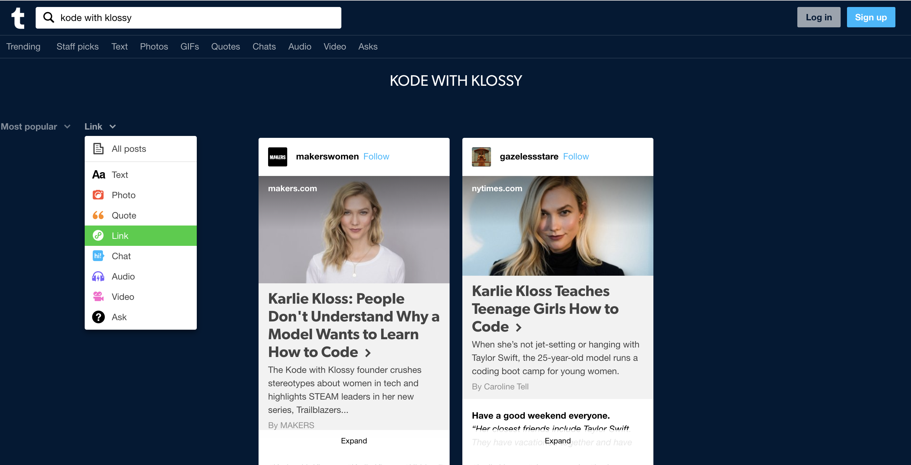

## Learning Goals

* Explain the concept of iteration
* Write a for-in loop to accomplish repetitive code
* Use for-in loops to iterate over arrays and dictionaries

## Technical Vocabulary

* Array
* Dictionary
* Element
* Index
* Iterate
* Loop

## Warm Up

Iteration (or looping for a specified number of times) is a process of repeating a task for each object in a collection. For each of the scenarios below, we’ll walk through using scenarios we are familiar with to demonstrate the concept.

These are examples that would be programmatically challenging because they would require several steps, but are things that we do everyday.

<table>
  <thead>
    <tr>
      <th>Scenario</th>
      <th>Collection</th>
      <th>For each...</th>
      <th>Do this:</th>
      <th>Then:</th>
    </tr>
  </thead>
  <tbody>
    <tr>
      <td>Grading papers</td>
      <td>papers</td>
      <td>paper</td>
      <td>
        <ol>
          <li>read through it</li>
          <li>mark the score on the top</li>
          <li>record score in gradebook</li>
        </ol>
      </td>
      <td>repeat with next paper</td>
    </tr>
    <tr>
      <td>Feeding animals</td>
      <td>animals</td>
      <td>animal</td>
      <td>
        <ol>
          <li>bring the animal to the food bucket</li>
          <li>allow the animal to eat</li>
          <li>bring animal back to barn</li>
        </ol>
      </td>
      <td>repeat with next animal</td>
    </tr>
  </tbody>
</table>

We can also iterate in programming. By “in programming”, we mean things that could be done, with relative ease, by a computer. Like crunching numbers.

<table>
  <thead>
    <tr>
      <th>Scenario</th>
      <th>Collection</th>
      <th>For each...</th>
      <th>Do this:</th>
      <th>Then:</th>
    </tr>
  </thead>
  <tbody>
    <tr>
      <td>Calculating max heart rate</td>
      <td>birth years</td>
      <td>year</td>
      <td>
        <ol>
          <li>subtract birth year from 2019 to get age</li>
          <li>subtract age from 220</li>
        </ol>
      </td>
      <td>repeat with next year</td>
    </tr>
    <tr>
      <td>Formatting names</td>
      <td>names</td>
      <td>name</td>
      <td>
        <ol>
          <li>capitalize the first letter</li>
          <li>lowercase all remaining letters</li>
        </ol>
      </td>
      <td>repeat with next name</td>
    </tr>
  </tbody>
</table>
<br>

<div class="try-it">
  <h3>Think About It: Iteration in Real Life and Programming</h3>
  <p>Brainstorm a real life scenario that uses iteration. Fill out the table below and be ready to share.</p>
  <table>
    <thead>
      <tr>
        <th>Scenario</th>
        <th>Collection</th>
        <th>For each...</th>
        <th>Do this:</th>
        <th>Then:</th>
      </tr>
    </thead>
    <tbody>
      <tr>
        <td><textarea rows="4"></textarea></td>
        <td><textarea rows="4"></textarea></td>
        <td><textarea rows="4"></textarea></td>
        <td><textarea rows="4"></textarea></td>
        <td><textarea rows="4"></textarea></td>
      </tr>
    </tbody>
  </table>
  <p>Think of how arrays are used in apps that you use. Why might you a developer to iterate over that collection? Jot down your scenario below.</p>
  <table>
  <thead>
      <tr>
        <th>Scenario</th>
        <th>Collection</th>
        <th>For each...</th>
        <th>Do this:</th>
        <th>Then:</th>
      </tr>
    </thead>
    <tbody>
      <tr>
        <td><textarea rows="4"></textarea></td>
        <td><textarea rows="4"></textarea></td>
        <td><textarea rows="4"></textarea></td>
        <td><textarea rows="4"></textarea></td>
        <td><textarea rows="4"></textarea></td>
      </tr>
    </tbody>
  </table>
</div>

## What is a `for-in` loop?

A `for-in` loop is a block that will run code a specific number of times. It can iterate through a collection (array or dictionary) and do something with each element. Loops are very common and necessary parts of a programming language; every programming language has its version of getting this done.

The benefit of loops is they save us time. When we want do to the same thing for lots of items, we only have to write that command once. For example, if we wanted to do something with each string in the `trending` array, our code would look like this:

```swift
var trending = ["@cosette", "@avani", "@lorengray", "@jamescharles"]

print("Have you seen that TikTok from /(trending[0]) yet?!");
print("Have you seen that TikTok from /(trending[1]) yet?!");
print("Have you seen that TikTok from /(trending[2]) yet?!");
print("Have you seen that TikTok from /(trending[3]) yet?!");
```

Right now, this doesn’t seem so bad. What if we had 100 creators on our list? 1000? That’s a lot of lines of code to write and potentially a lot of places we would need to update it every time we added or removed a creator.

## Syntax (Arrays)

We can use `for-in` loops to do something with each individual element from an array. If we use our array of trending TikTok creators, we could write a `for-in` loop to do the same thing with each of the strings in our array.

```swift
var trendingCreators = ["@cosette", "@avani", "@lorengray", "@jamescharles"]

for creator in trendingCreators {
  print(creator)
}
```

<div class="try-it">
  <h2>Turn & Talk</h2>
  <ul>
    <li>What do you think will happen when we run the code above?</li>
    <li>What if we add another creator to our array?</li>
    <li>Why do you think we used the words "creator" and "trendingCreators" in our <code class="try-it-code">for-in</code> loop?</li>
  </ul>
</div>

### Breaking it Down

Let's try to understand what's going on here.

```swift
var trendingCreators = ["@cosette", "@avani", "@lorengray", "@jamescharles"]

for creator in trendingCreators {
  print(creator)
}

// => @cosette
// => @avani
// => @lorengray
// => @jamescharles
```

The word `creator` right after the keyword `for` refers to each element of our array, and the `trendingCreators` after the `in` keyword is the name of the array we are telling the computer to iterate over. We've told our loop to run the same number of times as there are elements in the array. So, since we currently have 4 elements in the array, it will run 4 times. If we added another creator to our array, the loop would run 5 times.

By using the word `creator` after the `for` keyword, we're telling our code that we can use `creator` like a variable (inside of the code block, or the curly braces, only), and its value for each iteration of the loop will be whatever element of the array it's currently iterating over.

<div class="try-it">
  <h2>Try It: Looping over Arrays</h2>
  <ul>
    <li>Declare an array of the names of five of your friends</li>
    <li>Write a <code class="try-it-code">for-in</code> loop that uses each name and prints <code class="try-it-code">Hello, [friend's name]</code> to the console</li>
    <li>Declare an array of the names of four things you want to learn</li>
    <li>Write a <code class="try-it-code">for-in</code> loop that uses each thing you want to learn and prints <code class="try-it-code">I want to learn [thing I want to learn]</code> to the console</li>
  </ul>
  <p>Talk with your partner: What did you name your arrays? What word did you use to describe the individual elements (what did you type between <em>for</em> and <em>in</em> in your loops)?</p>
</div>

## `for-in` Loops and Dictionaries

For the most part, the syntax for iterating over a dictionary looks very similar. Check it out:

```swift
var capitals = ["France": "Paris", "Cuba": "Havana", "Japan": "Tokyo"]

for pair in capitals {
  print(pair)
}
```
<div class="try-it">
  <h2>Turn & Talk</h2>
  <ul>
    <li>What do you think will print when we run this code?</li>
    <li>Why does the variable <code class="try-it-code">pair</code> represent on each iteration?</li>
  </ul>
  <p>With your partner, verify your predictions from the Turn & Talk by running this code in an Xcode playground.</p>
  <p>Now, instead of printing <code class="try-it-code">pair</code> inside the loop, try printing <code class="try-it-code">pair.key</code> and <code class="try-it-code">pair.value</code> and see what happens.</p>
</div>

Takeaways:
- The syntax for looping over a dictionary is the same as an array
- When looping over a dictionary, we can control how much information we want - both key and value, just the key, or just the value
- The loop will a certain number of times - the number of key/value pairs that are in the dictionary it is looping over

### Another Way to Iterate Over Dictionaries

If you are looping over a dictionary and want both key and value to use at some point, it may be beneficial to modify your syntax so that both have a label:

```swift
var capitals = ["France": "Paris", "Cuba": "Havana", "Japan": "Tokyo"]

for (country, capital) in capitals {
  print("The capital of \(country) is \(capital).")
}
```

In the code snippet above, we still get both the key and value, but this time they each have a label/variable name associated with it. So, it may be easier to work with if we want to interpolate with each of them.

<div class="try-it">
  <h2>Try It: Looping over Dictionaries</h2>
  <p>Create a dictionary of 3+ key/value pairs, where the keys are names of cities, and the values hold the distance between that city and your location (you'll need to do some research! You choose the cities!)</p>
  <p>Write a <code class="try-it-code">for-in</code> loop that uses each city and distance and prints <code class="try-it-code">You are currently ___ miles away from _____.</code>.</p>
  <p><strong>Spicy Challenge:</strong> Building on your code from the bullet points above, print out custom sentences based on the distance. If you are within 100 miles, print <code class="try-it-code">You are currently only ___ miles away from _____.</code>. If you are more than 100 miles, print <code class="try-it-code">WOW! You are ___ miles away from _____.</code></p>
</div>

## Placeholders & Counters

Sometimes, when iterating over an array, our end goal won't be to do the exact same thing to each element. Sometimes we'll want to combine elements. Sometimes we'll want to filter through them and only use some of them.

Here's a real-life example: [Tumblr](https://www.tumblr.com/search/kode+with+klossy) has an array of posts related to each term. When we first search a term, we'll see all posts. If we select "Link" from the filter drop-down, we'll only see the two posts that are links.

How did Tumblr do that? They iterated over the array of **all** posts, checked each one for a piece of criteria, and put those that did meet the criteria in a placeholder. After it finished iterating, it returned the placeholder and displayed them in the browser.



Let's solve a slightly less involved challenge, but one that gets at the same idea. Our goal will be to take an array of numbers, and return an array of only the numbers from the original array that are greater than 10.

```swift
// start with an array of numbers
var numbers = [1, 4, 23, 14, 5, 7, 11, 6, 92]

// start a placeholder array that will eventually store numbers over 10
var largeNumbers = [Int]()

// iterate over the array
for number in numbers {

}
```

In the code above, we set up our placeholder and our `for in` loop. Now, we need to do some work inside the curly braces of the loop.

```swift
var numbers = [1, 4, 23, 14, 5, 7, 11, 6, 92]
var largeNumbers = [Int]()

for number in numbers {
  // check if the current number being iterated over is greater than 10
  if number > 10 {

  }
}
```

In the code above, we wrote a conditional to check the value of the current number against 10. Now, we need to write code inside that conditional.

```swift
var numbers = [1, 4, 23, 14, 5, 7, 11, 6, 92]
var largeNumbers = [Int]()

for number in numbers {
  if number > 10 {
    largeNumbers.append(number)
  }
}
```

At this point, our `largeNumbers` array is holding all four numbers greater than 10, but we aren't ever printing it out, so it's hard to see that.

```swift
var numbers = [1, 4, 23, 14, 5, 7, 11, 6, 92]
var largeNumbers = [Int]()

for number in numbers {
  if number > 10 {
    largeNumbers.append(number)
  }
}

print(largeNumbers)
```

<div class="try-it">
  <h2>Try It: Placeholders</h2>
  <p>Declare an array that contains at least five strings and store it in a variable. You choose what the words are!</p>
  <p>Use a <code class="try-it-code">for in</code> loop to create a new array of the words from your original array than have less than 6 characters. Use <code class="try-it-code">console.log()</code> to verify your new array holds what you think it does.</p>
  <p><strong>Spicy Challenge:</strong> Declare a function called <code class="try-it-code">findLongestWord</code>. It should iterate over an array of strings. Your function should return one string, the string from the original array that had the greatest number of characters. If there is a tie for the greatest number of characters, return the last one that is in the array.</p>
</div>

## `for-in` Loops _without_ Collections

We can also use `for-in` loops without a collection, like an array or dictionary. In this case, we would do this because we want to perform a certain action, a certain number of times. There are a couple differences in the syntax you might see when we aren't iterating over an array. See the code below:

```swift
for _ in 1...4 {
  print("Hello!")
}
```

Why didn't we use a variable here? We didn't _need_ one. We weren't iterating over an array and trying to do something with each element, so we use the underscore.

```swift
for number in 1...4 {
  print(number)
}
```

In the example above, we did declare a variable, `number` - it will behave as if we were iterating over [1, 2, 3, 4]. (This doesn't mean `1...4` really is an array, though.) If you're interesting in learning more about this, read up on [the Range documentation](https://developer.apple.com/documentation/swift/closedrange).

<div class="try-it">
  <h2>Try It: Looping without Collections</h2>
  <p>Write a <code class="try-it-code">for-in</code> loop that prints <code class="try-it-code">Are we there yet?</code> to the console 100 times.</p>
  <p>Write a <code class="try-it-code">for-in</code> loop that prints <code class="try-it-code">I've had ___ frappuccinos today ...</code> to the console 10 times, with the numbers 1 - 10 filled in for the blank.</p>
  <p><strong>Medium Challenge:</strong> Write a <code class="try-it-code">for-in</code> loop that prints <code class="try-it-code">I've had ___ frappuccinos today ...</code> to the console 5 times, <em>starting at 7</em>.</p>
  <p><strong>Spicy Challenge:</strong> Write a <code class="try-it-code">for-in</code> loop that prints <code class="try-it-code">I've had ___ frappuccinos today ...</code> to the console 10 times, with the numbers 0 - 9 filled in for the blank. <em>However</em>, the second statement printed out technically has incorrect grammar. That sentence should say <code class="try-it-code">I've had 1 frappuccino today ...</code>, with frappuccino being singular. How can you utilize other concepts you've learned this week to accomplish that?</p>
</div>

## Loops

We are really getting into some complicated work. Work through the practice below to make you have this down.

<div class="practice">
  <h2>Practice: Loops</h2>
  <h3>Check Your Understanding</h3>
  <p>Let's take some time to answer the following questions in our journals, and then discuss our answers together.</p>
  <ul>
    <li>What is a for-in loop (in Swift)? What does it do?</li>
    <li>What are the different ways you can use a for-in loop?</li>
    <li>How can for-in loops be useful? What do you think is the point of them?</li>
    <li>Can you brainstorm some ways that one of your favorite apps might make use of a for-in loop?</li>
  </ul>
  <h3>More Practice</h3>
  <p>At this point, you have the tools to do just about anything with loops! The most frequent use cases will be involving arrays. If you’d like more practice before moving on, check out the Leveled <a href="../array-exercises">Array Exercises</a>.</p>
</div>
