## Learning Goals

* Connect StoryBoards with View Controllers
* Build a table for an iOS application
* Programmatically build a dynamic table  

## Technical Vocabulary

- View Controller
- Interface Builder
- programmatically

## Tables IRL

Tables are tricky to use, but are features of applications that iOS users expect. The most well-known table is the Messages screen:


<div class="try-it">
  <h2>Check It Out: Tables</h2>
  <p>On your iPad or a phone, look through some of your favorite apps. Look through some of Apples apps (App Store -> Apps, Phone -> Contacts, Reminders, Clock -> Alarm, </p>
</div>

It may be something we haven't even noticed or appreciated in the past, but the foundation of so many apps is built on tables. Since we are iOS developers, we need to know how to include them in our apps, too!

## Structure of this Lesson

There are a lot of steps involved in setting up tables, and not one can be missed. This lesson is written as a tutorial for you to go at your own pace. You will still have partner and whole-class check-ins throughout, to make sure everyone has the support they need.

## Project Setup

Create a new iOS, Single View App project in Xcode. Name it "TablePractice".

Right-click the `ViewController.swift` that was generated when you created the project, then select "Delete" to delete this file. If you receive a prompt, select "Move To Trash".

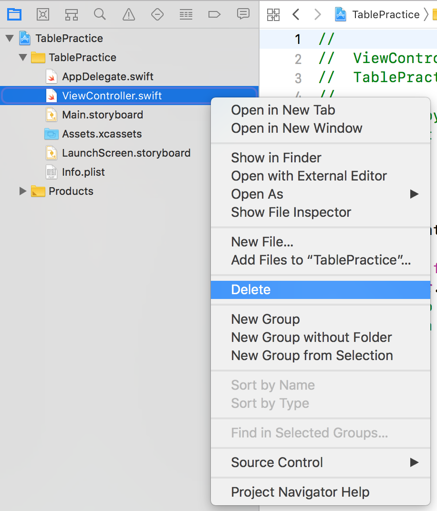

Open `Main.storyboard`, select the controller that was generated in the Outline and delete it with Edit » Delete ⌫ so that the storyboard is completely empty:

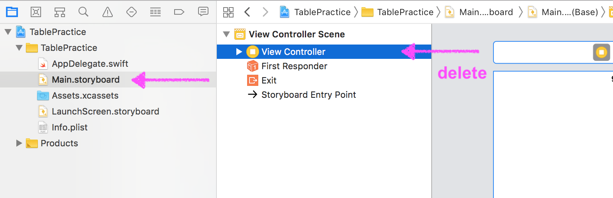

## Configure Table Content

Find a `Table View Controller` from the Object Library and drag it onto the Interface Builder.

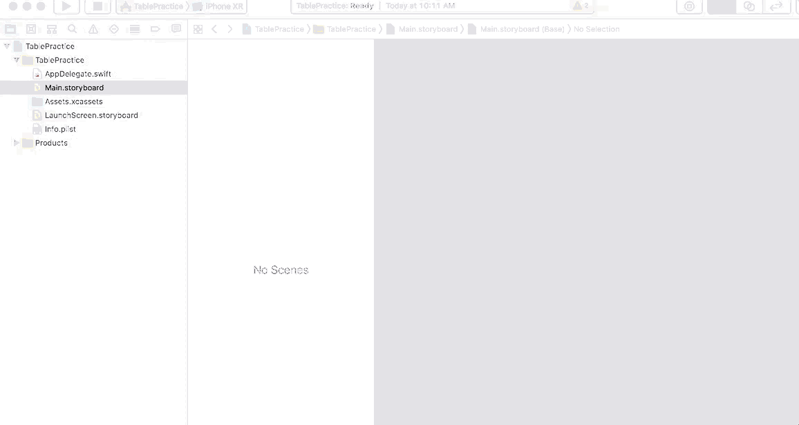

We want this to be the entry point for the app, but we don't have the arrow on the left-side like we used to with the initial StoryBoard. We can configure this:

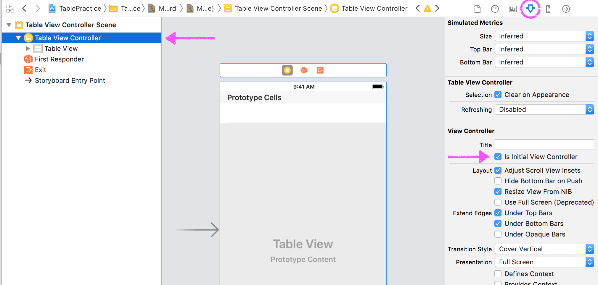

While the `Table View` is selected in the Document Outline, go to the Utilities Pane. From the Table View - Content drop-down, select "Static Cells".

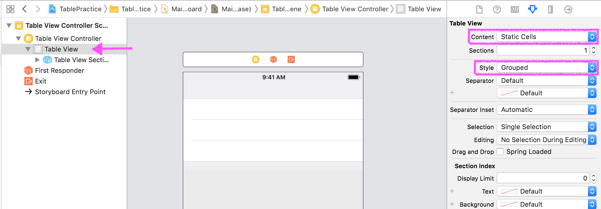

Your Document Outline should now look like this:

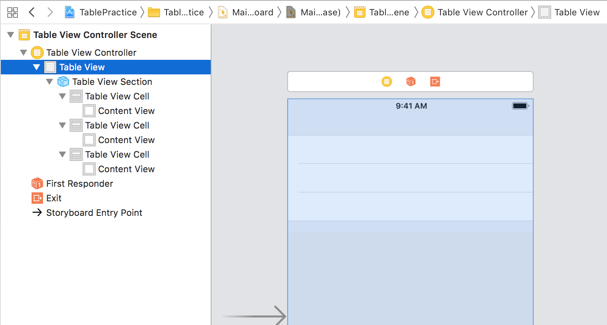

We currently have one section with three rows underneath it. Let's create a label/header for the section. Select the `Table View Header` in the Document Outline. In the Utilities Pane, type in a Header, then press enter/return:

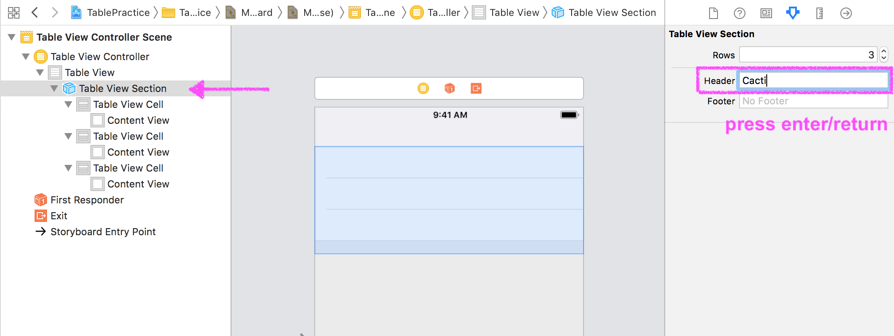

Now, let's put some content in the cells. Select the first `Table View Cell` in the Document Outline, and in the Utilities Pane, select "Basic" in the style dropdown.

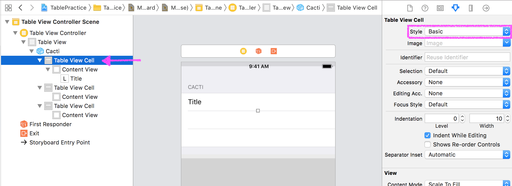

Now, double click the "Title" label on the StoryBoard and change the text:

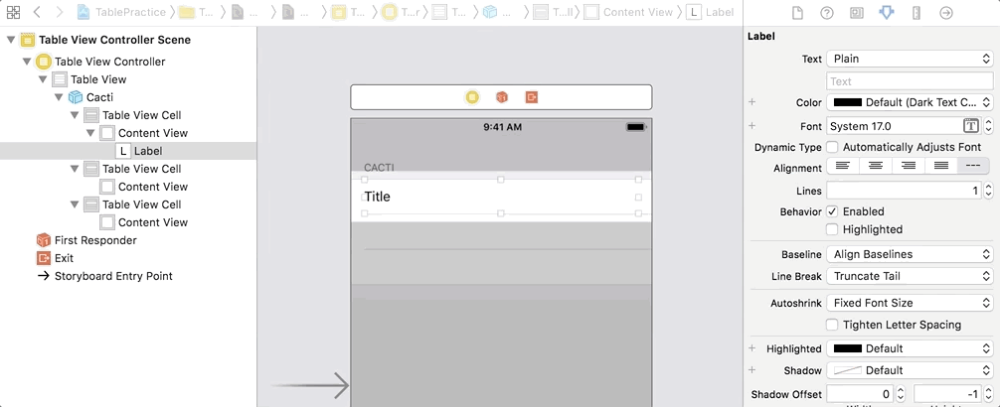

Do the same thing for the two remaining cells.

Run the project on a simulator and you should see your table!

## Multiple Sections

What's the point of this "Section" if it's the only one? We're going to take a series of steps to **programmatically** build a dynamic number of sections and rows in each section. This means that we will write code in a ViewController file rather than use the Interface Builder.

We will start by creating a new ViewController file in the project, which we will then link up to the StoryBoard. Right-click on the project file, the select "New File":

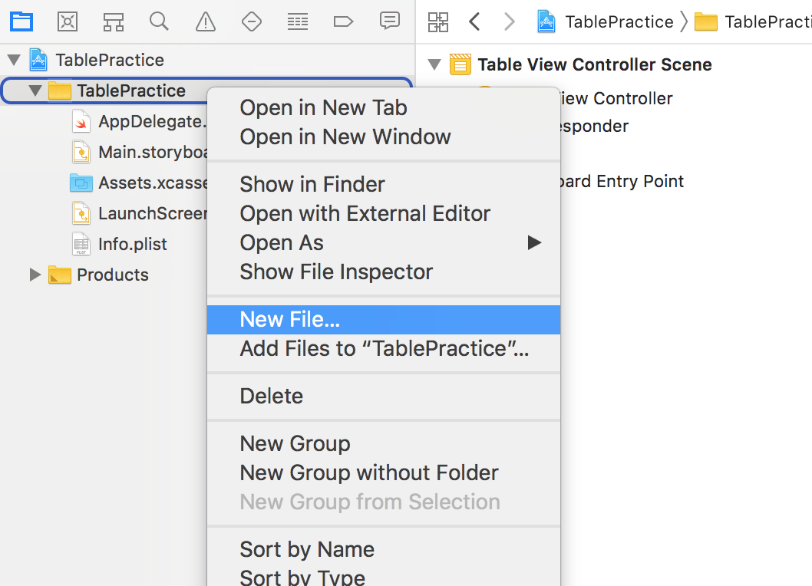

Select "Cocoa Touch File", then click "Next":

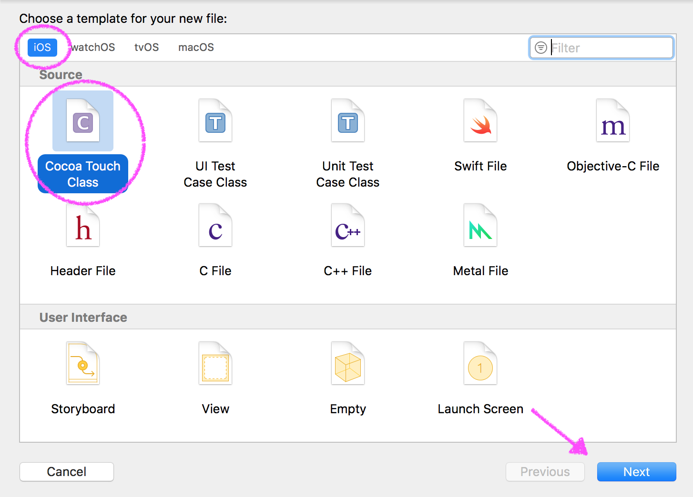

Make sure to select `UITableViewController` in the Subclass dropdown, and type a class class that ends in "TableViewController" in the class input.


You'll see new file be generated with a lot of code and comments already in it - almost 100 lines! Let's leave that be for now; we will utilize some of it later.

Now, we need to tell Xcode that we want this new file to be connected to the StoryBoard. Open the StoryBoard, select it so it's outlined in blue, then in the Utilies Pane, navigate to the Identify Inspector. In the drop-down for "Class", select the file you just created.

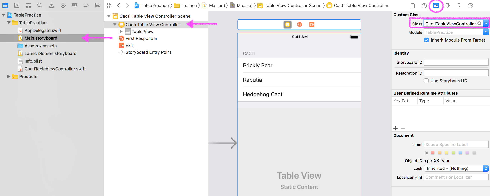

### Halfway There - Take a Pom 🎉

Now, instead of making "Static Cells", static meaning not-changing, we want to make dynamic cells so that the data can vary based on the array we use to fill the table. While the `Table View` is selected in the Document Outline, change the "Content Type" to "Dynamic Prototypes" and the "Style" to "Plain".

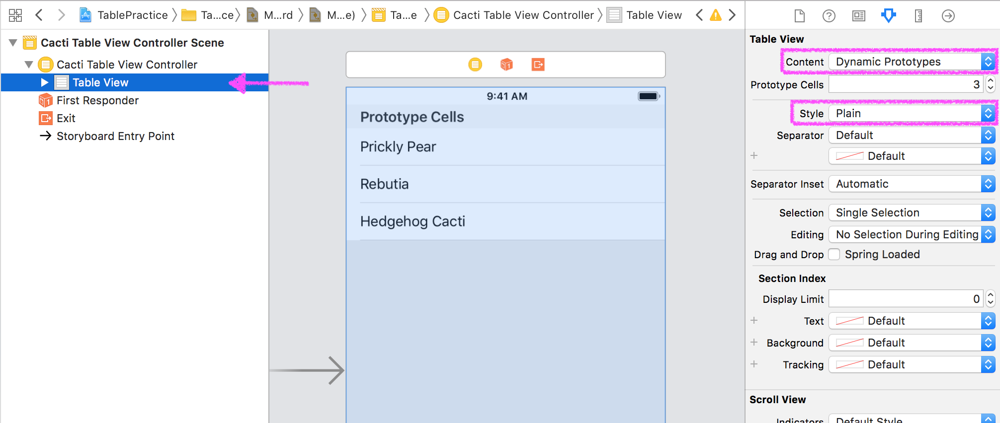

Select the `Table View Cell` in the Document Outline, and in the Utilities Pane, type "LabelCell" in the "Identifier" field. Later, when we write code, we will need to reference this - it's a small detail that's easy to forget!

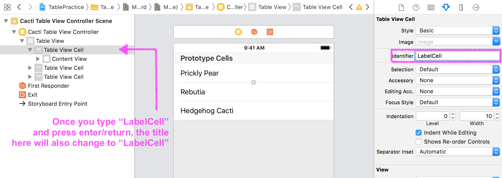

Now we're ready to write some code!

First, let's delete the `viewDidLoad` action. Now, in the `numberOfSections` action, instead of returning 0, `return 3`. Your code should look like this:

```swift
class CactiTableViewController: UITableViewController {

    // MARK: - Table view data source

    override func numberOfSections(in tableView: UITableView) -> Int {
        return 3
    }

    // (more below)
```

Now, in the `func tableView` that has an argument for `numberOfRowsInSection`, instead of returning 0, `return 5`.

```swift
override func tableView(_ tableView: UITableView, numberOfRowsInSection section: Int) -> Int {
     return 5
 }
```

Next, uncomment the `func tableView` that has an argument `cellForRowAt indexPath`. We need to do two things in this function:
1. Replace "reuseIdentifier" with "LabelCell".
2. Where a comment currently lives that says `// Configure the cell...`, add:

```swift
cell.textLabel?.text = "Section \(indexPath.section) Row \(indexPath.row)"
```

This is change the text of the label in each cell to say "Section 1 Row 3" (if the cell were in section 1, row 3).

Now, we need to override the `tableView` that takes an argument of `tableTitleHeader`. We can do this by starting to type `tableTitleHeader`, then Xcode will autocomplete the function for us. See the giphy below if you need help:


Inside that function, add `return "Section \(section)"`. This will label the section as Section 0, Section 1, Section 2, so we can clearly see what's going on once this is running in the simulator.

Run the simulator - you should see a table with three sections, labeled Section 0, 1, and 2, each with rows 0-4.

**Pro-Tip:** Did the "build success" but you now see a SIGABRT error in Xcode? Make sure you followed step 1, replacing "reuseIdentifier" with "LabelCell".

Let's clean up our code a little bit: go back into Xcode and delete all the comments that are remaining in you View Controller file. Re-run in the simulator to make sure you didn't accidentally delete something you didn't want to!

## Holding Data in an Array

In real applications, we would never just see a list of Section 0, Cell 1, etc. We would see real data in those sections and cells! This last step will pull all the pieces together.

We are going to add a `type`, or `struct`, above the class in our View Controller file. You can think of this as a mini-class: we will be using it as a blueprint for a lot of objects created from it, but it _only_ has properties, no actions.

 ```swift
import UIKit

struct Cacti {
    var id : Int
    var title : String
    var text : String
    var image : String
}

class StoriesTableViewController: UITableViewController {
  // the rest of your code
}
 ```

Now, let's create an array of objects from the `struct`. This array will be a property on the View Controller class.

```swift
class StoriesTableViewController: UITableViewController {
  var allCacti = [
      Cacti(id: 1,
            title: "Prickly Pear",
            text: "Opuntia, commonly called prickly pear, is a genus in the cactus family, Cactaceae.",
            image: "prickly-pear"),
      Cacti(id: 2,
            title: "Hedgehog Cacti",
            text: "Echinopsis is a large genus of cacti native to South America, sometimes known as hedgehog cactus, sea-urchin cactus or Easter lily cactus.",
            image: "hedgehog"),
      Cacti(id: 3,
            title: "Rebutia",
            text: "Rebutia is a genus in the family Cactaceae, native to Bolivia and Argentina. They are generally small, colorful cacti, and globular in form.",
            image: "rebutia")
  ]

  // the rest of your code
}
```

Now, since the only topic currently in our table is Cacti, we can change the retrun value of the `numberOfSections` function to `1`.

In the `tableView` function that handles `numberOfRowsInSection` - we can change that return value from `5` to the number of items in our `allCacti` array. Instead of hard-coding `3`, let's return `allCacti.count`. The code below shows the updates:

```swift
override func numberOfSections(in tableView: UITableView) -> Int {
    return 1
}

override func tableView(_ tableView: UITableView, numberOfRowsInSection section: Int) -> Int {
    return allCacti.count
}
```

The last change we need to make is that middle line of code in the `tableView` function that handles `cellForRowAt`. What it currently says just modifies the text of the cell label to say which cell it is.

```swift
cell.textLabel?.text = "Section \(indexPath.section) Row \(indexPath.row)"
```

We'd like for the title of the cacti to appear there instead. We can use the `indexPath` argument and call `.row` on it to get the number attached to the cell (starting at 0). We can use that number to access an element from the `allCacti` array. Then, we call `.title` to get the title from that element in the array.

```swift
cell.textLabel?.text = allCacti[indexPath.row].title
```

Let's run the project and see what we've got.

The header of the section still says "Section 0". To change this, change the return value `tableView` function that handles `titleForHeaderInSection`.

## Style Table Cells

Xcode gives us several built-in options to style cells: Basic, Left/Right Detail and Subtitle:

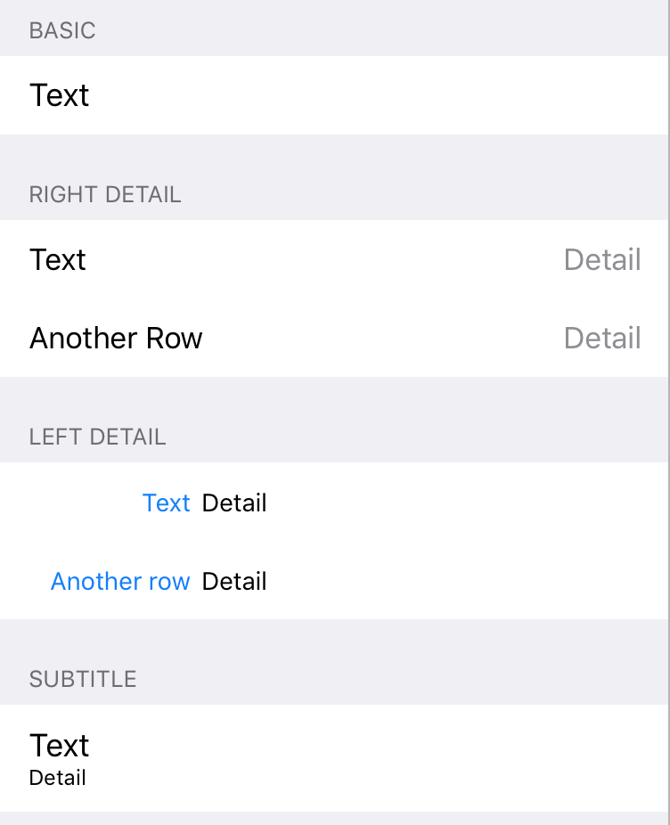

In the Document Outline, select the `LabelCell`. In the Utilities Pane, select the "Subtitle" option in the "Style dropdown".

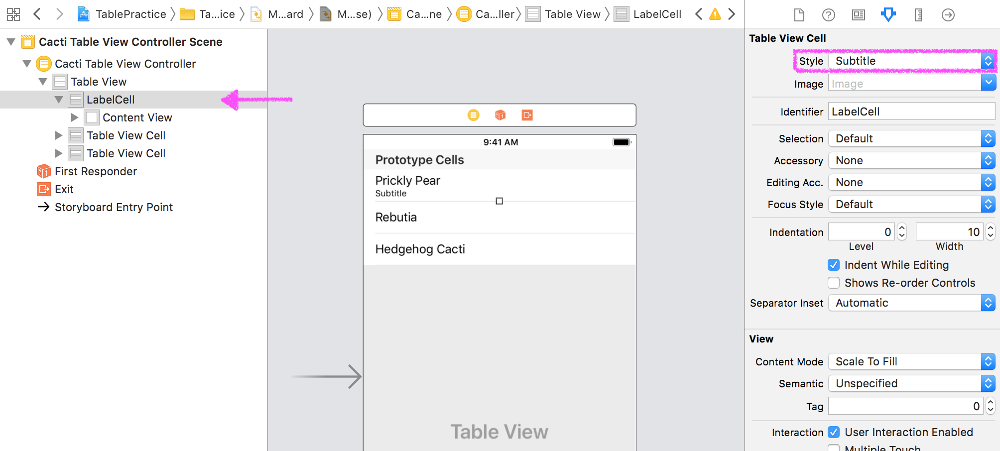

Did you see the change on the StoryBoard? The subtitle is where we can add our text from that array! However, with the title and text, our cell is now a little squished. We can control the height! With the `LabelCell` selected, go into the Size Inspector in the Utilies Pane. Click the "Custom" box, and change the height to what you think looks best.

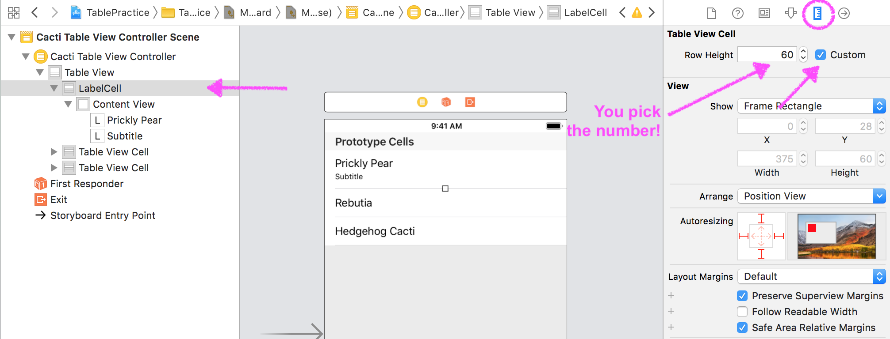

If we run this in the simulator, we'll see that every subtitle still says "Subtitle". We need to tell each cell that it needs to show the text that belongs to it. In the `tableView` function that handles `cellForRowAt`, let's add:

```swift
cell.detailTextLabel?.text = allCacti[indexPath.row].text
```

Now, we have the title and subtitle! Let's add one final touch - an image on the left side of each row.

If you look back up at the `allCacti` array for this example, you'll see that there is an `image` property for each cacti. It's currently pointing to files named "prickly-pear", "hedgehog", and "rebutia", but those files don't exist. In your "Assets" file, drag and drop 3 images (or however many rows you have). Rename the files if necessary to the filenames in the array.

If we run this in the simulator, we won't see the pictures, not yet. We've loaded them in the project, but haven't told the cell to display them. Let's add one more line of code to the `tableView` function that handles `cellForRowAt`:

```swift
cell.imageView?.image = UIImage(named: allCacti[indexPath.row].image)
```

A little more is going on with this line. Because the file name was stored as a string but we need to access an image, we wrapped the file name in `UIImage()` to convert it to an image.

Now, we can run this on our simulator and see all cells showing all data!
