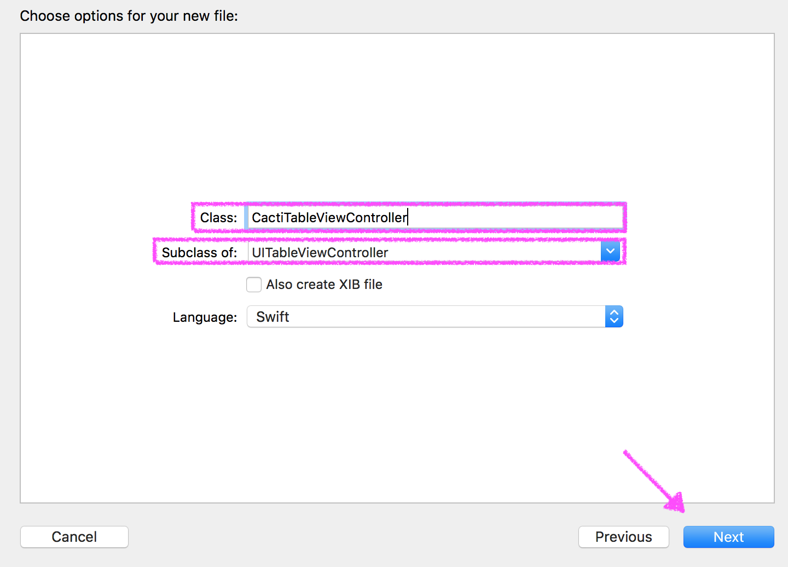

## Learning Goals

* Connect StoryBoards with View Controllers
* Build a table for an iOS application
* Programmatically build a dynamic table  

## Technical Vocabulary

- View Controller
- Interface Builder
- programmatically

## Tables IRL

## Structure of this "class"/tutorial

set some expectations,
red cards - stop and check in with someone

## Project Setup

Create a new iOS, Single View App project in Xcode. Name it "TablePractice".

Right-click the `ViewController.swift` that was generated when you created the project, then select "Delete" to delete this file. If you receive a prompt, select "Move To Trash".


Open `Main.storyboard`, select the controller that was generated in the Outline and delete it with Edit » Delete ⌫ so that the storyboard is completely empty:


## Configure Table Content

Find a `Table View Controller` from the Object Library and drag it onto the Interface Builder.


We want this to be the entry point for the app, but we don't have the arrow on the left-side like we used to with the initial StoryBoard. We can configure this:


While the `Table View` is selected in the Document Outline, go to the Utilities Pane. From the Table View - Content drop-down, select "Static Cells".


Your Document Outline should now look like this:


We currently have one section with three rows underneath it. Let's create a label/header for the section. Select the `Table View Header` in the Document Outline. In the Utilities Pane, type in a Header, then press enter/return:


Now, let's put some content in the cells. Select the first `Table View Cell` in the Document Outline, and in the Utilities Pane, select "Basic" in the style dropdown.


Now, double click the "Title" label on the StoryBoard and change the text:


Do the same thing for the two remaining cells.

Run the project on a simulator and you should see your table!

## Multiple Sections

What's the point of this "Section" if it's the only one? We're going to take a series of steps to **programmatically** build a dynamic number of sections and rows in each section. This means that we will write code in a ViewController file rather than use the Interface Builder.

We will start by creating a new ViewController file in the project, which we will then link up to the StoryBoard. Right-click on the project file, the select "New File":


Select "Cocoa Touch File", then click "Next":


Make sure to select `UITableViewController` in the Subclass dropdown, and type a class class that ends in "TableViewController" in the class input.



You'll see new file be generated with a lot of code and comments already in it - almost 100 lines! Let's leave that be for now; we will utilize some of it later.

Now, we need to tell Xcode that we want this new file to be connected to the StoryBoard. Open the StoryBoard, select it so it's outlined in blue, then in the Utilies Pane, navigate to the Identify Inspector. In the drop-down for "Class", select the file you just created.


### Halfway There - Take a Pom (put something cute here)

Now, instead of making "Static Cells", static meaning not-changing, we want to make dynamic cells so that the data can vary based on the array we use to fill the table. While the `Table View` is selected in the Document Outline, change the "Content Type" to "Dynamic Prototypes" and the "Style" to "Plain".


Select the `Table View Cell` in the Document Outline, and in the Utilities Pane, type "LabelCell" in the "Identifier" field. Later, when we write code, we will need to reference this - it's a small detail that's easy to forget!


Now we're ready to write some code!

First, let's delete the `viewDidLoad` action. Now, in the `numberOfSections` action, instead of returning 0, `return 3`. Your code should look like this:

```swift
class CactiTableViewController: UITableViewController {

    // MARK: - Table view data source

    override func numberOfSections(in tableView: UITableView) -> Int {
        return 3
    }

    // (more below)
```

Now, in the `func tableView` that has an argument for `numberOfRowsInSection`, instead of returning 0, `return 5`.

```swift
override func tableView(_ tableView: UITableView, numberOfRowsInSection section: Int) -> Int {
     return 5
 }
```

Next, uncomment the `func tableView` that has an argument `cellForRowAt indexPath`. We need to do two things in this function:
1. Replace "reuseIdentifier" with "LabelCell".
2. Where a comment currently lives that says `// Configure the cell...`, add:

```swift
cell.textLabel?.text = "Section \(indexPath.section) Row \(indexPath.row)"
```

This is change the text of the label in each cell to say "Section 1 Row 3" (if the cell were in section 1, row 3).

Now, we need to override the `tableView` that takes an argument of `tableTitleHeader`. We can do this by starting to type `tableTitleHeader`, then Xcode will autocomplete the function for us. See the giphy below if you need help:


Inside that function, add `return "Section \(section)"`. This will label the section as Section 0, Section 1, Section 2, so we can clearly see what's going on once this is running in the simulator.

Run the simulator - you should see a table with three sections, labeled Section 0, 1, and 2, each with rows 0-4.

**Pro-Tip:** Did the "build success" but you now see a SIGABRT error in Xcode? Make sure you followed step 1, replacing "reuseIdentifier" with "LabelCell".

Let's clean up our code a little bit: go back into Xcode and delete all the comments that are remaining in you View Controller file. Re-run in the simulator to make sure you didn't accidentally delete something you didn't want to!

## Holding Data in an Array
