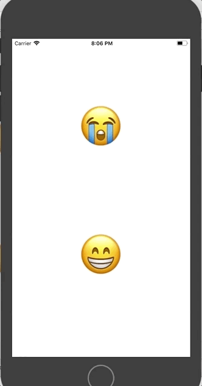

# Iteration 2: Custom Alerts

## Iteration Goals

By the end of this iteration, your app should have the following functionality:
  - When any emoji is clicked on, an alert will appear. The alert should inform the user of the emotion (in words) that the tapped-on emoji represents.

An example of what that will look like:



## Let's make it happen!

Inside your `ViewController.swift`, create a property (data type: dictionary) of emojis and the word that describes them. Here's an example:

```swift
let emojis = ["😭": "ugly crying", "😁": "happy"]
```

Now, on the first line of the `showMessage` action/function, create another constant that will store the information about _which_ button the user tapped. Just like we can grab the `.text` from a Label with an established outlet and `.image` from an Image View, we can grab the `.titleLabel.text` from a UIButton. Let's store it in a variable since we will want to use it again:

```swift
@IBAction func showMessage(sender: UIButton) {
  let selectedEmotion = sender.titleLabel?.text

  // the rest of your code from Iteration 1
}
```

Now, in your alertController, instead of hard-coding "message" or any other string, pull from your dictionary the _word_ that represents the emoji your user clicked on.

_HINT: Look back at that dictionary practice if you need to!_

Re-build in the simulator and make sure your alert now has the emotion that represents the emoji that was tapped. If it is, you are ready to commit your work!

## Commit Your Changes

In your terminal, make sure you are still in the emojional directory. Add and commit your changes. Your commit message should be something like "Complete Iteration 1".

You're ready to move on to [Iteration 3]({{ site.url }}/swift-ios/projects/emojional/i3)! If the class isn't ready, move on to the extension below first.

## Extension

What if you wanted _two_ options on that alert - one that says "OK" and one that says "bye"? Make it happen. If you don't want both, delete the code afterwards. Practice is good for you😉
