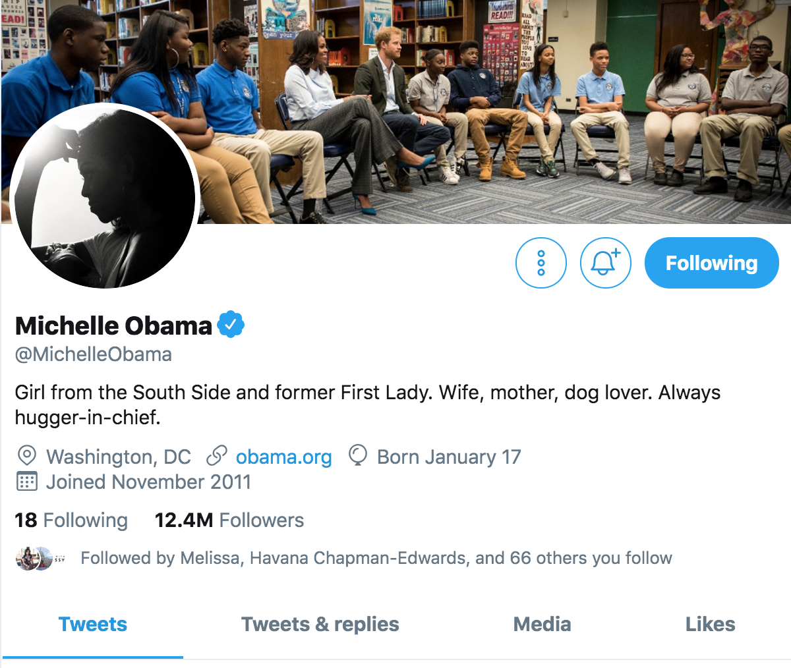
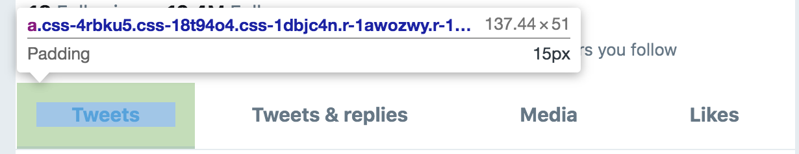
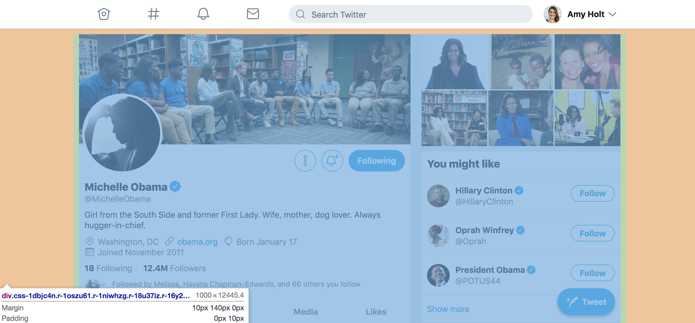
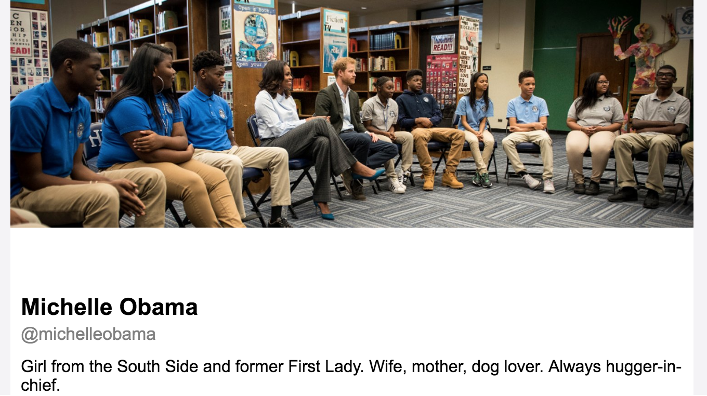
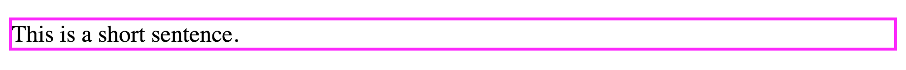
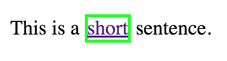
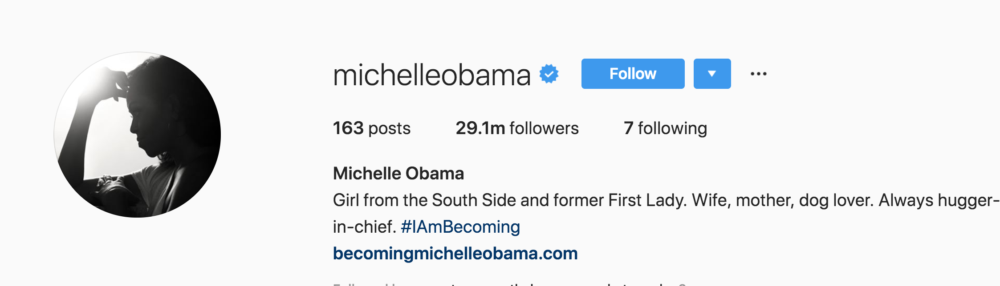
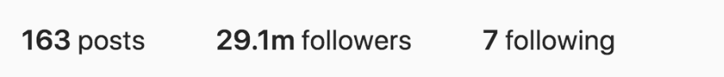
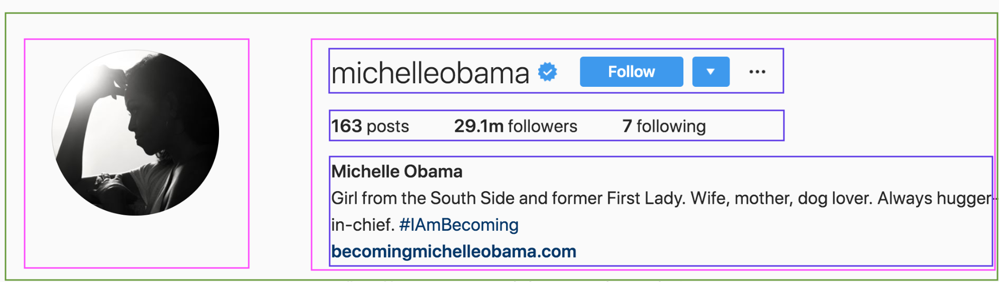
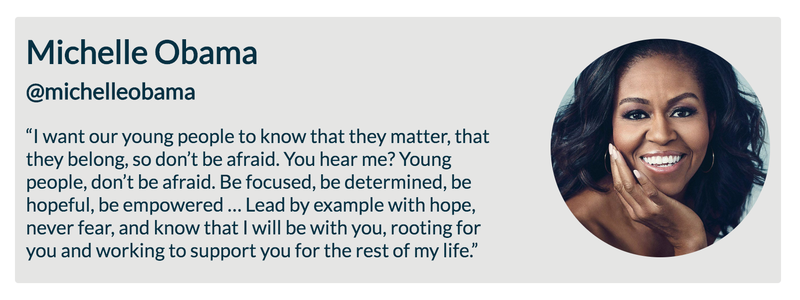

## Learning Goals

* Understand the difference between inline and block elements
* Use margin and padding to achieve ideal breathing room around elements
* Begin to think about writing semantic code for accessibility

## Technical Vocabulary

- Inline
- Block
- Inline-Block
- Box Model
- Semantic HTML

## CSS Box Model

When you hover over elements in the browser when you are in inspect mode, you may have noticed that there are flashes of blue, green, orange, and sometimes yellow. Chrome didn't just put different colors in there for fun; each color has a meaning.

Each element is a rectangular box. CSS leverages the **box model** to control layout and design. An HTML element is made up of its content and the padding, border, and margins surrounding it.

Up until now, we haven't used CSS to create space or "breathing room" between elements. Let's look at Michelle Obama's [twitter account](https://twitter.com/MichelleObama) for some examples:



At the bottom of the screen shot above, we see "Tweets/Tweets & Replies/Media/Likes". Each of these is wrapped in an `a` tag. If we wrote 4 `a` elements in a code pen right now, we would see something like this:


Well for one, the font and colors are all off, but we know how to adjust that. What we're focused on right now is that all the links are squished together! We are going to use two CSS properties to create space between each link. **Padding** creates space between the content and the border. **Margin** creates space outside the border, between other elements. The image below shows these coming together, including the color coding that the Chrome dev tools use:


<div class="try-it">
  <h2>Check It Out: Box Model</h2>
  <p>Go to the Estee Lauder site and open your dev tools. Click the inspect arrow, and hover over elements on the page. Where do you see margin and padding being used?</p>
</div>

**Margin** and **padding** are the CSS properties, but what values can they take? The need to know _how much space_ to give around the content or border, so they take either pixels or percentages:

```css
p {
  margin: 10px;
  padding: 3px;
}
```

The rule above will apply 10 pixels of margin and 3 pixels of padding to **all four sides** of every `p` element. If you only want margin or padding on one or some of the sides, you can use something like this:

```css
p {
  margin-right: 10px;
  margin-bottom: 50px;
}

button {
  padding-top: 5px;
  padding-left: 15px;
}
```

### Padding

Thinking back to Twitter, the following CSS rule is on each of the 4 `a` elements on that "Tweets/Tweets & Replies/Media/Likes" section:

```css
.r-1oqcu8e {
  padding-bottom: 15px;
  padding-left: 15px;
  padding-right: 15px;
  padding-top: 15px;
}
```

We can also see this by using the dev tools to inspect:



### Margin

Twitter also uses margin to create some space around the content and the egdes of the screen:



In the bottom left corner of this screen shot, we can see the CSS that's been applied to the div for the profile/feed card. It would look like this in a CSS file:

```css
div {
  margin: 10px 140px 0px;
  padding: 0px 10px;
}

/* That is the same as: */

div {
  margin-top: 10px;
  margin-right: 140px;
  margin-bottom: 0px;
  margin-left: 140px;
  padding-top: 0px;
  padding-right: 10px;
  padding-bottom: 0px;
  padding-left: 10px;
}
```

Those first couple lines look a bit more complicated at first. What they are doing is a shortcut.
- `margin: 10px 140px 0px;` says: apply a margin of 10px to the top of this element, 140px to the sides, and 0px to the bottom.
- `padding: 0px 10px;` says: apply a margin of 0px to the top and bottom, and 10px to both sides.

As you can see, there are a lot of ways these rules can be written! You don't have to memorize it all - that's why we have the dev tools. Whenever you aren't sure about how a rule may be affecting your code, you can use the dev tools to inspect and make changes.

Either as a class or own your own, add some CSS rules so that the content of this little app aren't all crunched into the corner. Leave the CSS rule that's there now - we'll talk about it later. You can edit the code directly, or click the "Edit on CodePen" button on the top right to open it up, then fork to your account, on the CodePen website.

<p class="codepen" data-height="300" data-theme-id="36709" data-default-tab="js,result" data-user="turing-kwk" data-slug-hash="Lvrbdo" style="height: 300px; box-sizing: border-box; display: flex; align-items: center; justify-content: center; border: 2px solid black; margin: 1em 0; padding: 1em;" data-pen-title="Try It:  Margins &amp;amp; Padding">
  <span>See the Pen <a href="https://codepen.io/turing-kwk/pen/Lvrbdo/">
  Try It:  Margins &amp; Padding</a> by Turing KWK (<a href="https://codepen.io/turing-kwk">@turing-kwk</a>)
  on <a href="https://codepen.io">CodePen</a>.</span>
</p>
<script async src="https://static.codepen.io/assets/embed/ei.js"></script>
<br>

### Default Browser Behavior

One thing to note - you may have noticed that the browser provides some "built-in" margin and padding, just like it makes out `h1` elements larger and bolder than content in a `p` element. The browser does this to be helpful to developers who aren't going to use any CSS (think <a href="https://denver.craigslist.org/">Craigslist</a>), but it can become bothersome for developers like us, who really want to customize the look and feel of our pages. So, at the top of every CSS file we write from here on out, we should include the following rule at the top of the page:

```css
* {
  margin: 0;
  padding: 0;
  box-sizing: border-box;
}
```

The `*` means: apply this rule to ALL elements. `box-sizing: border-box` is a little complicated; it basically means that if borders are used, they will be counted as the content. If you are doing very specific work with margins, where it would be obvious if you were off by 1 tiny pixel, this would be very important.

<div class="try-it">
  <h2>Try It: Margin and Padding</h2>
  <p>Card is a word that is commonly used in front-end development. When we refer to a card, we usually mean a <code class="try-it-code">div</code> or another similar element that is used to contain information. The profile information on twitter could be called a card.</p>
  <p>We are going to begin recreating a Twitter profile card. There are many ways this can be achieved - you may see that you and your partner's outcome looks the same, but code looks very different! That's ok! As you get more practice, you will find which methods you prefer.</p>
  <p>Create a new file on your desktop called "box-model-display" and make an HTML and CSS file in it. Then, work towards replicating this:</p>
  
</div>

## Block and Inline Elements

You might notice that some elements behave a little differently in a layout than others. Some elements make content stack, while others let elements sit next to each other. What’s that about?

**Block elements** stack on top of each other. Each one starts and ends on its own line. `h1`, `p`, and `div` elements are all block elements. They take up the space across the entire screen, even if they only have a small amount of content. A magenta border was applied to this `p` element to illustrate this:



**Inline elements** can be used to mark up a few words inside of a block element. They only take up as much space as the size of their content. Most elements are block elements. Some common inline elements you may have already used:

* `<em>` is used to denote that you’d like to emphasize some text.
* `<strong>` is used to denote that this text is important.
* `<a>` is used to create a link.

A lime border was applied to this `a` element nested inside of a paragraph to illustrate this:



It is sometimes inconvenient for a `div` or `p` or `h1` elements to take up the space. Look at Instagram: the username is an `h1` but has an icon and buttons to the left of it. How did Instagram do that?



## The Display Property

While a `div` is a block element by **default**, we can write a CSS rule to override that using the `display` property. The `display` property has 4 commonly used values:
- `block` - displays the element so that it starts on a new line, and takes up the whole width.
- `inline` - does not add a line-break after the element, so the element can sit next to other elements. Does not allow us to set a width or height on the element.
- `inline-block` - like `inline` but allows us to set a width and height on the element, and top and bottom margins/paddings are respected.
- `none` - the element is completely removed

<div class="try-it">
  <h2>Try It: Block and Inline Elements</h2>
  <p>Let's recreate a small part of an Instagram profile. Using only one <code class="try-it-code">div</code>, three <code class="try-it-code">p</code>s, and 3 <code class="try-it-code">strong</code> elements, write some code to replicate this section of the profile card:</p>
  <p>Building off your "box-model-display" HTML and CSS, work towards replicating this:</p>
  
</div>

## Creating Sections

Up to now, we've usually been using one `div` to wrap all our other elements. As we build more complex pages, we may find a need for more `div`-like containers. This allows us to group pieces of content together. If we take another look at Instagram, one way it may have been built is:



The screen shot was marked up for where `div`-like containers were used. The username and buttons associated with need to be in a row, so they are contained. The posts, followers, and following data are also on one row. Lastly, remaining profile information is in a column. All of that was contained in one container, to the right of the container that holds the profile picture. Then one final container wraps that entire section.

This level of complexity means a lot of nesting. We never want to overcomplicate code, but sometimes, to get the desired look of a page, we have to use multiple containers and levels of nesting to achieve that.

<div class="try-it">
  <h2>Try It: Creating Sections</h2>
  <p class="to-do">get hard copies of a twitter profile so girls can actually mark up??</p>
  <p>Looking at Twitter, let's mark up where we think containers were probably used.</p>
</div>

We have several container elements in addition to the `div` that we can use. Typically, developers decide to use different containers so they convey a purpose to a) other developers and b) users with visual impairments who use a screen-reader. Here is a list, with short explanations, of some other elements you may want to consider using when appropriate:

- `nav`: This is used for top nav bars or side nav bars, where a list of links for navigation live.
- `section`: This typically wraps a group of articles or divs.
- `article`: This is typically nested inside a section.
- `footer`: This is used for the section at the bottom of the page where you can typically find contact information.

It's important to note that all of these elements will behave just live a `div`, but writing more **semantic** HTML will make it more accessible to other people. Keep in mind that these are all block elements, so if you want them to next to each other, you'll have to think about their `display` property.


<div class="practice">
  <h2>Practice: Box Model & Display</h2>
  <p>Create a new folder called "box-model-practice" and an HTML and CSS file inside of it.</p>
  <p>We are going to create a social-media-profile-like card. Your goal is to recreate the image below, but you should feel free to choose the content for the picture/name/quote you use.</p>
  <p>Pro-Tip: Don't forget to use border as a tool to identify what element is where, and what space it's taking up. The focus of this practice is using <code>margin/padding</code> to create white space, and your knowledge about inline/block elements to control the display of elements. You'll need to use <code>width</code> and <code>border-radius</code> as well😉.</p>
  
</div>
