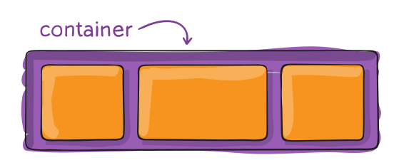

## Learning Goals

* Explain the difference between a parent and child, and a direct child
* Apply Flexbox to containers in order to achieve a desired layout

## Technical Vocabulary

- parent
- child
- direct child
- container
- item

## What is Flexbox?

Flexbox is a part of CSS that provides a more efficient way to lay out, align and distribute space among items in a container. It helps us when we have those silly block elements that can be hard to do just what we want them to do.

## Flexbox IRL

Flexbox is used _all over_ the internet. It's a little tough to learn, but once you know it, it makes your life a lot easier! That's why it is so popular among front-end developers.

Here are just a few popular pages that use Flexbox:
- [Disney Plus](https://www.disneyplus.com/) uses Flexbox on the top Nav bar and the grey bar at the bottom of the landing page
- [Lomotif](https://lomotif.com/) uses Flexbox to control the content on the right side of the landing page (title, subtitle, and two buttons)
- [The Ringer](https://www.theringer.com/) uses Flexbox to organize the links in the nav bar at the top of the page. It also uses Flexbox for each "section" of content - usually an image, title, subtitle, author, date, and tag

## Parents and Children

Before we start working with Flexbox, we need to make sure we are referring to elements and their relationship to other elements correctly. We need to be careful about the CSS rules we apply to a _parent_ element vs. those to a _child_ element. A **parent** element wraps other elements, a **child** is nested inside the parent. We will also refer to parents as **containers**, and children as **items**.

Let's look an some HTML to make sure we are all on the same page:

```html
<section class="container">
  <article class="item-in-container"></article>
  <article class="item-in-container"></article>
  <article class="item-in-container"></article>
</section>
```

In the code above, the `section` is the parent/container, and the 3 `article`s are all children/items because they are directly nested inside of that `section`. Let's looks at one more example:

```html
<section class="container">
  <article class="item-in-container">
    <h2>Title of Article 1</h2>
  </article>
  <article class="item-in-container">
    <h2>Title of Article 2</h2>
  </article>
  <article class="item-in-container">
    <h2>Title of Article 3</h2>
  </article>
</section>
```

In the code above, we now have these `h2` elements nested inside of the `article`s. It's important to know that `h2` is **not** a child of the `section`. It is technically a grandchild of the `section`, and a child of `article`. The idea of **direct child** is really important to understand as we work with Flexbox.



(Graphics from <a target="blank" href="https://css-tricks.com/snippets/css/a-guide-to-flexbox/" >CSS Tricks</a>)

## Creating a Flex Container

Without Flexbox, 10 colorful `article`s might look like this:

<p class="codepen" data-height="300" data-theme-id="36709" data-default-tab="html,result" data-user="turing-kwk" data-slug-hash="bJKmLB" style="height: 300px; box-sizing: border-box; display: flex; align-items: center; justify-content: center; border: 2px solid black; margin: 1em 0; padding: 1em;" data-pen-title="Flexbox: Normal Block Elements">
  <span>See the Pen <a href="https://codepen.io/turing-kwk/pen/bJKmLB/">
  Flexbox: Normal Block Elements</a> by Turing KWK (<a href="https://codepen.io/turing-kwk">@turing-kwk</a>)
  on <a href="https://codepen.io">CodePen</a>.</span>
</p>
<script async src="https://static.codepen.io/assets/embed/ei.js"></script>
<br>

But with Flexbox, we can start, having some control over them:

<p class="codepen" data-height="300" data-theme-id="36709" data-default-tab="html,result" data-user="turing-kwk" data-slug-hash="Pgayxz" style="height: 300px; box-sizing: border-box; display: flex; align-items: center; justify-content: center; border: 2px solid black; margin: 1.0em 0; padding: 1em;" data-pen-title="Flexbox: Applying Flexbox">
  <span>See the Pen <a href="https://codepen.io/turing-kwk/pen/Pgayxz/">
  Flexbox: Applying Flexbox</a> by Turing KWK (<a href="https://codepen.io/turing-kwk">@turing-kwk</a>)
  on <a href="https://codepen.io">CodePen</a>.</span>
</p>
<script async src="https://static.codepen.io/assets/embed/ei.js"></script>
<br>

<div class="try-it">
  <h2>Turn & Talk</h2>
  <p>Looking at the CSS in both examples above, what is the difference between the two files?</p>
  <p>What element(s) is the property <code class="try-it-code">display: flex;</code> applied to? Is that a parent or child?</p>
</div>

Takeaways:
- To use Flexbox, we need a container element with one or more children inside of it
- The declaration `display: flex;` should be on the parent's rule
- The parent won't be affected, but the way the children elements sit inside the parent may change

### Flex helps even things out

Adding `display: flex` to the CSS rule on the parent makes the parent element a flex container, and opens up a world of possibilities.

We can apply a width to each item. If all items can fit in the container at that width, that's the width they will be. If the width wouldn't leave enough room for all the items, they will become as wide as they can, and remain evenly spaced. In the CodePen below, change to width of the `article` to several different values and see what happens.

<p class="codepen" data-height="300" data-theme-id="36709" data-default-tab="html,result" data-user="turing-kwk" data-slug-hash="VNdVLv" style="height: 300px; box-sizing: border-box; display: flex; align-items: center; justify-content: center; border: 2px solid black; margin: 1em 0; padding: 1em;" data-pen-title="Flexbox: Items Too Wide">
  <span>See the Pen <a href="https://codepen.io/turing-kwk/pen/VNdVLv/">
  Flexbox: Items Too Wide</a> by Turing KWK (<a href="https://codepen.io/turing-kwk">@turing-kwk</a>)
  on <a href="https://codepen.io">CodePen</a>.</span>
</p>
<script async src="https://static.codepen.io/assets/embed/ei.js"></script>
<br>

## Justify Content

In professional apps, we typically see white space (margin or padding) used, and the content is centered on the screen. We can use Flexbox to center content:

<p class="codepen" data-height="300" data-theme-id="36709" data-default-tab="html,result" data-user="turing-kwk" data-slug-hash="KYerVR" style="height: 300px; box-sizing: border-box; display: flex; align-items: center; justify-content: center; border: 2px solid black; margin: 1em 0; padding: 1em;" data-pen-title="Flexbox: Centering Items">
  <span>See the Pen <a href="https://codepen.io/turing-kwk/pen/KYerVR/">
  Flexbox: Centering Items</a> by Turing KWK (<a href="https://codepen.io/turing-kwk">@turing-kwk</a>)
  on <a href="https://codepen.io">CodePen</a>.</span>
</p>
<script async src="https://static.codepen.io/assets/embed/ei.js"></script>
<br>

By adding `justify-content: center;`, the items in the container are now centered, instead of being crunched up on the left side of the container.

<div class="try-it">
  <h2>Try It: Justify Content</h2>
  <p>Fork the CodePen above. On the container's CSS rule, change the code to: <code class="try-it-code">justify-content: space-between;</code>. What happens?</p>
  <p>Now try: <code class="try-it-code">justify-content: space-around;</code>. What is the difference between space-around and space-between?</p>
  <p><strong>Finished early?</strong> Learn about even more values that we can provide to <code class="try-it-code">justify-content</code> with <a target="blank" href="https://css-tricks.com/almanac/properties/j/justify-content/">CSS Tricks</a>.</p>
</div>

The `justify-content` property allows us to control how our content sits _in relation to the main axis_ (for now, this means horizontally).

<div class="try-it">
  <h2>Try It: Flexbox Froggy</h2>
  <p>Work your way through Levels 1 - 4 of <a target="blank" href="https://flexboxfroggy.com/">Flexbox Froggy</a>.</p>
  <p>Make sure to check in with your partner every few levels to see if they need any help!</p>
</div>

## Align Items

Just like we can control how our content sits _in relation to the main axis_ with `justify-content`, we have a tool to control how our content sits _in relation to the secondary axis_. Check out the CodePen below. Try changing the value for `align-items` to `flex-end`, then `flex-start`, and see what happens!

<p class="codepen" data-height="300" data-theme-id="36709" data-default-tab="html,result" data-user="turing-kwk" data-slug-hash="mgKQOR" style="height: 300px; box-sizing: border-box; display: flex; align-items: center; justify-content: center; border: 2px solid black; margin: 1em 0; padding: 1em;" data-pen-title="Flexbox: Align Items">
  <span>See the Pen <a href="https://codepen.io/turing-kwk/pen/mgKQOR/">
  Flexbox: Align Items</a> by Turing KWK (<a href="https://codepen.io/turing-kwk">@turing-kwk</a>)
  on <a href="https://codepen.io">CodePen</a>.</span>
</p>
<script async src="https://static.codepen.io/assets/embed/ei.js"></script>
<br>

<div class="try-it">
  <h2>Try It: Flexbox Froggy</h2>
  <p>Work your way through levels 5 - 7<a target="blank" href="https://flexboxfroggy.com/">Flexbox Froggy</a>.</p>
  <p>Make sure to check in with your partner every few levels to see if they need any help!</p>
</div>

## Direction

Another CSS property with Flexbox is `flex-direction`. This property takes one of four values:

- `row` (default): left-to-right
- `row-reverse`: opposite of row; right-to-left
- `column`: same as `row` but top to bottom
- `column-reverse`: same as `column` but bottom to top

The direction of your flex container defines the _main axis_.
<br>
<br>

Here is a visual, created by the amazing [Samantha Ming](https://www.samanthaming.com/).


<div class="try-it">
  <h2>Try It: Flex Direction</h2>
  <p>Fork <a href="https://codepen.io/turing-kwk/pen/oNgGLKY">this CodePen</a>.</p>
  <p>On line 3 of the CSS file there is a "____" as the value for the `flex-direction` property. One by one, change that out for each of the four properties listed above. What happens to the 10 items?</p>
  <br>
  <p>Back in Flexbox Froggy, work through levels 8 - 13.</p>
</div>

## Wrap

Now, sometimes we don't want _all_ our items on the same row or column. We can use the property `flex-wrap`. It allows items to wrap onto the next line. The three values it takes are:

- `no-wrap` (default): one line, direction is defined by `flex-direction`
- `wrap`: multi-lines, direction is defined by `flex-direction`
- `wrap-reverse`: multi-lines, opposite to direction defined by `flex-direction`

<p class="codepen" data-height="300" data-theme-id="36709" data-default-tab="html,result" data-user="turing-kwk" data-slug-hash="qwKQwa" style="height: 300px; box-sizing: border-box; display: flex; align-items: center; justify-content: center; border: 2px solid black; margin: 1em 0; padding: 1em;" data-pen-title="Flexbox: Wrap">
  <span>See the Pen <a href="https://codepen.io/turing-kwk/pen/qwKQwa/">
  Flexbox: Wrap</a> by Turing KWK (<a href="https://codepen.io/turing-kwk">@turing-kwk</a>)
  on <a href="https://codepen.io">CodePen</a>.</span>
</p>
<script async src="https://static.codepen.io/assets/embed/ei.js"></script>
<br>

## Flexbox

There is more to learn about Flexbox, but we can do a lot with what we know. It will take a while to get used to; remember to use your Dev Tools and use that `border` property to help you understand what space each element is taking up.

<div class="practice">
  <h2>Practice: Flexbox</h2>
  <p>Open <a target="blank" href="https://codepen.io/turing-kwk/pen/WWyYZy">this CodePen</a> and fork it. This will create a new copy to your account that you can edit.</p>
  <p>Your job will be to update the CSS (you'll probably need to add some classes on some HTML elements, too!) so the outcome looks like the screen shot below, but <strong>first</strong>, take some time to jot down some notes and talk with a partner about <em>how</em> you will approach this.</p>
  
</div>

## More Practice

- Finish levels 14 - 24 of Flexbox Froggy
- Can't get enough of Flexbox Froggy? Try out [Flexbox Defense](http://www.flexboxdefense.com/)
