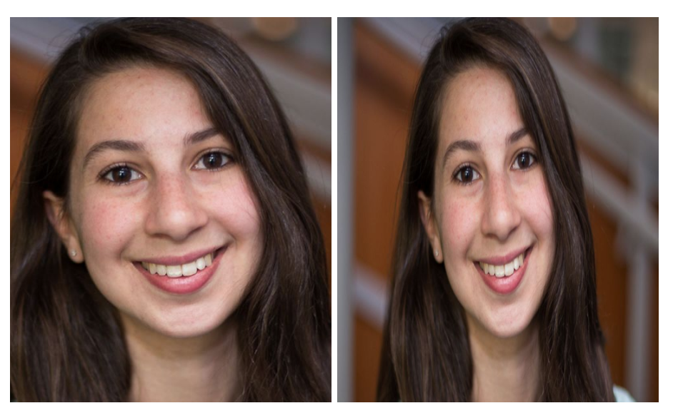

## Learning Goals

* Understand the difference between inline and block elements
* Use margin and padding to achieve ideal breathing room around elements
* Control the layout of a page using height, width, and an understanding of the box model

## Technical Vocabulary

- CSS Property
- Inline
- Block
- Box Model
- Margin
- Padding

## Warm Up

There are 4 posters around the room with HTML elements written on them. On the sticky notes at your table, write out how you would select that element in CSS.

Here's an example:

```html
<section class="cards">
```

```css
.cards {

}

/* OR */

section {

}
```

## Block vs. Inline

In the last HTML lesson, we talked about the difference between inline and block elements. With CSS, we have the power to override an elements default state of inline or block by using the `display` property.

Here's an example:

```css
button {
  display: block;
}

p {
  display: inline;
}
```

<div class="try-it">
  <h2>Check It Out: Block vs. Inline</h2>
  <p>Fork <a href="https://codepen.io/turing-kwk/pen/ZEYXOxw">this CodePen</a>. One by one, copy and paste the two CSS rules above, into your CSS file in CodePen. What happens when you paste in the rule for the buttons? For the paragraphs?</p>
</div>

In our next CSS lesson, we'll go a step further with layout. Understanding the difference between block and inline elements, and being able to change them, allows us to control the layout of a page a little more.

## CSS Box Model

When you hover over elements in the browser when you are in inspect mode, you may have noticed that there are flashes of blue, green, orange, and sometimes yellow. Chrome didn't just put different colors in there for fun; each color has a meaning.

Up until now, we haven't used CSS to create space or "breathing room" between elements. Let's look at Michelle Obama's <a target="blank" href="https://twitter.com/MichelleObama">twitter account</a> for some examples:


Each element is a rectangular box. CSS leverages the **box model** to control layout and design. An HTML element is made up of its content and the padding, border, and margins surrounding it. The image below helps us visualize each piece (and the colors match those in the Chrome Dev Tools!).


<!-- directions for instructor to know walk through examples of where we see breathing room -->

**Padding** creates space between the content and the border. **Margin** creates space outside the border, between other elements. The image below shows these coming together, including the color coding that the Chrome dev tools use:

<div class="try-it">
  <h2>Check It Out: Box Model</h2>
  <p class="to-do">Opportunity for sponsor integration. If not, Codecademy is a good one for this.</p>
  <p>Go to the _______ site and open your dev tools. Click the inspect arrow, and hover over elements on the page. Where do you see margin and padding being used?</p>
</div>

## Padding

**Padding** creates space between the content and the border. Most element don't have any by default, so a lot of times our content can look squished. `padding` is a CSS property we can use to add what we call "breathing room" between content and it's border.

Thinking back to Twitter, the following CSS rule is on each of the 4 `a` elements on that "Tweets/Tweets & Replies/Media/Likes" section:

```css
.r-1oqcu8e {
  padding-bottom: 15px;
  padding-left: 15px;
  padding-right: 15px;
  padding-top: 15px;
}
```

We can also see this by using the dev tools to inspect. The part highlighted in blue is the content and the part highlighted in green was space created by the `padding` rules.


There are several ways we can tell CSS that we want it to add padding. In the rule above that Twitter used, they wrote out a declaration for each side of the element. They could have written this rule and had the exact same outcome:

```css
.r-1oqcu8e {
  padding: 15px;
}
```

When you don't specify which side of the element you want padding on, all four sides will get that amount of padding.

If you want different sides of the element to have different amounts of padding, you should use `padding-right`, `padding-top`, etc. Here's an example:

```css
.r-1oqcu8e {
  padding-bottom: 10px;
  padding-left: 30px;
  padding-right: 30px;
  padding-top: 0px;
}
```

In the code snippet above, the element would have 10px of padding on the bottom and no padding on the top. Both sides - right and left - would have 30px of padding.

<div class="try-it">
  <h2>Try It: Padding</h2>
  <p>Fork <a href="https://codepen.io/turing-kwk/pen/qBEPOea">this CodePen</a>. Read through the HTML and CSS provided to make sure you understand what you're starting with.</p>
  <p>Work to re-create the image below using the HTML and CSS provided as a starter kit. The colors used were <code class="try-it-code">deeppink</code>, <code class="try-it-code">darkviolet</code>, and <code class="try-it-code">deepskyblue</code>.</p>
  
</div>

## Margin

Similar to padding, `margin` is a CSS property that helps us control spacing of elements. The difference between the two is, **margin** creates space outside the border, between other elements. Twitter uses margin to create some space around the content and the edges of the screen (notice the orange parts):


Writing declarations with the `margin` property is very similar to what we know about `padding`. Here is the CSS that was written for the margin at the bottom of a Twitter profile:


```css
.css-1dbjc4n {
  margin-top: 0px;
  margin-right: 0px;
  margin-bottom: 15px;
}
```

We can also write one declaration for all fours sides:

```css
.class-name {
  margin: 10px;
}
```

<div class="try-it">
  <h2>Try It: Margin</h2>
  <p>Fork <a href="https://codepen.io/turing-kwk/pen/ExawKoR">this CodePen</a>. Read through the HTML and CSS provided to make sure you understand what you're starting with.</p>
  <p>Work to re-create the image below using the HTML and CSS provided as a starter kit. You'll need both margin and padding!</p>
  
</div>

### Default Browser Behavior

One thing to note - you may have noticed that the browser provides some "built-in" margin and padding, just like it makes out `h1` elements larger and bolder than content in a `p` element. The browser does this to be helpful to developers who aren't going to use any CSS (think <a target="blank" href="https://denver.craigslist.org/">Craigslist</a>), but it can become bothersome for developers like us, who really want to customize the look and feel of our pages. So, at the top of every CSS file we write from here on out, we should include the following rule:

```css
* {
  margin: 0;
  padding: 0;
  box-sizing: border-box;
}
```

The `*` means: apply this rule to ALL elements. `box-sizing: border-box` is a little complicated; it basically means that if borders are used, they will be counted as the content. If you are doing very specific work with margins, where it would be obvious if you were off by 1 tiny pixel, this would be very important.

## Sizing Images

Many times, the photos we bring in will not be the exact size we want it to be for our site. We can use the `width` and `height` properties to handle this.

We will almost always want to preserve the ratio of the image, so we can give either a width or height. Once we set the width or height, the other dimension will be determined by the ratio of the original image.

If you want to give both width and height for some reason, you may need to apply the `object-fit` property. This might come in handy if you want to display a row of photos of the same height and width, but which all started off in various sizes.

Look at the two images of <a target="blank" href="https://www.youtube.com/watch?v=dhWPBY4IgRU">Dr. Katie Bouman</a> below, then look at the code that was used to style them:



```html


```

```css
img {
  height: 300px;
  width: 250px;
}

.correct-ratio {
  object-fit: cover;
}
```

The `object-fit` property on the `.correct-ratio` class fixed the distorted ratio for us. We did lose some of the photo (on the sides), but with most things, we want to maintain the original ratio.

<div class="try-it">
  <h2>Try It: Sizing Images</h2>
  <p>Open up a new CodePen. Find 3 photos from <a target="blank" href="https://www.pexels.com/">Pexels</a> and create image tags for each of them in the new CodePen. Get a mix of images that are vertical and horizontal.</p>
  <p>Style the photos so they appear to be the same size, and make sure they aren't squished!</p>
</div>

## Putting it All Together

In this final section, you'll use your new knowledge about the box model and image sizing to start re-creating a Twitter profile card!

<div class="try-it">
  <h2>Practice</h2>
  <p>Card is a word that is commonly used in front-end development. When we refer to a card, we usually mean a <code class="try-it-code">div</code> or another similar element that is used to contain information. The profile information on Twitter could be called a card.</p>
  <p>We are going to begin recreating a Twitter profile card. There are many ways this can be achieved - you may see that you and your partner's outcome looks the same, but code looks very different! That's ok! As you get more practice, you will find which methods you prefer.</p>
  <p>Create a new pen on CodePen. Then, work towards replicating the image below. Feel free to use any images and text you'd like!</p>
  
  <p><em>Hint: You can also use percentages as units for the width of an image.</em></p>
  <p><strong>Medium Challenge:</strong> Add a blue checkmark next to the user's name. You can find a lot of icons at <a href="https://www.flaticon.com/">Flat Icon</a>. Make sure the icon is about the correct size, and right next to the name. You can reference Michelle Obama's profile at the top of this lesson for what this should look like. Follow the same workflow to include an icon just as you would an image (right click and copy image address).</p>
  <p><strong>Spicy Challenge:</strong> Add another image to your Twitter profile. This image should be round, and part of it should lay over the background image. You can reference Michelle Obama's profile at the top of this lesson for what this should look like.</p>
</div>

## Extensions

- [Classes & IDs](../html-css-ids)
- [CSS: Does Order Matter?](../css-order)
