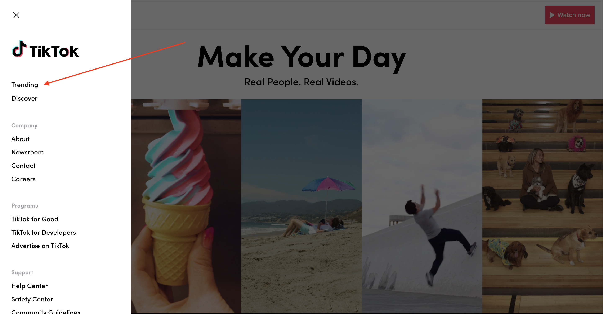
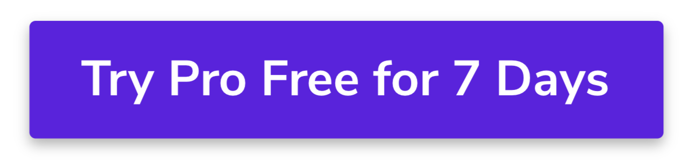

## Learning Goals

* Understand the basics of CSS
* Experiment with some of the common properties for aesthetic
* Build a small static site and style our markup

## Technical Vocabulary

* CSS
* CSS Property
* HTML Element

## Warm Up

Over the next couple of days, we'll create a lot of small websites to practice what we're learning.

Write a list of topics you are interested in or passionate about that you can refer back to when you need to make a small site.

Share with your partner - this will also help you get to know each other!

## What is CSS?

CSS stands for Cascading Style Sheets. It is a language that allows us to add styles to HTML documents on the web. It’s incredibly powerful!

Take a few minutes to check out the <a target="blank" href="http://www.csszengarden.com">CSS Zen Garden</a>. You'll notice that all of the sites here are created with the exact same HTML document; they were just styled differently with CSS.

You'll learn that there are many CSS properties out there that we can add to rules. You don't need to memorize the entire list; there are resources like <a target="blank" href="https://htmldog.com/references/css/properties/">this</a> which you can reference anytime you are coding! There are some common properties though, that you will find yourself using so often, that you know by heart.

Over the course of our first 2 CSS lessons, we'll talk about most of those common properties. By the middle of the week, you'll have most of the CSS tools you'll need to build a beautiful site!

## Styling Elements

In CSS, we write a set of rules for how our document should look. The browser evaluates those rules and styles the page accordingly. A CSS rule is defined as follows:


In the example above, the browser will set the color of any text element inside the `<body>` element. We can define multiple sets of properties and values in a given rule.

## Text

While we may take it for granted, the decisions that a website makes regarding text has a huge influence on the entire experience! Here are some things to notice about any piece of text:

- Font Family
- Size
- Weight
- Color

Using CSS, we can control all of that! If you visit [TikTok](https://www.tiktok.com/en/) on a laptop, you'll see a menu on the left hand side (image below).



Each link that a user can click on has the follow CSS rules applied to it. All of these lines of code are there solely to control the look and feel of those small links!

```css
element {
  font-family: 'sofiapro-medium';
  font-size: 16px;
  font-weight: 500;
  color: #000000;
}
```

<div class="try-it">
  <h2>Try It: Style Text</h2>
  <p>We'll be working in CodePen again, but today we will use both the HTML <em>and</em> CSS panes. You can collapse the JavaScript (JS) pane so you have more room to view your code. Follow these steps:</p>
  <ul>
    <li>Start by writing some HTML so we have some elements to style. Write an <code class="try-it-code">h1</code> element and make sure to include some content between the tags!</li>
    <li>Now, write a CSS rule for the <code class="try-it-code">h1</code>. Inside the rule, change the size and color of your <code class="try-it-code">h1</code>. Find a list of colors to use <a target="blank" href="http://colours.neilorangepeel.com/">here</a></li>
    <li>Repeat these steps with an <code class="try-it-code">h2</code>, then a <code class="try-it-code">p</code>, then another <code class="try-it-code">p</code>. Also check out the <code class="try-it-code">background-color</code> property!</li>
  </ul>

  <p>Finished Early? Here are two fun things to add on:</p>
  <ul>
    <li>Do some google research on how to use hexadecimal codes instead of color names. For example, the hexadecimal code for white is <code class="try-it-code">#ffffff</code>. See if you can implement these in your code!</li>
    <li>To add in some really fun fonts, check out <a href="https://codepen.io/team/sparkbox/full/OMdwoJ">this how-to guide</a>, then add some fun fonts to your CodePen!</li>
  </ul>
</div>

## Borders

One of the most helpful CSS properties to use while you are in the process of building a page is `border`. We will get into formatting in the next lesson, but the `border` property really helps you see what space a given element is taking up on the page.

<div class="try-it">
  <h2>Explore: Borders</h2>
  <p>For this activity, you'll be using the same CodePen that you started with text and colors.</p>
  <p>Add the property/value <code class="try-it-code">border: 1px solid red;</code> to each rule in your CSS file. This value looks a little different from most of those we've seen; there are 3 pieces of information.</p>
  <ul>
    <li><strong>1px</strong> refers to the thickness of the line on the border</li>
    <li><strong>solid</strong> refers to the border style, in this case a solid line</li>
    <li><strong>red</strong> is the color that you would like the border to be (it could be changed to any valid color name or hex code!)</li>
  </ul>
  <p>Tinker with the 3 pieces of information - change <strong>1px</strong> to <strong>5px</strong>, change the color, etc! Check out all the <a href="https://www.w3schools.com/css/css_border.asp">possible border styles</a> as well!</p>
</div>

Takeaways from this exploration:
- Any element can have a border
- We can define how thick it is, the style of it, and the color of it
- When we apply the rule, a border is added to all four sides of an element. (If you ever want to just apply it to one side - google around for `border-bottom`, `border-top`, etc.)
- If we don't define a border, no border will show up!

## Buttons

Before you get information about buttons in CSS, take a minute to explore and reflect on what you already know about them from a _user standpoint_!

<div class="try-it">
  <h2>Explore: Buttons</h2>
  <p>Visit the <a href="https://www.kodewithklossy.com/">Kode With Klossy</a> website in another tab. Find the "Learn More and Apply" button.</p>
  <ul>
    <li>How did you know it was a button?</li>
    <li>What do you observe when you hover your mouse over the button?</li>
  </ul>
  <br>
  <p>Visit the <a href="https://github.com/">GitHub</a> landing page in another tab. Find the "Sign In" button.</p>
  <ul>
    <li>How did you know it was a button?</li>
    <li>What do you observe when you hover your mouse over the button?</li>
    <li>What is at least one difference between this and the KWK button?</li>
  </ul>
</div>

Let's translate this into some CSS tools that we can use in the future:

**Kode With Klossy**:
1. The color was the same on the whole button
2. When a user hovers over the button, the color slightly changes
3. When a user hovers over a button, the cursor changes from an arrow to a pointer finger

Here is the code that was used to accomplish this (colors were modified for simplicity):

```css
button {
  background-color: green; /* (#1) */
}

button:hover {
  background-color: light-green; /* (#2) */
  cursor: pointer; /* (#3) */
}
```

The code snippet above includes two things we haven't talked about yet:
- `button:hover`: This is called a `pseudo-selector` - when the button is hovered over, this rule will come into play. If the button is not being hovered over, it will be ignored.
- `cursor: pointer;`: This declaration will change the image that is presented as the cursor. `pointer` provides a little hand that looks like it's pointing with its finger. If you're interested in learning about other cursors you could use, check out [this resource](https://developer.mozilla.org/en-US/docs/Web/CSS/cursor).

**GitHub**:
1. The button only has an outline - it's not filled in with the same color
2. The button has rounded corners
3. When a user hovers over a button, the cursor changes from an arrow to a pointer finger

Here is the code that was used to accomplish this:

```css
button {
  border: 1px solid white; /* (#1) */
  border-radius: 3px; /* (#2) */
}

button:hover {
  cursor: pointer; /* (#3) */
}
```

Another property/value pair that we haven't talked about:
- `border-radius: 3px;`: This is what rounds the corners of the button. `3px` was used for the GitHub Sign In button, but we could provide any value in pixels!

<div class="try-it">
  <h2>Try It: Buttons</h2>
  <p>Create a new CodePen for this activity.</p>
  <ol>
    <li>In the HTML file, write a button element with the content "Try Pro Free for 7 Days".</li>
    <li>In the CSS file, write the rules necessary to re-create the button pictured below! Use any color you want.</li>
  </ol>
  
  <br>
  <p><strong>Spicy Challenge:</strong>: When the button is hovered over, it should look like the image below. Implement the CSS code necessary to re-create that hover state.</p>
  
</div>

## Putting It All Together

In just your first day learning about CSS at Kode With Klossy, you've already learned so much!

Take a minute to write down your key takeaways from this lesson.
- Things that seem the newest to you
- Things that seem most interesting to you
- Questions that are still on your mind
