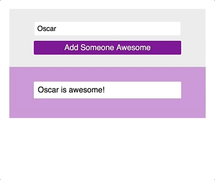

## Learning Goals

* Append multiple elements to the DOM to create a to-do list-like application
* Refactor code so that functions have a single responsibility

## Technical Vocabulary

- event
- append
- prepend
- argument
- object
- refactor
- helper function

## DOM Manipulation

You've already come so far with implementing JavaScript to manipulate the DOM! Today we will take it to the next level. We are going to build a site that can take user input multiple times and keep adding each input to a list. This "To-Do List" is a very common app that developers use as they are learning JavaScript. Here's an example of something like what we will build by the end of this lesson:



## `.append()`

jQuery gives us a function called `.append()`. If you google append, you'll see a definition:

```
verb
add (something) as an attachment or supplement.
```

The `.append()` function allows us to append a newly-created HTML element to an already-existing element. Here's an example of the syntax:

```html
<section class="container">
</section>
```

```javascript
var container = $('.container');
container.append(`<p>Hello!</p>`);
```

As you can see above, we have an empty `section` element in the HTML document. In JavaScript, we accessed that section element by its class. Let's break down the next line:

- `container` - the HTML section we accessed on the previous line
- `.append()` - this is being called on the `container`, so it's saying: I'd like you to attach something to the container.
- `(`<p>Hello!</p>`)` - this is the argument that `.append()` takes, wrapped in back-ticks, an HTML element. Whatever lives inside the back-ticks will be added into `innerHTML` of the container.

<div class="try-it">
  <h2>Try It: Basic Append</h2>
  <p>In a new CodePen write HTML so you have an <code class="try-it-code">article</code> with a nested <code class="try-it-code">h2</code>. Run the code and make sure you can see your header in the browser.</p>
  <p>Now, write some JavaScript that will append a paragraph to the <code class="try-it-code">article</code>. You should see the paragraph in your browser now.</p>
</div>

## When to Append

This is great, but the append is happening right away, so it's not really helping us build a dynamic to-do list.

<div class="try-it">
  <h2>Turn & Talk: When to Append</h2>
  <p>With your partner, write out a list (pseudo-code) of things we want to the computer to do to make a working to-do list, in order. Include in the order: when the user would interact.</p>
</div>

We can't just append directly in our JavaScript file, or as we saw, that HTML is added immediately. We want to respond to our user with an event listener and handler. Here's a more realistic example, with a little more going on.

<p class="codepen" data-height="300" data-theme-id="36709" data-default-tab="css,result" data-user="turing-kwk" data-slug-hash="WWqjLp" style="height: 300px; box-sizing: border-box; display: flex; align-items: center; justify-content: center; border: 2px solid black; margin: 1em 0; padding: 1em;" data-pen-title="Check it Out: Append">
  <span>See the Pen <a href="https://codepen.io/turing-kwk/pen/WWqjLp/">
  Check it Out: Append</a> by Turing KWK (<a href="https://codepen.io/turing-kwk">@turing-kwk</a>)
  on <a href="https://codepen.io">CodePen</a>.</span>
</p>
<script async src="https://static.codepen.io/assets/embed/ei.js"></script>

Read through each line of the JavaScript; make sure to reference the HTML so you know which DOM element we are accessing. Then, walk through it with your partner and answer the following questions:

<div class="try-it">
  <h2>Turn & Talk: Append</h2>
  <p>What are the two steps that are taken inside the event listener?</p>
  <p>When a name is submitted, the card that it is displayed on has a white background. Where in the code was this style applied? How did the HTML element know about that style?</p>
  <p>Try to add another <code class="try-it-code">p</code> element inside the append. What happens when you add another name now?</p>
  <p>As a user, are there any changes you would like to be made to make this site more user-friendly?</p>
</div>

Inside the event handler, we took two important steps:
1. Get the information that the user typed in
2. Append that information (plus some of our own text) inside a `p` element to the `cardContainer`.

When we appended the `p` element, we wrote a class on it. The CSS file has a rule written for that class, so when the paragraph was appended, it came with styles already applied!

You may have noticed that multiple elements can be appended at the same time. Typically, we will see one `div` or other container, wrapping other elements with information, appended. It could look something like this:

```javascript
function appendSomeoneAwesome() {
   var name = $('.name').val();
   var birthday = $('.birthday').val();

  cardContainer.append(`
    <div class="name-card">
      <p class="name">${name} is awesome!</p>
      <p class="birthday">Their birthday is ${birthday}.</p>
    </div>
  `);
}
```

The code above would append a `div` that contains two `p`s to the `cardContainer`.

<div class="try-it">
  <h2>Try It: Append</h2>
  <p>Fork <a href="https://codepen.io/turing-kwk/pen/rbEzOa">this CodePen</a> and write JavaScript so that the user can write a to-do list.</p>
</div>

## Appending Lots of Info

On most sites, we provide more than one piece of information, usually it's at least three. The more data we have to deal with, the more variables we have, it gets harder to read and messier to update... etc. If you are dealing with 3 or more pieces of information from a user, it's recommended to store them in an **object**. Here's an example:

```javascript
function appendScholar() {
  var name = $('.name').val();
  var studying = $('.studying').val();
  var city = $('.city').val();

  var scholarInfo = { name: name, studying: studying, city: city };

  cardContainer.append(`
    <div class="name-card">
      <p class="name">
        ${scholarInfo.name} is studying ${scholarInfo.studying} in ${scholarInfo.city}!
      </p>
    </div>
  `);
}
```

As a class, let's discuss what is happening here. Why would this be a benefit? (If you're not quite sure yet, that's ok!)

## Refactor Tractor

Our `appendScholar` example above has grown to 15 lines of code - that's quite long. It's borderline messy and hard to people new to this code to read. So, let's **refactor** it!

Refactoring is something we do once our code already works, but it's like editing it. We go back over it and look for opportunities to make it more readable or concise. When we notice that a function has more than 1 or 2 jobs, we need to refactor.

In the `appendScholar` function, it is gathering all the scholar information from the user, organizing it in an object, and then appending it:

```javascript
function appendScholar() {
  var name = $('.name').val();
  var studying = $('.studying').val();
  var city = $('.city').val();

  var scholarInfo = { name: name, studying: studying, city: city };

  cardContainer.append(`
    <div class="name-card">
      <p class="name">
        ${scholarInfo.name} is studying ${scholarInfo.studying} in ${scholarInfo.city}!
      </p>
    </div>
  `);
}
```

We're to create what is commonly referred to as a **helper** function, which will take one of the jobs. We can then call it from inside the other function.

```javascript
function getScholarInfo() {
  var name = $('.name').val();
  var studying = $('.studying').val();
  var city = $('.city').val();

  var scholarInfo = { name: name, studying: studying, city: city };

  appendScholar(scholarInfo);
}

function appendScholar(scholar) {
  cardContainer.append(`
    <div class="name-card">
      <p class="name">
        ${scholarInfo.name} is studying ${scholarInfo.studying} in ${scholarInfo.city}!
      </p>
    </div>
  `);
}
```

<div class="try-it">
  <h2>Turn & Talk: Refactoring</h2>
  <p>Break this code down with your partner.</p>
  <ul>
    <li>Do we see any new code, compared to the original <code class="try-it-code">appendScholar</code> function?</li>
    <li>What is happening on the last line of <code class="try-it-code">getScholarInfo</code>? What is that line doing?</li>
    <li>Why is the <code class="try-it-code">appendScholar</code> function taking an argument?</li>
    <li>Which of these functions should be called in the event listener? Why?</li>
  </ul>
</div>
<br>

To make sure everyone is on the same page...

- Do we see any new code, compared to the original `appendScholar` function?
  * A new function was declared, but other than that, code was just moved around.
- What is happening on the last line of `getScholarInfo`?
  * `appendScholar(scholarInfo);`
- What is that line doing?
  * We are calling the helper, `appendScholar` and passing it 1 argument, the object of `scholarInfo`.
- Why is the `appendScholar` function taking an argument?
  * This function is the one that actually appends the information. We have to pass it the argument with they info so it has something to append.
- Which of these functions should be called in the event listener? Why?
  * The event listener should call `getScholarInfo` because that step has to be taken before the `appendScholar` can do its job.

<div class="try-it">
  <h2>Try It: Refactoring</h2>
  <p>Familiarize yourself with the code in <a href="https://codepen.io/turing-kwk/pen/GLbvdX">this CodePen</a>. Then, fork it to your account. Write down the steps you are going to take to refactor the <code class="try-it-code">addNewUser</code> function. (Hint - there is more than on way to do this successfully!)</p>
  <p>Now, implement the code to refactor the <code class="try-it-code">addNewUser</code> function. Make sure the app is still working as expected.</p>
</div>

## Delete a To-Do

The point of a To-Do list is to finish items and cross them off, so we need to add some functionality on our app that allows users to cross-off, or delete, completed to-dos.

<div class="try-it">
  <h2>Try It: Delete a To-Do</h2>
  <p>Familiarize yourself with the code in <a href="https://codepen.io/turing-kwk/pen/XwWgXe">this CodePen</a>. Then, fork it to your account and start working on the steps below:</p>
  <ol>
    <li>First, where you are appending the to-do, add a button inside the div. Style it however you'd like!</li>
    <li>Now, write an event listener for the button. Put a <code class="try-it-code">console.log()</code> statement inside the event handler to make sure you are getting into that function. Make sure that the function is taking the argument <code class="try-it-code">event</code>.</li>
    <li>In this function, we need to locate that <code class="try-it-code">div</code> that is wrapped around the button, and delete the entire thing. Print to the console <code class="try-it-code">event.target.parentNode</code>. That should be the <code class="try-it-code">div</code>. We can call <code class="try-it-code">.remove()</code> on that element, and it should disappear. Make sure the remove the <code class="try-it-code">console.log()</code>.</li>
  </ol>
</div>

As a class, let's discuss how that worked to make sure we are all on the same page.

## Clear Input Fields

If it's been bothering you that the user has to delete the last thing they typed into the input, you're not alone. We can write code to clear out that field when the use clicks the submit button: We'll use:

```javascript
$('.name').val("");
```

The code above would access an element with the class `name`, and change it's value to an empty string.
<br>

You've learned a **lot** and have already come so far. Put all your skills together by completing this mini-project below.

<div class="practice">
  <h2>Practice: Build a To-Do List</h2>
  <p>Brainstorm a small-app idea that would require the user to type in at least one input. The user should see their inputted information on the browser, and should be able to enter more information and see that also listed on the browser.</p>
  <p>Wireframe your app and choose a color palette. Once your plans are approved, create a directory on your Desktop called and all the files you need.</p>
  <p>Now, build your list!</p>
</div>
