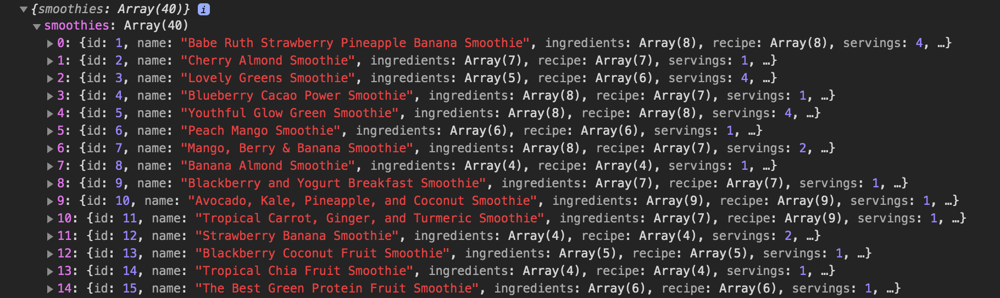
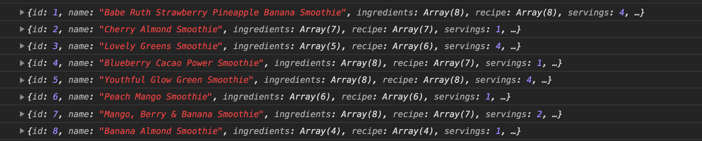

## Learning Goals

* Make fetch requests to get data from JSON APIs
* Append fetched data to the DOM

## Technical Vocabulary

- interface
- JSON
- API (Application Programming Interface)
- request
- response

## Why Fetch?

Up until now, we've built web applications either with data we wrote or using data that the user inputs. Many times, applications **interface** with other applications or data sets to provide the user everything they need!

Have you ever thought about how the weather app gets the data that it presents to you? There are tons of weather apps out there, and most of them present the same data to the user. Fetching data from a **JSON API** is a common task of a front-end developer. Let's break this term down:

- **JSON**: We worked with JSON in local storage. JSON is a standard for formatting data, and allows programmers working in various languages to read/write the same data.
- **API**: API stands for Application Programming Interface. It's a program written by someone else with data or functionality that can be included in various apps.
- **JSON API**: We can think of a JSON API as a source of information. We can access a JSON API and bring that information into our app, formatting and presenting it any way we'd like. There are JSON APIs out there for just about every topic. Here are just a few examples:

  - [Cat Facts]()
  - [NASA]()
  - [Tacos]()
  - [Census.gov]()
  - [Universities list]()
  - [Star Wars]()
  - [Trivia (questions and answers)]()

It's especially helpful to use a JSON API when your data is ever-changing - like the weather. It's also helpful when you want to provide your user with a lot of data, but don't want to type or hard-code it all into your site.

## Fetch API

To fetch information from a JSON API, we will use the **Fetch API**. It is something that is built into the browser that allows us to request information from JSON APIs! All it really requires of us is to provide it with a location (URL) to get the information from.

### Getting Data

Let's say we're trying to get a list of Cat Facts using the <a target="blank" href="http://www.catfact.info/">Cat Fact API</a>.

The fetch request would start with this line of code:

```javascript
fetch('http://www.catfact.info/api/v1/facts')
```

This line asks the browser to make a request for the JSON that is available at the URL inside the `('')`.

Now, if there is information there and we have permission to access it (which we do), it will return a `response.` The response won't be in a data format we can work with, so we need to write a line of code to get it into JSON:

```javascript
fetch('http://www.catfact.info/api/v1/facts')
  .then(response => response.json())
```

Let's break down this line:
- `.then()` - we can think of this as a function that will run once the browser has completed its job of fetching the data at the specified location.
- `response =>` - this is creating a new variable which holds whatever came through as the response. It's currently in a format that we can't use.
- `response.json()` - we call `.json()` on that response to convert it to JSON so we can work with it.

As of now, we are just assuming that there is data here, but we haven't seen it. Let's add a line to `console.log()` it to make sure we have something to work with.

```javascript
fetch('http://www.catfact.info/api/v1/facts')
  .then(response => response.json())
  .then(data => console.log(data))
```

Let's break down this new line of code:
- `.then()` - this runs once the `.then()` on the line above it completes.
- `data =>` - this is creating a new variable which holds the return value of the previous line.
- `console.log(data)` - will print out the value of that `data` variable.

When we run this, we should see something like this in the dev tools console:

```
> {page: 1, total: 1246, total_pages: 50, facts: Array(25)}
```

If we click on the arrow to the left of that object, then the arrow to the left of "facts", we'll see something like this:



Sure enough, we have data! Since we only want the facts, we can use dot notation to access the facts from that data:

```javascript
fetch('http://www.catfact.info/api/v1/facts')
  .then(response => response.json())
  .then(data => console.log(data.facts))
```

<div class="try-it">
  <h2>Try It: Print Data to the console</h2>
  <p>In your terminal, create a project called "fetch-request", and create <code class="try-it-code">index.html</code> and <code class="try-it-code">index.js</code> files. Make sure your HTML has a script tag for both jQuery and your JavaScript file.</p>
  <p>Now, write a fetch request to this url: <code class="try-it-code">https://opentdb.com/api.php?amount=10</code>. Get something from the response to print to the console!</p>
</div>

### Presenting Data

We have the data, now it's time to present it to the user, or `render` the data to the DOM. We've appended data that the user typed in many times before - so this isn't anything new!

We will add one more line of code, giving our app directions to call a function that hasn't yet been written:

```javascript
fetch('http://www.catfact.info/api/v1/facts')
  .then(response => response.json())
  .then(data => data.facts)
  .then(facts => appendFacts(facts))
```

Let's break down this last line:
- `.then()` - this runs once the `.then()` on the line above it completes.
- `facts =>` - this is the return value of the previous line, the array of fact objects.
- `appendFacts(facts)` - this calls a function names `appendFacts`, which will we write soon.

When we run this code, the fetch request will be made, the data will be converted, and then it will error out because the `appendFacts` function doesn't yet exist. Below our fetch, let's write that function:

```javascript
function appendFacts(facts) {
  facts.forEach(function(fact) {
    console.log(fact);
  })
}
```

Inside of `appendFacts`, we iterate over the `facts` array that was passed in as an argument, then print each fact to the console. When we run this code, we should see something like this:



Notice that each fact object is printed on it's own line, telling us we had a separate `console.log()` for each fact in the array. We're about the remove the `console.log()` statement, but it's always good to check on the data you have at each step along the process.

Lets refactor the `appendFacts` function so it actually appends each fact to the DOM:

```javascript
function appendFacts(facts) {
  facts.forEach(function(fact) {
    $('article').append(`<p>${fact.details}</p>`)
  })
}
```

Now, we should see each fact in the browser! We did it!

<div class="try-it">
  <h2>Try It: Append Data to DOM</h2>
  <p>Refactor your fetch request and write another function so that each of the trivia <em>questions</em> is rendered to the DOM.</p>
</div>

### Styling New Data

Remember, we can also add classes and IDs to the HTML element we append. Here's an example:

```javascript
function appendFacts(facts) {
  facts.forEach(function(fact) {
    $('article').append(`<p class="cat-fact">${fact.details}</p>`)
  })
}
```

```css
.cat-fact {
  background-color: teal;
}
```

<div class="practice">
  <h2>Practice: Fetch Requests</h2>
  <p>Visit <a target="blank" href="https://hedgehog-party.herokuapp.com/api/v1/invites">this site</a> to view the JSON data you will be fetching.</p>
  <p>Now, create a new directory called "hedgehog-party". Write the code you need to to append all the names of the hedgehogs attending the party! You will use the same URL as the site you visited for your fetch request.</p>
  <p>Finished Early? Feel free to jazz up your page with some fun styles and images of hedgies!</p>
</div>
