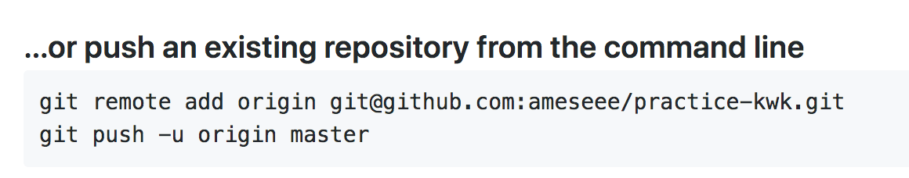
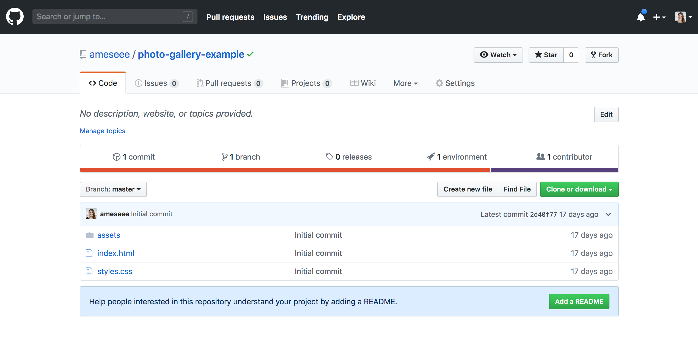

## Learning Goals

* Use terminal to navigate to a project & use version control
* Create a GitHub repository and push local code to it
* Deploy a project to GitHub Pages

## Technical Vocabulary

- Git
- version control
- terminal
- GitHub
- local repository
- remote repository
- deploy

## Version Control

Have you ever used GoogleDocs? Have you noticed the feature where you can save as you go, then look back and see when changes were made and who made them? That's what version control does for our code.

**Version control** is a tool that keeps track of the differences in code bases at different points in time. One common software for this is called **git**. We interact with git from the **terminal**. These are tools that all professional developers use.

## Git/Local Repository

The git commands work similar in the terminal. When we work with a project on our machine, we are working on the **local** repository. Local refers to being physically here, on this machine. Here are the main commands we will use at camp:

- `git init` - creates a git project; this is only used once per project
- `git add .` - this stages your work to be committed
- `git commit -m "Message about your work"` - this commits your work to the project's history
- `git status` - this gives you information about your project, tells you if you have any changes to add or commit

  <h2>Try It: Local Repository</h2>
  
In your terminal, <code class="try-it-code">cd</code> into your "responsive-design" directory and run <code class="try-it-code">git init</code>.

  
Now, run <code class="try-it-code">git status</code> and read the output.

  
Run <code class="try-it-code">git add .</code>, then re-run <code class="try-it-code">git status</code> and read the output.

  
Run <code class="try-it-code">git commit -m "Initial commit"</code>, then re-run <code class="try-it-code">git status</code> and read the output.

## GitHub/Remote Repository

GitHub is the cloud version of Git. Even though you committed your work, only your computer knows about it. When code is shared on GitHub, you can share it with other developers, or access it from your computer at home. If you've ever used Microsoft Word - Word is like Git, and GoogleDogs is like GitHub. When our work is on GitHub, it's called a **remote** repository.

Go to <a target="blank" href="https://github.com/">GitHub</a> and create an account.

When you are logged in to your account, click the plus sign at the top right corner of the page, and select "New repository". In the repository name field, type in "responsive-design". Click "Create repository".

What we've done is create a repository on GitHub named the same thing as our local repository. We now need to get them to know about each other so they can both have all your code.

You now see a page with three options. Look to the section that looks like this:

Copy that first line, then paste it into your terminal (you should still be in the responsive-design directory while doing this). Now, copy and paste in the second line.

Go back to GitHub and refresh the browser. The page should change quite a bit, you should see something more like this:

## GitHub Pages

Now we get to **deploy**, or creating a spot for it on the internet - where anyone can access, our site! Now, maybe your responsive-design practice work isn't the thing you really want on the internet. That's ok, we are doing this for practice and can take it down later if you'd like.

On the responsive-design repository page in GitHub, click Settings. Scroll down until you see the header "GitHub Pages". From the "Source" dropdown, select master branch. The page should refresh, scroll back down and you will see either a blue or green bar above that dropdown, and a link. That link is your website!

If you click that link and get a 404 page, just give it some time. It sometimes takes up to an hour to get all setup, sometimes it works in less than 5 minutes.

  <h2>Practice: GitHub Pages</h2>
  
Create a local git repository for your Photo Gallery. Then create a GitHub/remote repository for your Photo Gallery. Follow the steps to link those two together. Now, set up a GitHub Pages site.

  
If you aren't finished with your project, please remember that you will have to save those changes with git, then send those updates back up to GitHub using the following commands:

  <ul>
    <li><code class="practice-code">git add .</code></li>
    <li><code class="practice-code">git commit -m "Info about the changes you made"</code></li>
    <li><code class="practice-code">git push</code></li>
  </ul>

