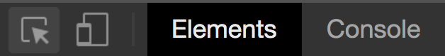

## Learning Goals

* Understand the structure of an HTML document
* Write a full HTML document and run in the browser
* Navigate the Elements tab of the Chrome Developer Tools
* Use the Atom text editor

## Technical Vocabulary

- HTML
- HTML Element
- Developer Tools
- Text Editor

## Required Structure of HTML

Every page that is built with HTML needs to have the four same elements to start:

* `<!DOCTYPE html>` declaration: The doctype declaration is not an HTML tag, but rather tells the browser which version of HTML the page is written in
* `<html></html>` tag wraps the entire document
* `<head></head>` tag wraps elements that shouldn’t be rendered: information about the page and how to process it
* `<body></body>` tag wraps elements that should be displayed: the actual content

You may have noticed use of the body tag during our first HTML lesson, but the others may seem new. We didn't need them in CodePen because CodePen has some special things built-in for people like us, who are just playing around with code to get the hang of it or build a small project, but aren't planning to send the code to production.

From now on, all of our HTML documents will require the four elements listed above.

## Inspecting HTML

Browsers have what are called **developer tools** that allow developers like us to look at the code at the same time we are looking at the result! It is incredibly helpful when working on HTML, CSS, and even JavaScript. All browsers tools are a little different, and Chromes are known for being the best, so we will all use Google Chrome as our browser for consistency.

Open up your browser to this lesson. Then, click `cmd + option + i` _or_ right-click, then select "Inspect". Your developer tools will open, blocking your view from a portion of the site. That's ok!

  <h2>Get Set Up: Dev Tools</h2>
  
You can have your dev tools on the bottom or either side of the window. Most people keep it at the bottom. If you'd like to change where the dev tools are, click the three-dot icon in the top right of the tools, then select one of the other "Dock side" options.

  
You can also control how much of the page the dev tools take up. Developers usually change this while working - sometimes you'll need to see more of the page, sometimes you'll want more space for the tools. Make sure you know how to expand and compact the dev tools!

  
Lastly, you can view your dev tools in dark mode or light mode. They usually default to light mode. If you'd like to change, click the three-dot icon in the top right of the tools, then select settings. Under Preferences, then Appearances, you'll see a drop-down for Theme. It's not recommended that you make any other changes on this page.

  
Pro-Tip: You can leave the dev tools by clicking the <code class="try-it-code">x</code> in the top right corner _or_ by using the same shortcut to open them, <code class="try-it-code">cmd + option + i.</code>

Let's practice our dev tool skills by exploring a live site!

Go to `www.kodewithklossy.com` and open your dev tools. Make sure that the "Elements" tab is selected. "Elements" is referring to the HTML elements that make up this page!

Change ^^ KWK to EL site.

You can toggle the arrow button in the top left corner of the dev tools. When it is highlighted blue, it is in select/inspect mode. Click it, then move your mouse over the site. You'll notice different sections of the page get highlighted in various colors. Click the button again, move your mouse over the page, and it's back to normal. This will be a tool we use a lot.

Either watch this video, or watch your instructor model some of the awesome features of the dev tools!

Make a video for teachers and tell them to model here. They should use dev tools to select an item and read the HTML. They should discuss classes/IDs on elements. They should show how the classes and IDs are denoted and color-coded when you hover over an element. They should show how you can use cmd++ to zoom in or cmd+- to zoom out. They should show changing content inside the tags and seeing it reflect in browser. They should warn that if you refresh, all your changes disappear. Maybe even make the video student-facing so it's here as a resource???

  <h2>Try It: Dev Tools</h2>
  
Specific instructions for inspecting Estee Lauder sites.

  
Things like, find the H2. What type of element is ____? What class is on the h1? Change ___ to whatever words you want!

  
<code class="try-it-code"></code>

## Text Editors

Code, just like the code you've written here at Kode With Klossy, is running in the browser all the time. Up until now, we've been writing in a CodePen, where we can type code and immediately see the result on the same screen. For production-level sites and apps, developers use tools bigger than CodePen.

We will used a tool called Atom which is a **text editor**. It's an application that will allow us to create code files for any programming language. It does things like highlight our code with specific colors to it's easier to read, provide line numbers on the left-hand-side so it's easy to find errors and communicate with others about our code, and more!

Let's go ahead and create an HTML file and open in Atom.

  <h2>Get Set Up: Atom</h2>
  
Press <code class="try-it-code">cmd + space</code> to open the spotlight search feature on your computer. Type in "finder", and press <code class="try-it-code">enter/return</code>.

  
In the finder application, click on "Desktop". Then, right-click in the empty area to the right, and select "New Folder". Rename the untitled folder to "html-in-atom".

  
Then, open the Atom Application. Click "File", select "Open", then find your "html-in-atom" folder. Atom should open and you should see a blank, black screen.

  
Now, right-click on the very small "html-in-atom" in the top left corner, and select "New File". A small black box will pop up at the top-middle of your screen, type in "index.html", then press <code class="try-it-code">enter/return</code>. You should see a file under your folder now. If you don't press <code class="try-it-code">enter/return</code> or click out of that little black box, the file will not be created!

## Running HTML in the Browser

There are a few steps we will need to take every time we get started on a project. Watch the video, or your instructor, walk through them.

teacher model/walk through together/video on basic HTML set up with an H1, then using finder to click open index.html, seeing in browser.//Adding a title in the head element//adding some more content

  <h2>Try It: Running HTML in the Broswer</h2>
  
Write an HTML document in your <code class="try-it-code">index.html</code> file. Include a title in the head tag, and an <code class="try-it-code">h1</code> and a <code class="try-it-code">list</code> in the body.

  
Open your <code class="try-it-code">index.js</code> file in Chrome.

## Linking Stylesheets & Google Fonts

As you continue developing, you'll learn that computers don't make any assumptions; they sit around and wait for very specific directions. If we want styles from CSS to be applied to our HTML elements, we have to tell the computer which CSS styles go with which document. We do this using a `link` element inside of the `head` in the HTML document.

Teacher model/Video: make a CSS file, see that it doesn't automatically work; link in HTML, the show that it now works. Now add Google Font, apply to styles

  <h2>Try It: Linking Stylesheets</h2>
  
Create a new file called <code class="try-it-code">styles.css</code> in your "html-in-atom" folder.

  
Add a link tag in your HTML so your document knows about the stylesheet.

  
Write a CSS rules on one of your elements, then check that the changes are reflected in the browser. You may need to refresh (<code class="try-it-code">cmd + r</code>) to see the changes.

  
Now, find a font on <a href="https://fonts.google.com/">Google Fonts</a>, add the link to your HTML, and apply that font with a CSS rule. Check that the changes are reflected in the browser!

