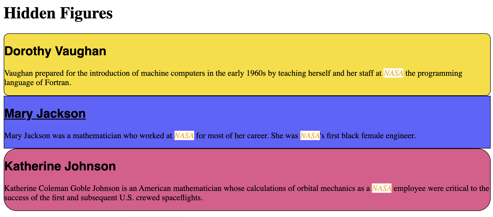
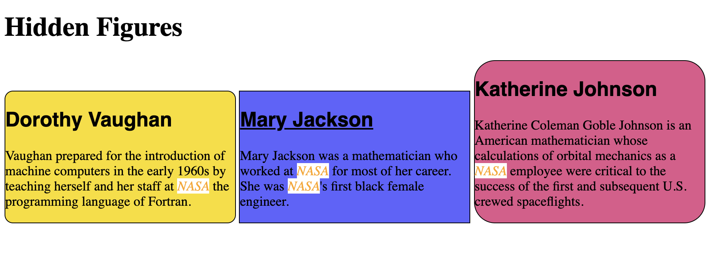

## Learning Goals

* Understand and implement nesting with HTML elements
* Identify and use container elements

## Technical Vocabulary

- HTML
- HTML Element
- Container Elements
- Nest
- Wrap
- Attribute
- Class

## Warm Up


## Intro

A lot of the content in this lesson will feel really connected to CSS. In fact, we will reference CSS several times and need to use it a couple times!

The reason for this is that as we begin to build more professional looking sites, we have to understand the relationship between HTML and CSS, and how they can work together. We can't learn much about either of them without talking about both.

## Nesting Elements

In most HTML documents, we will see **nesting**. This means that one (or more) elements will live inside of another element.

One common example is when you see one word within a paragraph that is a link. To aid in formatting pages (which we will go into more in our next CSS lesson), we can use **container** elements. Their job is to hold a group of elements together. The Turn & Talk box below is made with a container element! Inside of it is an `h2` and several `p` tags.

<div class="try-it">
  <h2>Turn & Talk</h2>
  <p>Read through the two code snippets below, then talk with your partner about both, including answers to these questions:</p>
  <p>In the first code snippet, which element is nested inside of the <code class="try-it-code">nav</code>? Why do you think the author of this code decided to use nesting?</p>
  <p>In the second code snippet, which element is wrapped around other elements? What do you think the author decided to indent all of the nested elements they way they did? What do you imagine <code class="try-it-code">nav</code> stands for/does?</p>
</div>

```html
<p>“Don't let anyone rob you of your imagination, your creativity, or your curiosity. It's your place in the world; it's your life. Go on and do all you can with it, and make it the life you want to live.”  - <a href="https://www.space.com/17169-mae-jemison-biography.html">Mae Jemison<a>, first African American woman astronaut in space</p>
```

```html
<nav>
  <h1>Author Finder</h1>
  <p>Search for your favorite author:</p>
  <input placeholder="Author Name"/>
  <button>Go!</button>
</nav>
```

There are two words you'll hear in regards to nesting: **nest** and **wrap**.

In the second example, the `nav` element _is wrapping_ the `h1`, `p`, `input`, and `button` elements. You could also say that the `h1`, `p`, `input`, and `button` elements _are nested in_ the `nav` element.

It's also important to point out the use of indentation in the example above. Since `nav` is the parent, or wrapping element, it is not indented at all. Every element nested inside of it is indented one tab. The HTML will _work_ even if indentation is not used; but it makes it much more readable for you and others.

<div class="try-it">
  <h2>Try It: Nesting Elements</h2>
  <p>Let's open a new pen in CodePen and follow these steps!</p>
  <ul>
    <li>First, write an empty <code class="try-it-code">div</code> tag.</li>
    <li>Inside of the div tag, write 2-3 paragraphs.</li>
    <li>Outside of the div tag, write one more paragraph.</li>
    <li>In CSS, add a border to the div element. (If you forgot the syntax, <a href="https://css-tricks.com/almanac/properties/b/border/">check this out</a>.</li>
    <li>Check your indentation - the div and last paragraph should not be indented at all, but the paragraphs nested inside the div should be indented once.</li>
  </ul>

  <p><em>Why did we use CSS in an HTML lesson? Sometimes CSS, especially the border property, can help us see how HTML code, particularly a container element, is working.</em></p>
</div>

<p class="to-do">great spot for sponsor integration, reference something on their site?</p>

In the Try It above, you used a `div` element for the first time. You'll be seeing this more and more! `div` is an element that is used to contain other elements.

Other container elements we can use:
- `nav`
- `header`
- `section`
- `aside`
- `footer`

For all the container elements listed above, they behave the same as a `div`. They just hold other elements and keep them contained. We _should_ use them only when appropriate - but there isn't a right or wrong as to how to use them. Two sites could look exactly the same, but the code that created them could look quite different!

<div class="try-it">
  <h2>Turn & Talk: Container Elements</h2>
  <p>What type of content, do you predict, would be appropriate to be contained in each of the elements listed above?</p>
  <p>With your partner, visit the landing page for <a href="https://www.spotify.com/us/">Spotify</a>, and answer these questions:</p>
  <ul>
    <li>What information is in the header/nav?</li>
    <li>Is there a footer? What type of information is in it?</li>
    <li>Besides header and footer, in what other places do you think the developers of this page probably used a container element?</li>
  </ul>
</div>

## Block vs. Inline Elements

You might notice that some elements behave a little differently in a layout than others. Some elements make content stack, while others let content sit next to each other. What’s that about?

This is an important difference:

* **Block elements** stack on top of each other. Each one starts and ends on its own line.
* **Inline elements** can be used to mark up a few words inside of a block element.

Most elements are block elements. When you write two paragraph, `<p>`, elements in your HTML file, they will show up on different lines, right? That is because they are block elements. Other block elements we've worked with:

- `h1`
- `h2` (and `h3` - `h6`)
- `div`

Some common inline elements that are used:

- `a`
- `em`
- `strong`
- `button`
- `input`

When looking at the markup, you also notice that it’s common for inline elements to be written on the same line of code, nested inside of a parent element.

```html
<p>“Don't let anyone rob you of your imagination, your creativity, or your curiosity. It's your place in the world; it's your life. Go on and do all you can with it, and make it the life you want to live.”  - <a href="https://www.space.com/17169-mae-jemison-biography.html">Mae Jemison<a>, first African American woman astronaut in space</p>
```

<div class="try-it">
  <h2>See It To Believe It: Inline vs. Block</h2>
  <p>Let's take a couple minutes to see this in action, to make sure we have an understanding. Open <a href="https://codepen.io/turing-kwk/pen/LYEjaZY">this CodePen</a>, then click the "Fork" button in the top nav bar. This will create a copy of the CodePen to your account!</p>
  <ul>
    <li>In the CSS file, add a border of any color to the <code class="try-it-code">h1</code>.</li>
    <li>Element by element, add a border (use a different color for each one).</li>
  </ul>
  <p>When we introduced the <code class="try-it-code">border</code> property in the first lesson, we mentioned it was a helpful tool. This is what we were talking about! It's a great way to quickly check what space an element is actually taking up. A short title in an <code class="try-it-code">h1</code> element may look like it's only an inch or so wide, but it's actually taking up the entire width of the page!</p>
</div>

For now, we just need to know that some elements behave differently than others do. In our next CSS lesson, we will learn how to **change** the default behavior.

## Classes

Right now, we know how to style all of the paragraphs or all of the links on a page. But what if we only wanted to style a particular one? **Classes** will help us do that!

Earlier, we learned that an `img` tag has a `src` attribute. An **attribute** is an extra piece of information we can choose to attach to any HTML element. One common and handy attribute is **class**.

```html
<div>
  <h2 class="magenta-text">Sub Header</h2>
  <p class="magenta-text">Some text</p>
  <p class="blue-text underlined">Some more text</p>
  <p class="magenta-text">Some more text</p>
  <p class="black-text">Even more text</p>
</div>
```

A couple of things to note about **class** attributes:
- They are written inside of the opening tag of an element
- They can be used on ANY type of element
- An element can have more than one class
- As the developers writing the code, we get to decide the class name that is inside the quotes
- Class names should be in lower case. If the class name is more than one word, a dash `-` should be used instead of a space

### Why do we need classes?

Classes allow us to more specifically target an element with CSS. If we wanted to have many paragraphs on a page, some being black and some magenta, there's no way that this rule alone would do the job:

```css
p {
  color: magenta;
}
```

... or this:

```css
p {
  color: black;
}
```

... or this:

```css
p {
  color: usually black but sometimes magenta;
}
```

The browser needs really specific directions in order to show your content just how you want! So instead of only targeting elements by the element name, we can now target by class or ID. Here is the syntax:

```css
/* this rule will target ANY element with the class of "magenta-text" on it */
.magenta-text {
  color: magenta;
}

/* this rule will target ANY element with the class of "black-text" on it */
.black-text {
  color: black;
}

/* this rule will target ANY element with the ID of "special-text" on it */
#special-text {
  text-decoration: underline;
}
```

- Classes are targeted by using the `.`, then the class name defined on the HTML element
- IDs are targeted by using the `#`, then the ID name defined on the HTML element

<div class="try-it">
  <h2>Try It: Targeting with Classes & IDs</h2>
  <p>Create a new pen on your CodePen account.</p>
  <ul>
    <li>In the HTML file, write a <code class="try-it-code">section</code> element with at 4 <code class="try-it-code">paragraphs</code> nested inside of it.</li>
    <li>Give 3 of the 4 nested paragraphs the same class. Give the other paragraph a different class name.</li>
    <li>Give the <code class="try-it-code">section</code> an ID.</li>
    <li>In your CSS file, style the 3 paragraphs one way, and the other paragraph in a different way.</li>
    <li>Now, style the <code class="try-it-code">section</code> by targeting the ID instead of the element.</li>
  </ul>
</div>

### Class or ID?

You may be noticing that classes and IDs do essentially the same thing. They do! So, why do we have both?

Classes can be used by many elements. If you want several elements to share styles, they should all get the same class name. IDs should only be used by one single element.

You can think of them in terms of a common school situation:
- **Class:** The class all shares a teacher. That teachers name may be written in every single planner, or on the top of a paper that is submitted.
- **ID:** Every scholar has their own lunch number, or phone number, etc. that is unique to that ONE scholar. It should only be used for them.

At the end of the day, it won't mess anything up if you use the "wrong" one. If you aren't sure, it's good to default to using a class.

<div class="try-it">
  <h2>Practice</h2>
  <p>Create a new pen on your CodePen account. Work to re-create the screenshot pictured below. You'll need to use containers, classes, and/or IDs to achieve this. Feel free to use content and colors of your choice.</p>
  
  <br>
  <br>
  <br>
  <p><strong>Medium Challenge:</strong> We know that each container used for each mathematician is a block element. Do some research, and try to find a way that you can change these "rows" into "columns". Example below:</p>
  

  <p><strong>Spicy Challenge:</strong> Add a photo for each mathematician, and size each photo differently. You'll have to do some research as we have not covered how to do that yet.</p>
</div>
