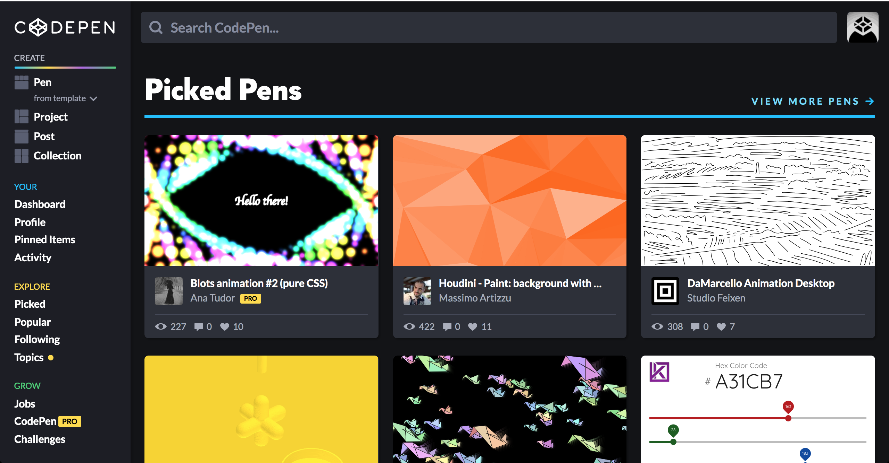
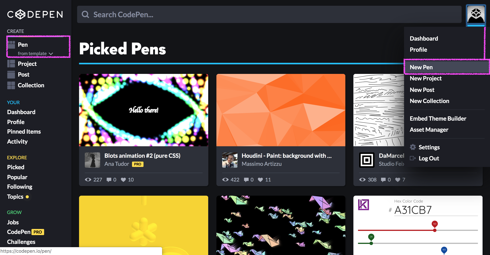
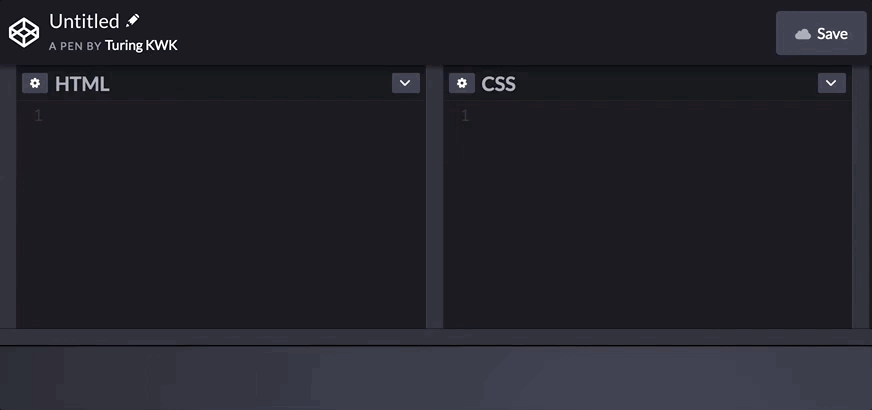
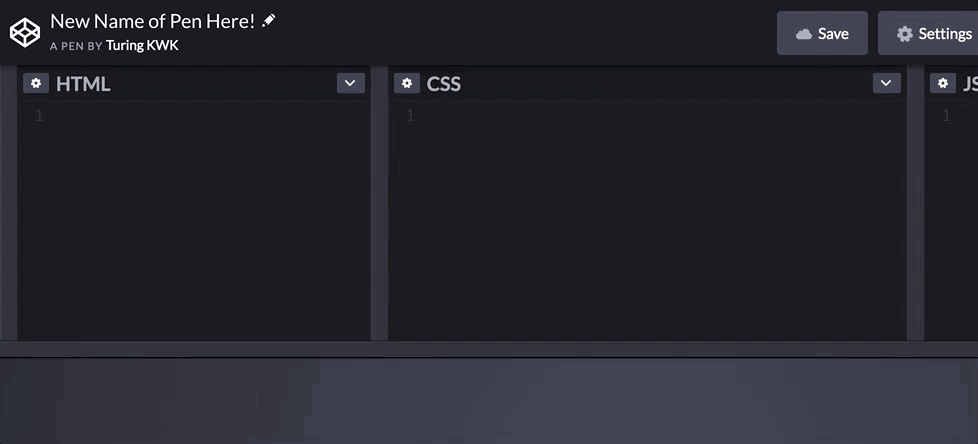
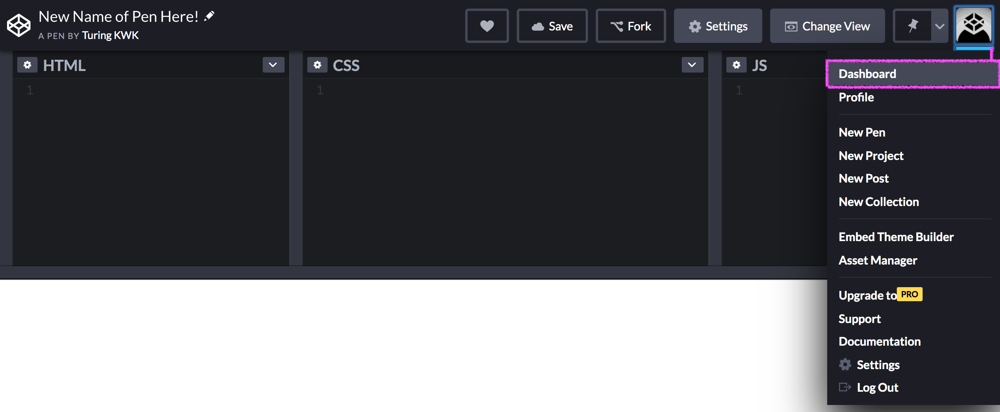

CodePen is an online tool, or playground, that developers use to write HTML, CSS, and JavaScript. It's convenient because you can share your code easily, and see the results of your code in the same window! We will be using this throughout camp.

## Create an Account

Visit <a href="https://codepen.io/">https://codepen.io/</a> and click Sign Up.

On the next screen, select the Free Plan by clicking the grey Sign Up button. You can then select to create you account with Twitter, GitHub, Facebook or your email address. Complete the prompts based on the method you selected to create the account, then log in.

## Navigating Your Account

Once you are logged in, you'll see a screen something like this:

The left side of the page has a nav bar with a lot of options, the middle of the page has a selection of really cool projects from other CodePen users, and in the top right corner you can access your account/profile.

### Creating a New Pen

A "Pen" is basically a small project. It's the only feature that we'll really use within CodePen.

From the main screen, there are two ways to create a new pen - by clicking "New Pen" on the left-side nav bar, or selecting your avatar in the top-right corner, then clicking "New Pen" from the drop-down.

### Navigating a Pen

Once you're in a pen, there are some key features you want to be aware of. First, how to name the Pen so that you can come back to it later. If you don't do this, CodePen will assign a random name to it, and it's just a little harder to look up.

Change the name of the pen by clicking the small pen icon in the top-left corner next to "Untitled", then type in the desired name of your pen. Then press enter/return.

It's also good to know that you can change the size of the entire code section as well as each of the HTML, CSS, and JavaScript sections by dragging the bar that separates each section.

Possibly the **most important** button on this page is **Save**. CodePen will autosave for you, but only after you click this button once. Even then, it's always better to be safe, so it's recommended that when you have some code you're happy with, to click **Save** to make 100% it's safe.

Notice that once this pen was saved, a few other buttons appeared. The heart icon let's you favorite pens, and we'll talk about "Fork" later.

## Viewing All Your Pens

If you'd like to browse all the work you've done, or look for a specific pen, start by going back to the dashboard:

On your dashboard, any pen that you have saved while logged into your account will appear. CodePen only displays 8 per page; click the "Next" button at the bottom of the page to view more.

To look at or edit a specific pen, click on it from the dashboard.

## Forking Pens

Throughout camp, your instructors will provide you with pens that already have some code, and ask you to modify it. The will provide you with a pen, then ask you to fork it. Forking means making a copy, and that copy will be saved to your account.

To fork a pen, you'll click the "Fork" button next to "Save". Then, you'll be able to edit (don't forget to click "Save"!) and have a copy of it for yourself!

If you go back to your dashboard, that forked pen will now appear! You can even fork your own pens.

## Google Fonts

Later, you'll learn how to incorporate Google Fonts into a project. If you ever want to incorporate one in a pen, it's a little different because we don't use the `<head>` element in HTML in CodePen. Instead, we'll click the gear/settings icon on the HTML Panel, and then copy and paste any `<link>` tags in the "Stuff for `<head>`" box.

