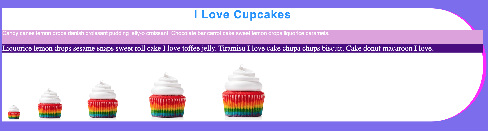

## Learning Goals

* Understand the basics of CSS
* Experiment with some of the major properties for both aesthetic
* Build a small static site and style our markup

**Note** - for the Try It and Practice sessions, you should be working in a CodePen Pen. You should have created an account in the Intro to HTML Lesson.

## Technical Vocabulary
* CSS
* CSS Property
* HTML Element
* id
* class

## What is CSS?

CSS stands for Cascading Style Sheets. It is a language that allows us to add styles to HTML documents on the web. It’s incredibly powerful!

Take a few minutes to check out the [CSS Zen Garden](http://www.csszengarden.com/). You'll notice that all of the sites here are created with the exact same HTML document, they were just styled differently with CSS.

## Styling Elements

In CSS, we write a set of rules for how our document should look. The browser evaluates those rules and styles the page accordingly. A CSS rule is defined as follows:


In the example above, the browser will set the color of any text element inside the `<body>` element. We can define multiple sets of properties and values in a given rule.

<div class="try-it">
  <h2>Try It: Add Some Color</h2>
  <p>In your CodePen, write an <code class="try-it-code">h1</code> and two <code class="try-it-code">p</code> elements, nested inside of a <code class="try-it-code">div</code>. Change the colors of your <code class="try-it-code">h1</code> and <code class="try-it-code">p</code>. Find a list of colors to use <a target="blank" href="http://colours.neilorangepeel.com/">here</a>. Now, add a <code class="try-it-code">background-color</code> to your <code class="try-it-code">div</code>.</p>
  <p>Finished Early? Do some google research on how to change the size of your text.</p>
</div>

## Classes

Right now, we know how to style all of the paragraphs or all of the links on a page. But what if we only wanted to style a particular one?

As it turns out, we can set a `class` attribute on an HTML element. The class attribute takes one or more words, separated by spaces. Typically we use classes to describe what kind of element we’re creating. For example, we might create a <p> element with the class of "sidebar" to denote that this is a particular kind of section on the page. We might also use classes to describe the kind of content inside of the element.

When we add classes, we make one change in the HTML and one change in the CSS:

```html
<h2 class="heading-main">Lorem Ipsum</h2>
```

```css
.heading-main {
  background-color: yellow;
}
```

This will look for every element — regardless of type — that has the class of `heading-main` and style it with a yellow background color.

Notice the syntax - when we were just targeting an `h2` element, we would just type `h2`. Since we are targeting a class, we have to be really specific in telling the computer how to do that - when it sees a `.` it will look for a class that matches the words following the `.`.

<div class="try-it">
  <h2>Try It: Add Classes</h2>
  <p>In your CodePen, apply a class to your div, and change your CSS to target the class instead of the <code class="try-it-code">div</code> element. Then, apply a class to <strong>one</strong> of your paragraph elements. Write a rule for that classes that changes the paragraph to a color you have not yet used.</p>
  <p>What happened to the paragraphs? Is that what you expected? Talk with your partner about why this may have behaved this way.</p>
</div>

## IDs

IDs add one more layer of complexity. On the surface, they look and behave a lot like our classes. IDs are really meant to only be used once. Classes can, and usually are, used mutliple time. Here's an example of an ID in action:

```html
<div>
  <p>Carrot cake cotton candy chocolate bar liquorice.</p>
  <p class="cupcake">Cupcake I love candy canes lemon drops gummi bears.</p>
  <p class="cupcake" id="best-cupcake">Cake icing cake dragée gummi bears.</p>
</div>
```

```css
p {
  color: magenta;
}

.cupcake {
  color: cyan;
}

#best-cupcake {
  color: darkslateblue;
}
```

<div class="try-it">
  <h2>Turn & Talk</h2>
  <p>Looking at the HTML and CSS above, what color do you predict each paragraph will appear?</p>
  <p>Based on what you know about the syntax for rules for classes, what do you think the syntax for ids is?</p>
</div>

## The Most Helpful CSS Property

You'll learn that there are many CSS properties out there that we can add to rules. You don't need to memorize the entire list; there are resources like [this](https://htmldog.com/references/css/properties/) which you can reference anytime you are coding. There are some common properties though, that you will find yourself using so often, that you know by heart.

One of the most helpful CSS properties to use while you are in the process of building a page is `border`. We will get into formatting in the next lesson, but the `border` property really helps you see what space a given element is taking up on the page. It also is sometimes something you want to add!

<div class="try-it">
  <h2>Try It: Borders</h2>
  <p>Building off your CodePen from when we added colors, add the property/value <code class="try-it-code">border: 1px solid you-choose-the-color;</code> to each rule in your CSS file.</p>
  <p>How much space is the <code class="try-it-code">h1</code> taking up? Does this surprise you? What if you wanted to put an h1 or image to the right of it? (We will discuss this as a group; if you're not sure, it's ok!)</p>
  <p>Now, add the property/value <code class="try-it-code">border-radius: 10px;</code> to your <code class="try-it-code">div</code>. What happens?</p>
  <p>This may not be the most <i>visually appealing</i> site as of now... but don't worry, we are learning the foundations to make something really beautiful!</p>
</div>

## Sizing Images

Many times, the photos we bring in will not be the exact size we want it to be for our site. We can use the `width` and `height` properties to handle this.

We will almost always want to preserve the ratio of the image, so we can give either a width or height, but usually don't give both. If you want to give both for some reason, you may need to apply the `object-fit` property. This might come in handy if you want to display a row of photos of the same height and width, but which all started off in various sizes.

<div class="try-it">
  <h2>Try It: Sizing Images</h2>
  <p>Open up a new CodePen. Find 3 photos from <a href="">Pexels</a> and create image tags for each of them in the new CodePen. Get a mix of images that are vertical and horizontal.</p>
  <p>Style the photos so they appear to be the same size, and make sure they aren't squished!</p>
  <p>What happens when you apply (or remove) the <code class="try-it-code">object-fit</code> property?</p>
</div>

## Other Commonly Used Properties

Like we talked about earlier, there is a plethora of CSS properties available to us! You don't have to know them all, but it's fun to explore what's out there. Here is a list of commonly used properties:

- font-size
- width/height
- text-align
- cursor
- box-shadow
- opacity
- border-bottom/border-top/border-right/border-left
- letter-spacing

<div class="practice">
  <h2>Practice: CSS Rules</h2>
  <p>Create a new CodePen for this set of practice.</p>
  <p>Your job is to re-create the site in the screen shot below. You can choose your own cupcake image and lorem ipsum!</p>
  <p>This isn't obvious from looking at the screen shot, but push yourself to use classes and IDs when it feels appropriate. Use <a target="blank" href="https://htmldog.com/references/css/properties/">this</a> as a reference for syntax examples for each property!</p>
  
</div>
