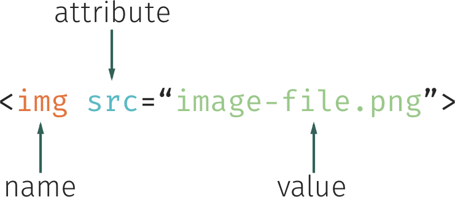

## Learning Goals

* Understand what HTML stands for and it's purpose
* Know how to build a site with text content, links, and images
* Understand and implement nesting with HTML elements

**Note** - for the Try It and Practice sessions, you should be working in a CodePen Pen.

## Technical Vocabulary

- HTML
- HTML Element
- HTML Tag
- Attribute
- Nesting

## Warm Up

In your notebook, jot down your answers. Then, we'll discuss as a class.
- What are you favorite websites?
- What is it about these websites that you like? The look of it? The functionality/purpose?

## Overview

Of all of the major technologies used on the web, on either the front- or the back- end, HTML is the oldest. In the beginning, the web was just a bunch of HTML documents that you wrote by hand. They had these cool things called hyperlinks that would allow a user to click on a word on one page and be taken to another page.

At the end of the day, HTML is made up two things: text, and **tags** that mark up that text. (HTML stands for hyper text markup language!)

Let’s say that we had some text and we wanted to communicate that this text was a paragraph.

```
This text is a paragraph.
```

We’d wrap the text in paragraph tags.

```html
<p>This text is a paragraph.</p>
```

You’ll notice that there are tags on both ends of the text. The entire code block above, the tags and text inside, make up an **HTML Element**.


We use `<p>` (the opening tag) to tell the browser that everything that’s about to follow is part of a paragraph and `</p>` (the closing tag) to tell the browser that this paragraph is done. When a user visits our site, the browser loads up the HTML and parses it into the elements that will eventually make up our user interface. The `p` stands for paragraph in this case. We can't make up tags - HTML is a language that provides a wide variety of tags that we must utilize.

Here is an example of a slightly more complex HTML document:

```html
<h1>Very Important Heading</h1>

<p>This is an introduction paragraph. Designers typically use "Lorem Ipsum" to fill out space in their designs while they wait for the real content. Lorem Ipsum looks kind of like Latin, but it's actually completely bogus. The nice part is that it has roughly the same distribution of word sizes as English.</p>

<h2>Lorem Ipsum Example</h2>

<p>Lorem ipsum dolor sit amet, consectetur adipisicing elit, sed do eiusmod tempor incididunt ut labore et dolore magna aliqua. Ut enim ad minim veniam, quis nostrud exercitation ullamco laboris nisi ut aliquip ex ea commodo consequat. Duis aute irure dolor in reprehenderit in voluptate velit esse cillum dolore eu fugiat nulla pariatur. Excepteur sint occaecat cupidatat non proident, sunt in culpa qui officia deserunt mollit anim id est laborum.</p>
```

<div class="try-it">
  <h2>Try It: Building a Basic Page</h2>
  <p>Use what you know about headings and paragraph tags to create at least three headings of any size (h1 - h6) and three paragraph elements in your CodePen. The topic is your choice!</p>
  <p>Need some filler text? Check out <a href="https://meettheipsums.com/">Meet the Ipsums.</a></p>
</div>

## Links

To add a link, we use the `<a>` tag. It has an opening and closing tag, and it utilizes attributes!

The `<a>` tag, like the `` tag, also has an attribute. Instead of `src`, we use `href` or hyper reference. The value of this attribute should be the web address, including http://, where you want the link to go.

For example:

```html
<a href="https://www.karliekloss.com/">Karlie Kloss</a>
```

<div class="try-it">
  <h2>Try It: Adding Links</h2>
  <p>In the same CodePen you started before, add a few links to your HTML.</p>
  <p>Want a challenge? Make an HTML list and add your links as list items.</p>
</div>

## Images and Attributes

We use HTML tags to “mark up” text to show its semantic meaning. The browser uses these tags to build up the document. Most tags have an opening and closing tag, but a few do not. For example, images (defined using the `` tag) do not have a closing tag.

Consider the following:

```html

```

There are two things happening here:

First, we have an `` tag that is somewhat unique in that it doesn’t have a closing tag like all of the others we’ve seen so far.

Second, our `` tag has extra information inside it!

- Our browser is more than happy to present an image, but it has to know which image we want to it present. That’s where the `src` attribute comes in. It tells the browser what the source of our image is - we give it a link (an address!) to the image we want to render.
- We also add the `alt` attribute contains text that identifies the image to a screen reader. The alt text is displayed if the picture can’t be displayed for some reason. It helps all users, not just those using screen readers!



<div class="try-it">
  <h2>Try It: Adding Images</h2>
  <p>Let's update our page in CodePen with two (or more!) images.</p>
  <p>First, copy and paste the code above into your CodePen. Does the image of Karlie appear on your site?</p>
  <p>Now, go to <a href="https://unsplash.com/">Unsplash</a>, <a href="https://www.pexels.com/">Pexels</a>, or Google and find an image you'd like to use. Right-click it, then select "Copy Image Address". In your HTML, write an image tag, then use <code class="try-it-code">cmd + v</code> to paste the image address in.</p>
</div>

## Nesting Elements

In most HTML documents, we will see **nesting**. This means that one (or more) elements will live inside of another element.

One common example is when you see one word within a paragraph that is a link. To aid in formatting pages (which we will go into more tomorrow), we can use **container** elements. Their job is to hold a group of elements together. Two examples are below.

<div class="try-it">
  <h2>Turn & Talk</h2>
  <p>Read through the two code snippets below, then talk with your partner about both, including answers to these questions:</p>
  <p>In the first code snippet, which element is nested inside of the <code class="try-it-code">nav</code>? Why do you think the author of this code decided to use nesting?</p>
  <p>In the second code snippet, which element is wrapped around other elements? What do you think the author decided to indent all of the nested elements they way they did? What do you imagine <code class="try-it-code">nav</code> stands for/does?</p>
</div>

```html
<p>“Don't let anyone rob you of your imagination, your creativity, or your curiosity. It's your place in the world; it's your life. Go on and do all you can with it, and make it the life you want to live.”  - <a href="https://www.space.com/17169-mae-jemison-biography.html">Mae Jemison<a>, first African American woman astronaut in space</p>
```

```html
<nav>
  <h1>Author Finder</h1>
  <p>Search for your favorite author:</p>
  <input placeholder="Author Name"/>
  <button>Go!</button>
</nav>
```

There are two words you'll hear in regards to nesting - nest and wrap.

In the second example, the `nav` element is wrapping the `h1`, `p`, `input`, and `button` elements. You could also say that the `h1`, `p`, `input`, and `button` elements are nested in the `nav` element. Nesting is a concept you will see in CSS and JavaScript as well!

It's almost important to point out the use of indentation in the example above. Since `nav` is the parent, or wrapping, element, it is not indented at all. Every element nested inside of it is indented on tab. HTML will _run_ if indentation is not used; but it makes it much more readable for you and others.

<div class="try-it">
  <h2>Try It: Nesting Elements</h2>
  <p>Let's update your CodePen!</p>
  <p>First, wrap a <code class="try-it-code">body</code> tag around all of your code.</p>
  <p>Then, in one of your existing paragraphs, change at least one word or phrase. Do some Google research on <code class="try-it-code">code</code>, <code class="try-it-code">em</code>, <code class="try-it-code">i</code>, <code class="try-it-code">small</code> or <code class="try-it-code">s</code> if you want to do something other than a link!</p>
</div>

In the Try It above, you used a `body` element for the first time. You'll be seeing this more and more.

Every HTML document has one `head` element and one `body` element. The `head` holds a lot of information about the site that the user won't see in the browser. The `body` wraps everything that the user does see in the browser. When we work in CodePen, we don't _have_ to use the `body` element, but it's good to know that it exists because we'll be seeing it later.

Let's put everything we've learned so far together by completing one last round of practice.

<div class="practice">
  <h2>Practice: HTML</h2>
  <p>If you'd like to save your work from class, save the pen in CodePen, then create a new one for this section.</p>
  <p>Using the unicorn lorem ipsum below (but selecting your own photo), recreate this site. The links can go to anywhere you'd like!</p>
  <p>Surprise pegasus surprise app pop pigeon delight. Unicorn unicorn wereunicorn pegasus pigeon delight pop social social. Pony pop pony, kittens kittens pigeon pony puppy unicorn pegasus pigeon. Social wereunicorn kittens app kittens delight delight pony, delight rainbows surprise social app. Surprise social delight unicorn kittens unicorn pony pop rainbows.</p>
  <br>
  
</div>
