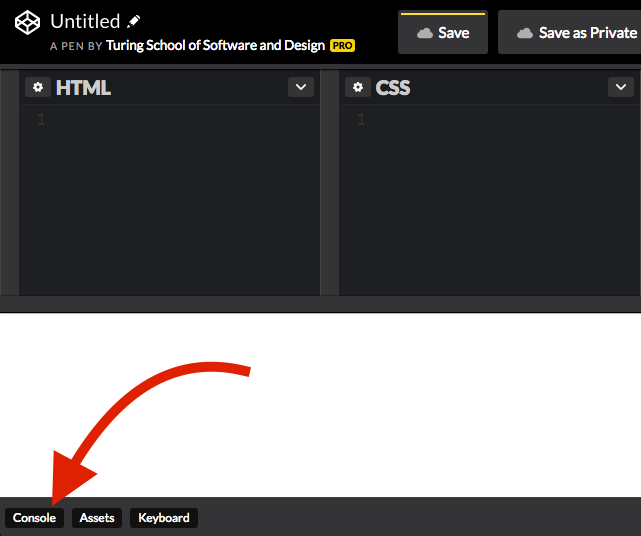

## Learning Goals

* Use variables to store strings and numbers
* User comparison operators to compare variables, strings, and numbers
* Write and understand conditional logic

**Note**: For this class, we will only be working in CodePen.

## Technical Vocabulary

- variable
- string
- interpolation
- operators
- conditionals

## What is JavaScript?

JavaScript is the language of the internet. It is commonly confused with [Java](https://www.seguetech.com/java-vs-javascript-difference/), but they are two very different languages. As of now, we can build very good looking sites, but they don't _do_ much. JavaScript is what allows our pages to be dynamic - show your name in the top corner to indicate you are signed in, change information on the screen based on what you type in a form, etc.

If we compare a web app to a human body, we can think of HTML as a skeleton, CSS as clothes and accessories, and JavaScript as the muscle.

## Strings

You can think of strings as a series of characters (alpha, numeric, spaces, and special characters) between two quote marks, like so:

```js
'hello, world!'
```

In JavaScript, strings can be either double quoted (“like this”) or single quoted (‘like this’).

In order to experiment with strings, we’ll click on the console button in CodePen:



<div class="try-it">
  <h2>Try It: Strings</h2>
  <p>In your CodePen console, type <code class="try-it-code">"your name"</code>.</p>
  <p>Now, type <code class="try-it-code">"your name".length</code>. (Instead of the words "your name", type your actual name).</p>
  <p>What printed as the output? Check with your neighbor - did you get the same thing? What does <code class="try-it-code">.length</code> do?</p>
</div>

## `console.log()`

Right now, we can see the strings we type in when we hit enter. However, we won’t always be writing our code in the console, so let’s move to a more realistic way of writing our JavaScript.

Keep the console open, but in the JavaScript editor tab on Codepen, type the following:

```js
console.log('hello, world!');
```

You should see "hello, world!" appear in the console. This isn’t super exciting right now, but let’s build on it.

## Variables

In most programming languages, including JavaScript, you can save values to variables. Unlike in math class, where we would use x or y and a number, variables in programming are much more flexible. For example, here are three variables, each of which has a string as its value.

```js
var name = "Beyonce";
var firstHit = "Crazy In Love";
var documentary = "Homecoming";
```

To define a variable, we use the `var` keyword followed by an arbitrary name we choose for the variable. Notice that all of the variables start with a lowercase letter. If you are choosing a variable name that has two words, uppercase the first letter of the second word. This is called camelCase.

After naming the variable, we use the `=` sign to show what value the variable will hold.

We can now `console.log()` any of these variables we have defined. The example below defines three variables, but only one will be logged to the console.

```js
var name = "Beyonce";
var firstHit = "Crazy In Love";
var documentary = "Homecoming";

console.log(name);
```

We can also include variable data in a sentence. This is called **interpolation**:

```js
console.log(`The first ${name} hit was ${firstHit}.`);
//=> The first Beyonce hit was Crazy In Love.
```

Make sure to use the back-ticks when you are using string interpolation (to the left of the 1 on your keyboard); it will _not_ work with regular single or double quotes.

<div class="try-it">
  <h2>Try It: Strings and Variables</h2>
  <p>If you have the strings "Beyonce" and "Knowles" in the following variables:</p>
  <code class="try-it-code">var first = "Beyonce"</code><br>
  <code class="try-it-code">var last = "Knowles"</code>
  <p>Use string interpolation to complete the following:</p>
  <ul>
    <li>What code can you write to output the string "BeyonceKnowles"?</li>
    <li>What code can you write to output the string "KnowlesBeyonce"?</li>
    <li>What code can you write to output the string "Beyonce Knowles"?</li>
    <li>What code can you write to output the string "Knowles Beyonce Knowles Beyonce"?</li>
    <li>What code can you write to output the string "I love Beyonce"?</li>
  </ul>
</div>

## Numbers

Like we saw with strings above, we can also store numbers in variables.

```js
var kids = 3;
var numberOneAlbums = 6;
var age = 37.5;
```

We can also do math with numbers in JavaScript! The same math operators you are used to from class work here.

```js
3 + 5
//=> 8

12 / 2
//=> 6

(3 + 2) * 8
//=> 40
```

As you can see from the last example above, we can also use parenthesis and the Order of Operation holds true here as well.

## Operators

We can also compare values. The return value is a **boolean**, true or false.

```js
3 < 5
//=> true

4 >= 9
//=> false

7 == 7
//=> true

"hello" == "hello"
//-> true

"hello" == "Hello"
//-> false
```

We have some other helpful operators that may be newer to you. Look at each snippet of code and it's return value, then predict what the operator does.

```js
3 != 4
//=> true

5 != 5
//=> false

32 % 6
//=> 2

16 % 3
//=> 1
```

We can also use math on variables, if those variables hold numbers.

```js
var name = "Beyonce";
var formationStops = 49;
var perShowRate = 5.2; //million dollars

var formationEarnings = formationStops * perShowRate;

console.log(formationEarnings);
console.log(`${name} made $${formationEarnings} million for her 2016 Formation Tour.`);
//=> Beyonce made $254.8 million for her 2016 Formation Tour.
```

<div class="try-it">
  <h2>Try It: Numbers & Operators</h2>
  <p>Start with these numbers:</p>
  <code class="try-it-code">var a = 12</code><br>
  <code class="try-it-code">var b = 65</code><br>
  <code class="try-it-code">var c = 31</code><br>
  <code class="try-it-code">var d = 98</code>
  <p>Write code to find the average of these four numbers.</p><br>

  <p>Find the answer to this problem using JavaScript: Karina earns $10.25 per hour at her job at Express. If she worked 20 hours last week, how much should she get paid?</p>
  <p>Push It: Print out to the console a complete sentence with your answer to the problem about Karina's pay.</p>
</div>

## Conditionals

Just like in real life, programming is full of decisions. We usually make decisions based on our current state or mood.

A real life example:

Am I hungry?
Yes -> I'll eat
No -> I won't eat

A programming example:

Do you have an account?
Yes -> Please log in
No -> Please create an account

JavaScript, like most all languages, gives us a mechanism to ask those questions and provide different outcomes based on the answer:

```js
var queen = "Beyonce";

if (queen == "Beyonce") {
  console.log("You are correct!")
} else {
  console.log("Beyonce is the only queen.")
}
```

For the example above, "You are correct!" will print to the console. Let's break this down line-by-line.

```js
var queen = "Beyonce";          // new variable created

if (queen == "Beyonce") {       // program checks for this condition
                                // if it evaluates to true, it will execute this block
  console.log("You are correct!")
} else {                        // if it evaluates to false, it will execute this block
  console.log("Beyonce is the only queen.")
}
```

In the parenthesis after `if`, we have to give JavaScript something that can be evaluated to `true` or `false`. We call this an `if statement`. If it evaluates to `true`, the code in the block below it will execute, or run. It will ignore the rest of the options. If it evaluates to `false`, it will try the next block.

Sometimes we may want to provide more than two options. Look at the use of `else if`:

```js
var queen = "Beyonce";

if (queen == "Beyonce") {
  console.log("You are correct!")
} else if (queen == "Elizabeth II") {
  console.log("I guess you are technically right...")
} else {
  console.log("Beyonce is the only queen.")
}
```

<div class="try-it">
  <h2>Try It: Conditionals</h2>
  <p>Create a variable named <code class="try-it-code">favoriteFood</code> and assign it to a string of your favorite food.</p>
  <p>Write an if statement comparing your favorite to 'Chipotle', which if evaluated to true, prints out a sentence (you choose!)</p>
  <p>Write an else if statement comparing your favorite to 'Starbucks', which if evaluated to true, prints out a sentence (you choose!)</p>
  <p>Write another else if - you choose what you compare it to.</p>
  <p>Write an else statement that prints out a sentence of your choice.</p><br>
  <p>Try changing your <code class="try-it-code">favoriteFood</code> to Chipotle, then Starbucks (if it wasn't already). Do you get what you expected?</p>
</div>

## JavaScript

JavaScript is pretty different from HTML and CSS. There is a lot more going on, and for the things we are going to build, a lot more to learn. You've built the foundations today, and are on your way to building some awesome apps!

<div class="practice">
  <h2>Practice: JS Foundations</h2>
  <p>Write a program that checks a string. It should print to the console "even" if the number of characters in the text is even, and "odd" if the number of characters in the text is odd.</p>
</div>
