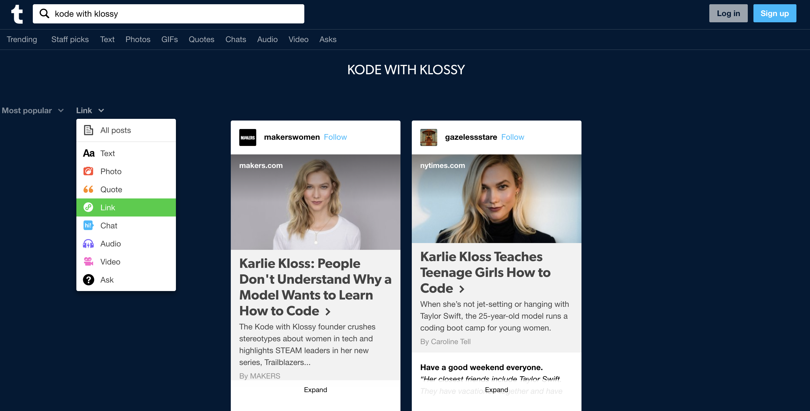

## Learning Goals

* Explain the concept of iteration
* Use JavaScript syntax to iterate over an array

## Technical Vocabulary

- Collection
- Array
- Element
- Index
- Iterate

## Warm Up


## Iteration

There are times when we want to repeat the same operation multiple times over a set of data. For us, sets of data are **arrays**. Iteration allow us to do that by running through the elements in an array, one by one, and then executing code for each element.

## Iterator Methods

In our Intro to Arrays lesson, you learned about the array methods `.push()` and `.pop()`. Today we will learn about another array method, `.forEach`. It is called an iterator method because its job is to run a function not only once, but one time **for each element** in the array.

## `forEach`

The benefit of loops is they save us time. When we want do to the same thing for lots of items, we only have to write that command once. If we didn’t use an array and use the `forEach` method, our code would look like this:

```js
var trending = ["@cosette", "@avani", "@lorengray", "@jamescharles"];

console.log(`Have you seen that TikTok from ${trending[0]} yet?!`);
console.log(`Have you seen that TikTok from ${trending[1]} yet?!`);
console.log(`Have you seen that TikTok from ${trending[2]} yet?!`);
console.log(`Have you seen that TikTok from ${trending[3]} yet?!`);
```

Right now, this doesn’t seem so bad. What if we had 100 creators on our list? 1000? That’s a lot of lines of code to write and a lot of places we would need to update it every time we added or removed a creator.

### Syntax

```javascript
var trending = ["@cosette", "@avani", "@lorengray", "@jamescharles"];

trending.forEach(function(creator) {
  console.log(creator);
});
```

<div class="try-it">
  <h2>Explore: <code class="try-it-code">forEach</code></h2>
  <p>With your partner, talk about what you think is happening on each line of the code above.</p>
  <p>Once you've made your predictions, type the code out in a CodePen and see what happens. Were your predictions accurate?</p>
</div>
<br>

Let's break this code down:
- `trending` is the array we are going to iterate over
- `.forEach()` is a built-in function that runs through each element of the array it is called on, one-by-one. It takes on argument, a function. This is different from anything we've seen before. It's saying it will run this function _for each_ element in the array.
- `function(creator) {` is the function that will run on each element in the array. If there are 10 elements in the array, it will run 10 times. 100 elements? 100 times. `creator` is the variable that represents the current element in the array that is being iterated over.
-  `console.log(creator)` is the code that will run for each element. In this case, each creators handle in the array will print to the console.

<div class="try-it">
  <h2>Try It: forEach</h2>
  <p>In a CodePen, write an array with at least four elements, strings, of things you want to learn.</p>
  <p>Write a <code class="try-it-code">forEach</code> for this array and print out "I want to learn ____" for each element.</p>
</div>

## Placeholders & Counters

Sometimes, when iterating over an array, our end goal won't be to do the exact same thing to each element. Sometimes we'll want to combine elements. Sometimes we'll want to filter through them and only use some of them.

Here's a real-life example: [Tumblr](https://www.tumblr.com/search/kode+with+klossy) has an array of posts related to each term. When we first search a term, we'll see all posts. If we select "Link" from the filter drop-down, we'll only see the two posts that are links.

How did Tumblr do that? They iterated over the array of **all** posts, checked each one for a piece of criteria, and put those that did meet the criteria in a placeholder. After it finished iterating, it returned the placeholder and displayed them in the browser.



Let's solve a slightly less involved challenge, but one that gets at the same idea. Our goal will be to take an array of numbers, and return an array of only the numbers from the original array that are greater than 10. One important thing to know about `forEach` is that it won't ever change the array it was called on.

```js
// start with an array of numbers
var numbers = [1, 4, 23, 14, 5, 7, 11, 6, 92];

// start a placeholder array that will eventually store numbers over 10
var largeNumbers = [];

// iterate over the array
numbers.forEach(function(number) {

});
```

In the code above, we set up our placeholder and our `forEach`. Now, we need to do some work inside the `forEach`.

```js
var numbers = [1, 4, 23, 14, 5, 7, 11, 6, 92];
var largeNumbers = [];

numbers.forEach(function(number) {
  // check if the current number being iterated over is greater than 10
  if (number > 10) {

  }
});
```

In the code above, we wrote a conditional to check the value of the current number against 10. Now, we need to write code inside that conditional.

```js
var numbers = [1, 4, 23, 14, 5, 7, 11, 6, 92];
var largeNumbers = [];

numbers.forEach(function(number) {
  if (number > 10) {
    // if the number is greater than 10
    // push it into the largeNumbers placeholder array
    largeNumbers.push(number);
  }
});
```

At this point, our `largeNumbers` array is holding all four numbers greater than 10, but we aren't ever printing it out, so it's hard to see that.

```js
var numbers = [1, 4, 23, 14, 5, 7, 11, 6, 92];
var largeNumbers = [];

numbers.forEach(function(number) {
  if (number > 10) {
    largeNumbers.push(number);
  }
});

console.log(numbers); // [1, 4, 23, 14, 5, 7, 11, 6, 92]
console.log(largeNumbers); // [23, 14, 11, 92]
```

<div class="try-it">
  <h2>Try It: Placeholders</h2>
  <p>In a CodePen, write an array that contains at least five strings and store it in a variable. You choose what the words are!</p>
  <p>Use <code class="try-it-code">forEach</code> to create a new array of the words from your original array than have less than 6 characters. Use <code class="try-it-code">console.log()</code> to verify your new array holds what you think it does.</p>
  <p><strong>Spicy Challenge:</strong> Declare a function called <code class="try-it-code">findLongestWord</code>. It should iterate over an array of strings. Your function should return one string, the string from the original array that had the greatest number of characters. If there is a tie for the greatest number of characters, return the last one that is in the array.</p>
</div>


## More Practice

At this point, you have the tools to do just about anything with an array! If you'd like more practice before moving on, check out the [Leveled Array Exercises](../js-array-exercises).
