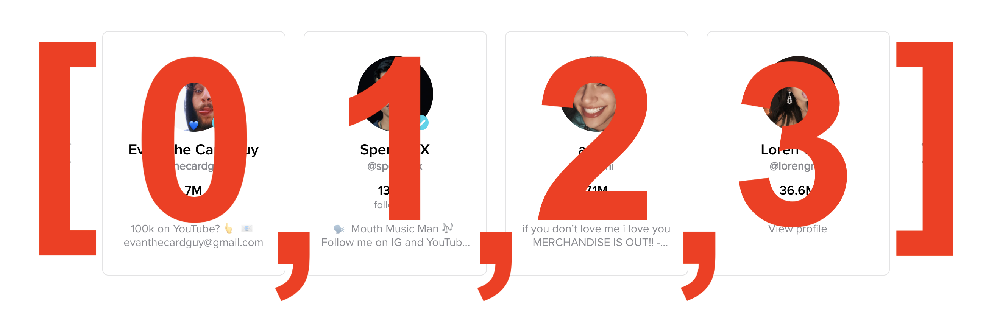

## Learning Goals

* Understand what an array is and why they are useful
* Use JavaScript syntax to declare and modify an array

## Technical Vocabulary

- Collection
- Array
- Element
- Index

## Warm Up

In a CodePen, declare a variable for every scholar in the room. The variable names should be something like `scholar1`, `scholar2`, etc. and the values should be strings of their first names.

## Collections

**Collections** are data types that hold _multiple things_ - think about your grandma’s cat statue collection - there is probably more than one, right?

In JavaScript, there are two types of collections: arrays and objects. In this lesson and during our time at camp, we will mainly focus on arrays.

## Arrays

An **array** is an ordered collection that stores multiple values. They are useful whenever you need to keep track of an ordered list of things. This is similar to how we keep track of lists in the real world. Think back to the Warm Up - if there are 15 or 20 scholars in the room, writing out a variable for each and every one can be time consuming. An array will allow us to store all scholar names in **one** variable!

An array can store any kind of element - from numbers to strings to ... other arrays. Usually, a single array holds a lot of items that are all of the _same type_.

<div class="try-it">
  <h2>Turn & Talk</h2>
  <p>Think about Instagram or TikTok - where might those applications use arrays?</p>
</div>

### Arrays IRL

It's very likely that every application you've used - on a phone or laptop - utilized arrays in the code that built it.

We can't see all the code that built every application, but there are some places where it's very clear that an array would be the best tool to use. Here are some examples from popular sites:

- [Instagram](https://www.instagram.com/alfie_the_alpaca_in_adelaide/) uses arrays to hold all the posts for a given user. Alfie the Alpaca has over 700 posts, so the array is over 700 elements long!
- [Twitch](https://www.twitch.tv/) has an array of recommended channels. They advertise these channels in the top left corner of their landing page.
- [TikTok](https://www.tiktok.com/discover?lang=en) has an array of trending creators stored in their program. TikTok shows the information of first four creators on the "Discover" page. When a user clicks the arrow to see more, TikTok shows the information of the second four trending creators, etc.


### Syntax

An array starts and ends with square brackets: `[]`. Each item inside of the array is called an **element**. Elements inside an array are separated by a comma. In almost all cases, we will store the arrays we write in variables.

```js
// An array of strings:
var trending = ["@thecardguy", "@spencerx", "@avani", "@lorengray"];

// An array of numbers:
var followers = [7, 13.8, 7.1, 36.6];
```

We can think of each user as an element in an array:


### Access an Element

Each element in an array is automatically assigned a number called an **index**. This index can be used to access a specific element inside the array. Indices begin at 0 and count up. If we look back at our `trending` array, the following would be true:

```js
var trending = ["@thecardguy", "@spencerx", "@avani", "@lorengray"];
```
- "@thecardguy" has an index of 0
- "@spencerx" has an index of 1
- "@avani" has an index of 2
- "@lorengray" has an index of 3

By using the square brackets, we can use the index to access a specific value in an array.

Thinking back to the visual representation of our array, here's the index of each element:



```js
var trending = ["@thecardguy", "@spencerx", "@avani", "@lorengray"];

trending[0];
//=> "@thecardguy"

trending[2];
//=> "@avani"
```

We can also check how many elements are in an array with the `.length` property:

```js
var trending = ["@thecardguy", "@spencerx", "@avani", "@lorengray"];
trending.length;
//=> 4
 ```

<div class="try-it">
  <h2>Try It: Creating Arrays</h2>
  <p>In a new CodePen, create a variable that stores an array of at least 4 strings - you choose what the content is about. The variable name should describe the type of data those 4 strings hold.</p>
  <p>Write a series of <code class="try-it-code">console.log()</code> or <code class="try-it-code">alert()</code> statements: print out the first element, the last element, and then the second element.</p>
</div>

### Updating Elements

We can also update elements with the square bracket syntax we looked at earlier. We access the index value that we would like to change, and then reassign a new value for that index with a `=`.

```js
var trending = ["@thecardguy", "@spencerx", "@avani", "@lorengray"];

trending[1] = "@cosette";

console.log(trending);
//=> ["@thecardguy", "@cosette", "@avani", "@lorengray"]
```

### Adding Elements

A common way to add something to an already existing array is to use the `push()` method which will add an element to the end of the array.

```js
var trending = ["@thecardguy", "@cosette", "@avani", "@lorengray"];

trending.push("@jamescharles");

console.log(trending);
//=> ["@thecardguy", "@cosette", "@avani", "@lorengray", "@jamescharles"]
```

In the code snippet above, `.push()` is called on the `trending` array. We give `.push()` an argument of the new element we want to be added on the array. In this case, it was the string of `@jamescharles`.

### Removing Elements

There are a few ways we can remove elements from an array. Most often, we either want to remove the first or last element. To do this, we have the `pop()` and `shift()` methods. Check it out:

```js
var trending = ["@thecardguy", "@cosette", "@avani", "@lorengray", "@jamescharles"];

trending.pop();

console.log(trending);
//=> ["@thecardguy", "@cosette", "@avani", "@lorengray"]
```

`pop()` was called on the `trending` array, and it removed the **last** element from the array.
<br>

_A little different from `.push()`, `.pop()` does not take arguments - it knows what to do: remove the last element from an array._

<div class="try-it">
  <h2>Try It: Modifying Arrays</h2>
  <p>For this, you will use the array you wrote in the previous Try It. </p>
  <p>Practice accessing specific elements. Make sure to <code class="try-it-code">console.log()</code> to verify you are accessing what you think you are.</p>
  <p>Now, add two new elements into your array. Use a <code class="try-it-code">console.log()</code> to make sure they have been added.</p>
  <p>Lastly, remove at least two elements from your array. Again, make sure they have been successfully removed by printing to the console.</p>
</div>

### Random Elements

Sometimes, we want to pull an element out of an array at random - have any of your teachers ever used popsicle sticks to decide who to call on? That's a real life example. We can do the same thing with programming!

JavaScript gives us a tool called `Math` to do advanced math, like square roots, logarithms, etc. Included in that are some options on how to use it. We've got:

- `Math.random()` - returns a random decimal between 0 and 1
- `Math.floor(number)` - returns the value of a number rounded down to the nearest integer

Let's work on generating a random number between 1 and 20.

First, generate a random decimal:

```js
var randomDecimal = Math.random();
//=> 0.5617898712887952 (this number will vary)
```

Now, let's multiply it by 20:

```js
var randomDecimal = Math.random();
//=> 0.5617898712887952 (this number will vary)

var random = randomDecimal * 20;
//=> 11.235797425775903
```

We still don't have a nice integer as expected, so let's round it down:

```js
var random = randomDecimal * 20;
//=> 11.235797425775903

var final = Math.floor(random);
//=> 11
```

Going back to `why would this be useful`? A teacher could have a program with an array of names, like this:

```js
var students = ["Leta", "Ellen Mary", "Pam", "Megan", "Amy", "Sarah", "Robyn", "Courtney", "Rachel", "Allison", "Ruby", "Maile", "Julie", "Meg", "Christie", "Emmie", "Aurora", "Tori", "Juliana", "Kerry"];
```

Now, the teacher can write a `pickStudent` function:

```js
function pickStudent() {
  var random = Math.random() * 20;
  var rounded = Math.floor(random);
  var student = students[rounded]; // note about how this work below!
  return student;
}

var randomStudent = pickStudent();
console.log(randomStudent);
//=> one random element from the array will print out
```

Instead of calling `students[0]` or `students[7]`, we called `students[rounded]`. Since we know that `rounded` is a variable that stores a number, the number it stores is substituted in for the variable name `rounded`, then the array looks for the element in that index.

<div class="try-it">
  <h2>Turn & Talk</h2>
  <p>Considering this section on selecting random elements from an array, answer the following questions with your partner:</p>
  <ul>
    <li>What does <code class-"try-it-code">Math.random()</code> do?</li>
    <li>Why did we choose to multiply <code class-"try-it-code">Math.random()</code> by 20 for this example?</li>
    <li>What does <code class-"try-it-code">Math.floor()</code> do?</li>
    <li>Why do we have to pass an argument, or put a number inside the parenthesis for <code class-"try-it-code">Math.floor()</code>?</li>
    <li>Is it possible for this function to ever return the same number? Why or why not?</li>
  </ul>
</div>

## Putting It All Together

Arrays are a type of collection that developers use on a daily basis. It's important to have an understanding of their job and the ability to create and identify them. However, keep in mind that even professional developers can't remember it all and have to use their resources!


<div class="practice">
  <h2>Practice: Arrays</h2>
  <p>Declare a variable called <code class="try-it-code">hobbies</code> that stores an array of your top five favorite accounts to follow on social media, in strings.</p>
  <ul>
    <li>Change the value of at least one of the elements in the array</li>
    <li>Add a new account to the array</li>
    <li>Remove the last account from the array</li>
    <li>Print the value of the third element of the array</li>
    <li>Change the value of another element in the array</li>
    <li>Add another account to the array</li>
    <li>Print the value of the first element of the array</li>
    <li>Print one account to the console, at random.</li>
  </ul>
  <p><strong>Spicy Challenge:</strong> Write a function that takes in one argument, a string. If the string is "happy", output a randomly generated sentence about being happy. If the string is "ok", output a randomly generated sentence about being ok. If the string is "sad", output a randomly generated sentence to cheer someone up. _You will need to use a function, conditional, multiple arrays, and have to generate a random number._</p>
</div>
