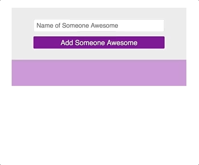

## Learning Goals

* Append multiple elements to the DOM to create a to-do list-like application
* Use DOM traversal to listen for events on dynamically created elements

## Technical Vocabulary

- Append
- Event
- Object

## DOM Manipulation

You've already come so far with implementing JavaScript to manipulate the DOM! In this lesson, we will take it to the next level. We are going to build a site that can take user input multiple times and keep adding each input to a list. This "To-Do List" is a very common app that developers use as they are learning a new language. Here's an example of something like what we will build by the end of this lesson:



The scale we are working at is small right now, but this type of functionality is essentially all over the internet. Some examples:
- On Twitter, when a user tweets, they then see a card with that information on it.
- On Google Calendar, when a user adds an event, a color-coded box appears on their calendar at the given time
- On TikTok, when a creator uploads a video, that video is added to the top of their list of videos

## `.append()`

jQuery gives us a function called `.append()`. If you google append, you'll see a definition:

```
verb
add (something) as an attachment or supplement.
```

The `.append()` function allows us to append a newly-created HTML element to an already-existing element. Here's an example of the syntax:

```html
<section class="container">
</section>
```

```javascript
var container = $('.container');
container.append(`<p>Hello!</p>`);
```

As you can see above, we have an empty `section` element in the HTML document. In JavaScript, we accessed that section element by its class. Let's break down the next line:

- `container` - the HTML section we accessed on the previous line
- `.append()` - this is being called on the `container`, so it's saying: I'd like you to attach something to the container.
- ``(`<p>Hello!</p>`)`` - this is the argument that `.append()` takes, wrapped in back-ticks, an HTML element. Whatever lives inside the back-ticks will be added into `innerHTML` of the container.

<div class="try-it">
  <h2>Check It Out: Basic Append</h2>
  <p>Fork <a href="https://codepen.io/turing-kwk/pen/rNaYNJo">this CodePen</a>.</p>
  <p>First, answer the following questions with your partner:</p>
  <ul>
    <li>If you compare the HTML to what you see in the browser, you'll notice that "Make coffee" and the other 2 to-dos are not in the HTML. What code got them to appear in the browser?</li>
    <li>Why did those three to-dos appear in the To Do List, and not in the Notes section?</li>
  </ul>
  <p>Now, to learn more about how <code class="try-it-code">.append()</code>, take the following steps to tinker with it:</p>
  <ul>
    <li>On line 5, delete the back ticks that enclose the paragraph that says <code class="try-it-code">Put laptop in backpack</code>. What happens? (When you're done exploring this, add the back ticks back in.)</li>
    <li>On line 6, change the <code class="try-it-code">p</code> tags to <code class="try-it-code">h3</code> tags. Does <code class="try-it-code">.append()</code> still work the same way? Try out a few different tags as well!</li>
    <li>Append 3 more to-dos to the bottom of the list.</li>
    <li>Append a paragraph that says "Shower!", but make sure that it shows up first on the list.</li>
    <li>Append at least 2 paragraphs tags to the Notes section.</li>
  </ul>
</div>

Takeaways:
- The three to-dos appeared in the To-Do section and not in the Notes section because `.append()` was called on the `list` variable, so the elements were added into that container.
- If back ticks aren't used to enclose the element you want to append, a) the element won't append and b) all code written below that line will not be able to run.
- We can append ANY type of HTML element!

## When to Append

This is great, but the append is happening right away, so it's not really helping us build a dynamic to-do list.

<div class="try-it">
  <h2>Turn & Talk: When to Append</h2>
  <p>With your partner, write out a list (pseudo-code) of things we want to the computer to do to make a working to-do list, in order. Include in the order: when the user would interact.</p>
</div>

We can't just append directly in our JavaScript file, or as we saw, that HTML is added immediately. We want to respond to our user with an event listener and handler. Here's a more realistic example, with a little more going on.

<p class="codepen" data-height="300" data-theme-id="36709" data-default-tab="css,result" data-user="turing-kwk" data-slug-hash="WWqjLp" style="height: 300px; box-sizing: border-box; display: flex; align-items: center; justify-content: center; border: 2px solid black; margin: 1em 0; padding: 1em;" data-pen-title="Check it Out: Append">
  <span>See the Pen <a href="https://codepen.io/turing-kwk/pen/WWqjLp/">
  Check it Out: Append</a> by Turing KWK (<a href="https://codepen.io/turing-kwk">@turing-kwk</a>)
  on <a href="https://codepen.io">CodePen</a>.</span>
</p>
<script async src="https://static.codepen.io/assets/embed/ei.js"></script>

Read through each line of the JavaScript; make sure to reference the HTML so you know which DOM element we are accessing.

<div class="try-it">
  <h2>Turn & Talk: Append</h2>
  <p>While referencing the CodePen above, answer these questions with your partner:</p>
  <ul>
    <li>What are the two steps that are taken inside the event listener?</li>
    <li>When a name is submitted, the card that it is displayed on has a white background. Where in the code was this style applied? How did the HTML element know about that style?</li>
    <li>Try to add another <code class="try-it-code">p</code> element inside the append. What happens when you add another name now?</li>
    <li>As a user, are there any changes you would like to be made to make this site more user-friendly?</li>
  </ul>
</div>

Inside the event handler, we took two important steps:
1. Get the information that the user typed in
2. Append that information (plus some of our own text) inside a `p` element to the `cardContainer`.

When we appended the `p` element, we wrote a class on it. The CSS file has a rule written for that class, so when the paragraph was appended, it came with styles already applied!

You may have noticed that multiple elements can be appended at the same time. Typically, we will see one `div` or other container, wrapping other elements with information, appended. It _could_ look something like this:

```javascript
function appendSomeoneAwesome() {
   var name = $('.name').val();
   var birthday = $('.birthday').val();

  cardContainer.append(`
    <div class="name-card">
      <p class="name">${name} is awesome!</p>
      <p class="birthday">Their birthday is ${birthday}.</p>
    </div>
  `);
}
```

The code above would append a `div` that contains two `p`s to the `cardContainer`.

<div class="try-it">
  <h2>Try It: Append</h2>
  <p>Fork <a href="https://codepen.io/turing-kwk/pen/rbEzOa">this CodePen</a> and write JavaScript so that the user can write a to-do list. A couple of commented out notes were provided to get you started!</p>
  <p><strong>Medium Challenge:</strong> As a user, it's kind of frustrating when you want to type a second to-do, but first have to delete your previous input. Add in the functionality that clears the input field as soon as the user clicks the "Add to To-Do List" button.</p>
</div>

## Delete a To-Do

The point of a To-Do list is to finish items and cross them off, so we need to add some functionality on our app that allows users to cross-off, or delete, completed to-dos.

This presents an interesting challenge - we can't access an element on the DOM with jQuery if it wan't on the original HTML document. Since a delete button associated with a given to-do will be created dynamically, we will need to do some **DOM traversal**.

In the lesson on Forms, we briefly talked about `event.preventDefault()`. We are going to use something related to that. The **event object** is a JavaScript object that gets created by the browser when the user takes an action to create an event. It holds information about the event itself. A click event object has information like:
- The location that the user clicked (X and Y coordinates)
- The HTML element that the user clicked
- a LOT more!

What we really care about is _the HTML element that the user clicked_. If the user clicked a delete button, we want to delete the card that belongs to that delete button. We can access the information of which element was clicked on by using `event.target`.

So, we are going to add this code in:

```js
// access the card container
var cardContainer = $('.card-container');

// listen for a click on the card container
cardContainer.on("click", deleteCard);

function deleteCard() {
  // event.target refers to the element that was clicked on
  // className checks the class that is on an element
  // if it was an element with the class of delete...
  if (event.target.className === "delete") {
    // event.target refers to the element that was clicked on
    // parentNode travels up and looks for the direct parent element
    // then we will remove it's PARENT element, which will be a card
    event.target.parentNode.remove();
  }  
}
```

Let's break that code snippet down:
- We placed the event listener on an element that was in the original HTML.
- `event.target` refers to the element that was clicked on.
- `.className` looks up the class name that is on an element.
- We used a conditional to check if the element that the user clicked is a delete button.
- `.parentNode` travels up the HTML and accessed the direct parent of the element it was called on. In our case, `event.target.parentNode` will access the card.
- `.remove()` completely deletes an element from the page. We can not get it back once we do this.

_Keep in mind: for this to all work, our JavaScript file would still have all the code to take the user input and add the card!_

<div class="try-it">
  <h2>Try It: Delete a To-Do</h2>
  <p>Familiarize yourself with the code in <a href="https://codepen.io/turing-kwk/pen/XwWgXe">this CodePen</a>. Then, fork it to your account and start working on the steps below:</p>
  <ol>
    <li>First, between lines 11 and 12, add a button inside the div. Style it however you'd like!</li>
    <li>Now, write an event listener for the card container. Put a <code class="try-it-code">console.log()</code> statement inside the event handler to make sure you are getting into that function.</li>
    <li>Write the conditional to check that a delete button was clicked on.</li>
    <li>Write the code to delete the card inside of the conditional.</li>
  </ol>
</div>

As a class, let's discuss how that worked to make sure we are all on the same page.

## Clear Input Fields

If it's been bothering you that the user has to delete the last thing they typed into the input, you're not alone. We can write code to clear out that field when the use clicks the submit button: We'll use something like:

```javascript
var nameInput = $('.name');

nameInput.val("");
```

The code above would access an element with the class `name`, and change its value to an empty string.
<br>

You've learned a **lot** and have already come so far. Put all your skills together by completing this mini-project below.

<div class="practice">
  <h2>Practice: Build a To-Do List</h2>
  <p>Brainstorm a small-app idea that would require the user to type in at least one input. The user should see their inputted information on the browser, and should be able to enter more information and see that also listed on the browser. The user should also be able to delete items previously added to the list.</p>
  <p><strong>Spicy Challenge:</strong> In addition to a delete button, add another button that will do something else to the card. If it's a to-do list, it's nice to have a way to indicate the level of importance one task has over another. The details depend on what you initially built. (The real-life connection here is in basically everything you see on the internet - any social media post has at least two ways a user can interact - favorite, comment, view profile, etc. You are essentially building that type of functionality!)</p>
</div>
<br>

## Extensions

- Using objects when we get lots of info from our user is a common pattern. [Read more about it here](../js-extension-objects-dom)!
- As developers write more and more code, it can get difficult to keep track of what is what. It's important to step back and clean up our code from time to time. **Refactoring** is a common and important practice for developers. [Learn about it here](../js-extension-refactoring).
