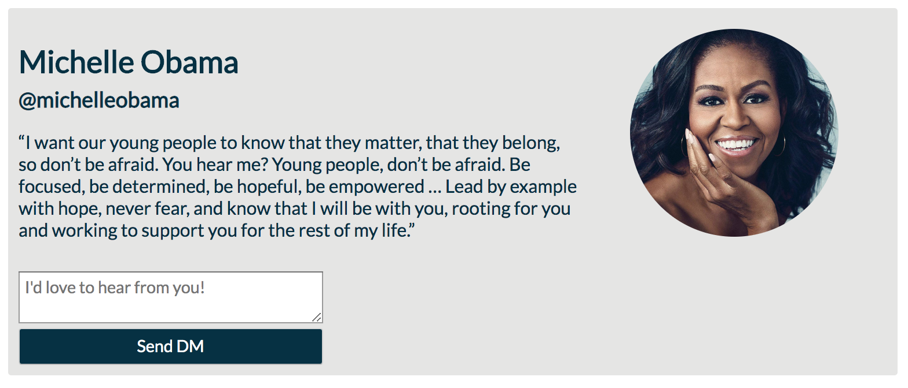

## Learning Goals

* Understand the required structure of an HTML form
* Grab the user input from a form
* Give user a customized response after a user completes a form

## Technical Vocabulary

- Form
- Input
- Label
- Type

## Forms

So far, we’ve done an excellent job of displaying information to the user, but we haven’t really asked them for their input. HTML also includes a set of elements for building forms. Forms are an important part of a website. They allow users to send data to the web site. Most of the time that data is sent to the web server, but the web page can also intercept it to use it on its own.

## Form Basics: Inputs and Buttons

There is a lot to forms that we’ll go more into depth with in a moment, but to start we’ll focus on two elements:

- `<input>` creates an input field. `<input>` is like `` in that it does not require or support a closing tag. It can take an optional type attribute that helps validate user input in some browsers (<a target="blank" href="https://developer.mozilla.org/en-US/docs/Web/HTML/Element/input">visit MDN</a> to find out more).
- `<button>` creates a button. `<button>` on the other hand does support a closing tag.

<p class="codepen" data-height="300" data-theme-id="36709" data-default-tab="html,result" data-user="turing-kwk" data-slug-hash="qwyyqe" style="height: 300px; box-sizing: border-box; display: flex; align-items: center; justify-content: center; border: 2px solid black; margin: 1em 0; padding: 1em;" data-pen-title="Check It Out: Inputs and Buttons">
  <span>See the Pen <a href="https://codepen.io/turing-kwk/pen/qwyyqe/">
  Check It Out: Inputs and Buttons</a> by Turing KWK (<a href="https://codepen.io/turing-kwk">@turing-kwk</a>)
  on <a href="https://codepen.io">CodePen</a>.</span>
</p>
<script async src="https://static.codepen.io/assets/embed/ei.js"></script>
<br>

## Forms: Next Level

Basic input and button elements are a great starting point, but to build a truly usable form we need to use the following base elements:

- `form`
- `label`
- `input`
- `type` attribute

As you look at the code for forms, you will notice quite a bit of nesting; this is necessary. It's important to indent properly to made you code more readable!

Here's a **good** example of indentation:

```html
<form>
  <label>Your Name
    <input type="text">
  </label>
  <label>Your Email
    <input type="email">
  </label>
  <input type="submit">
</form>
```

Here's a **bad** example of indentation:

```html
<form>
<label>Your Name
  <input type="text">
  </label>
<label>Your Email
<input type="email">
</label>
<input type="submit">
</form>
```
<br>

## What can you do within a form?

Most often, we ask users for text. If they are registering for an event like camp, we probably ask for their name, age, address, and food allergies. Sometimes we ask for an age/birthdate, sometimes we ask them to "check all that apply". We can have special inputs based on the information we are asking our users for. Here are some common input types you've probably seen. Can you predict what they do?

- `<input type="password">`
- `<input type="number">`
- `<input type="date">`
- `<input type="color">`

<div class="try-it">
  <h2>Try It: HTML Forms</h2>
  <p>In a new CodePen, create an HTML with at least 4 inputs. Use at least 2 different types of inputs.</p>
  <p>Finished early? Check out other types of input you have available with HTML <a target="blank" href="https://www.w3schools.com/html/html_form_input_types.asp">here</a>. Also, check out the <code class="try-it-code">textarea</code> element.</p>
</div>

<!-- Styling Forms - maybe there is a little code challenge on this as a "break" from JS? on Friday W1 afternoon? -->

<!-- ## Styling Forms

These forms have all the right components, but don't look very professional. Because `<input>` is an inline element, each input is bumping up against each other. See how much of a difference just a few CSS rules can make, and lookout for anything new in the HTML:

<p class="codepen" data-height="300" data-theme-id="36709" data-default-tab="css,result" data-user="turing-kwk" data-slug-hash="YMjRMN" style="height: 300px; box-sizing: border-box; display: flex; align-items: center; justify-content: center; border: 2px solid black; margin: 1em 0; padding: 1em;" data-pen-title="Check It Out:  HTML Form with Styles">
  <span>See the Pen <a href="https://codepen.io/turing-kwk/pen/YMjRMN/">
  Check It Out:  HTML Form with Styles</a> by Turing KWK (<a href="https://codepen.io/turing-kwk">@turing-kwk</a>)
  on <a href="https://codepen.io">CodePen</a>.</span>
</p>
<script async src="https://static.codepen.io/assets/embed/ei.js"></script>
<br>

On the other hand, this doesn't quiet yet look like a professional form. Wrapping the `<input>` inside the label is something you may or may not want to do - it makes it harder to line up the start of the input fields.  

<div class="try-it">
  <h2>Try It: Styling Forms</h2>
  <p>Find some inspiration. Go to one of your favorite websites and find a form that you want to recreate. Need some help with ideas? Look at <a target="blank" href="https://app.pairin.com/">Pairin</a>, <a target="blank" href="https://github.com/">GitHub</a> (you'll have to logout), or <a target="blank" href="https://www.codecademy.com/login">Codecademy</a>.</p>
  <p>While your form won't <em>do</em> anything yet, we can style it up to look just as good as a professional site. In the next section, we'll dig into that functionality!</p>
</div> -->

<!-- ## Building on Past Projects

One thing that can feel hard at first but is a huge part of a developers job is to build on code written in the past - by them or someone else. It can take some time to read over some code, understand what is happening, then decide how to move forward to add a feature or change some of the styles. Practice that real-world skill by completing the activity below.

<div class="practice">
  <h2>Practice: HTML Forms</h2>
  <p>Open up your "box-model-practice" project in Atom, where we made a social media card.</p>
  <p>Add to the card an option to send a message to the person featured on that card. It might look like this:</p>
  
</div> -->

## Using User Input

Now we know how to write HTML forms, let's make them functional! Usually, the flow of interactions is as follows:
- User types in information
- User clicks a button
- User gets some sort of response

To make this happen, we will have to write code that:
- Listens for the button click
- Gets the information that user typed in
- Use that information in a message/response

Check out the CodePen below to see what that looks like in JavaScript:

<p class="codepen" data-height="300" data-theme-id="36709" data-default-tab="css,result" data-user="turing-kwk" data-slug-hash="YMOMgE" style="height: 300px; box-sizing: border-box; display: flex; align-items: center; justify-content: center; border: 2px solid black; margin: 1em 0; padding: 1em;" data-pen-title="Check It Out: Forms with JS">
  <span>See the Pen <a href="https://codepen.io/turing-kwk/pen/YMOMgE/">
  Check It Out: Forms with JS</a> by Turing KWK (<a href="https://codepen.io/turing-kwk">@turing-kwk</a>)
  on <a href="https://codepen.io">CodePen</a>.</span>
</p>
<script async src="https://static.codepen.io/assets/embed/ei.js"></script>
<br>

<div class="try-it">
  <h2>Turn & Talk</h2>
  <p>While referencing the CodePen above, do your best to answer each question with your parter.</p>
  <ul>
    <li>What is the name of the event handler?</li>
    <li>Based on the name of the event handler, what do you think its job is to do?</li>
    <li>Which part of this code looks <em>new</em> to you?</li>
    <li>What do you <em>predict</em> that new piece of code does for us?</li>
  </ul>
</div>

Takeaways:
- Inside our event handler, we can instruct our program to grab the current value of an input element. We do this with `.val()`.
- We need to store the value of the input element in a variable.
- We have to wait until we are inside the event handler to grab the input value, otherwise it would still be an empty string.

## Forms

Earlier in the lesson, we wrapped inputs in a `form` element. In the example above, we've just left `input` elements floating around. The `form` element has some default behavior that can be tricky, but we'll briefly go into it.

By default, when a `form` is submitted, it will attempt to send that request somewhere (to our back-end, if we had one), then refresh the page. This is not ideal for us because we don't actually want to send information off or refresh the page. The video below illustrates the default behavior:

<iframe width="100%" height="560" frameborder="0" scrolling="no" src="https://screencast-o-matic.com/embed?sc=cqhebOZmE0&v=5&ff=1" allowfullscreen="true"></iframe>

While this can be inconvenient, we have a work-around! We can prevent the default behavior that the click usually causes. We will add one line of code to our event handler:

```js
function addName(event) {
  event.preventDefault();
  // the rest of your code here
}
```

The `event` variable we are passing around represents the click event. This is a little abstract, but when an event takes place, we have an object with a lot of information about that event. `.preventDefault()` is a function we can call on the event to prevent the refresh from occurring.

<div class="try-it">
  <h2>Try It: Refactor into a Form</h2>
  <p>Fork <a target="blank" href="https://codepen.io/turing-kwk/pen/YbKWbw?editors=1111">this CodePen</a> and refactor it so that the inputs are wrapped in a form. Make sure it has the same functionality it did before your refactor.</p>
</div>

Take some time to put together everything we've learned today and complete the practice below.

<div class="practice">
  <h2>Practice: Forms</h2>
  <p>Create a new CodePen. Don't forget to load jQuery into the pen!</p>
  <p><strong>Mild Challenge:</strong> Build a small site that has two input fields and a button to submit. You can choose what type of information the user needs to provide! Just make sure that the user gets clear directions on what they should enter. When the user clicks the button, they should see a message that includes both pieces of information that they provided appear on the screen.</p>
  <p><strong>Medium Challenge:</strong> Build a small site that has two input fields and a button to submit. The user should see directions instructing them to create a new password, then type that same password in the second input field. When they click the button, they should get one of two messages: "Oops! Those don't match." or "Great password! It's been reset." based on if the two inputs match each other.</p>
  <p><strong>Spicy Challenge:</strong> You can add this on to either the Mild or Medium Challenge. If the user didn't complete one of the input fields, don't let them click the button. You'll need to look into the HTML attribute <code class="try-it-code">disabled</code> and a conditional! </p>
</div>
