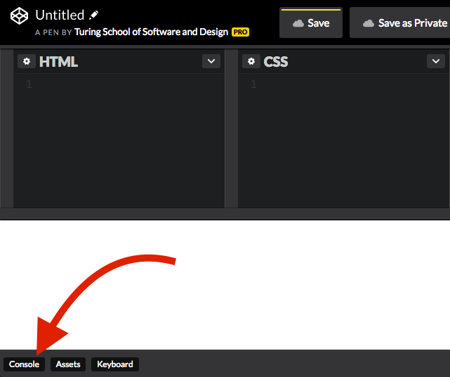

## Learning Goals

* Use variables to store strings and numbers
* Use string interpolation to write sentences using variables

## Technical Vocabulary

- Variable
- String
- Interpolation
- Number
- Console

## What is JavaScript?

JavaScript is the language of the internet. It is commonly confused with <a target="blank" href="https://www.seguetech.com/java-vs-javascript-difference/">Java</a>, but they are two very different languages. As of now, we can build very good looking sites, but they don't _do_ much. JavaScript is what allows our pages to be dynamic - show your name in the top corner to indicate you are signed in, change information on the screen based on what you type in a form, etc.

If we compare a web app to a human body, we can think of HTML as a skeleton, CSS as clothes and accessories, and **JavaScript as the muscle**.

## Strings

You can think of strings as a series of characters (alpha, numeric, spaces, and special characters) between two quote marks, like so:

```js
'hello, world!'
```

In JavaScript, strings can be either double quoted (“like this”) or single quoted (‘like this’).

In order to experiment with strings, we’ll click on the console button in CodePen:



A console is a place where we can input commands and see the output. Using it is an important part of both learning to code and a professional workflow.

<div class="try-it">
  <h2>Try It: Strings</h2>
  <p>In your CodePen console, type <code class="try-it-code">"your first name"</code>. Instead of the words "your first name", type your actual name. You <strong>do</strong> need to include the quotes.</p>
  <p>Type <code class="try-it-code">"your age"</code>.</p>
  <p>Type <code class="try-it-code">"your full name"</code>.</p>
  <p>Type anything you want - try to use some characters from your keyboard that are not numbers or letters. Make sure your text is enclosed in quotes.</p>
</div>

Takeaways:
- Strings can hold any type of character, including spaces
- The way we type a string will be the exact way a computer sees is (it won't assume we meant to capitalize that first letter, catch if we misspell something, etc.)

## `console.log()`

Right now, we can see the strings we type in when we hit enter. However, we won’t always be writing our code in the console, so let’s move to a more realistic way of writing our JavaScript.

Keep the console open, but **in the JavaScript editor tab** on CodePen, type the following:

```js
console.log('hello, world!');
```

You should see "hello, world!" appear in the console. This isn’t super exciting right now, but let’s build on it.

## `alert()`

Another tool is `alert()`. There will be times this will feel quicker than `console.log()` because you don't have to open your console. Sometimes though, it may not feel as helpful. It will be referenced in some lessons, so you should be familiar with it.

```js
alert('hello, world!');
```

You should see "hello, world!" appear in a box that pops up over your browser. You can't continue working into your browser until you click

## Variables

In most programming languages, including JavaScript, values can be saved to variables. Unlike in math class, where we would use x or y and a number, variables in programming are much more flexible. For example, here are three variables, each of which has a string as its value.

```js
var name = "Beyoncé";
var firstHit = "Crazy In Love";
var documentary = "Homecoming";
```

To define a variable, we use the `var` keyword followed by an arbitrary name we choose for the variable. Notice that all of the variables start with a lowercase letter. If you are choosing a variable name that has two words, uppercase the first letter of the second word. This is called camelCase.

After naming the variable, we use the `=` sign to show what value the variable will hold.

We can now print any of these variables we have defined out to the console. The example below defines three variables, but only one will be logged to the console.

```js
var name = "Beyoncé";
var firstHit = "Crazy In Love";
var documentary = "Homecoming";

console.log(name);
//=> "Beyoncé"
```

<div class="try-it">
  <h2>Try It: Strings and Variables</h2>
  <p>Complete the following in a CodePen. You should type your code in the JavaScript editor of the CodePen, and see the results in the console.</p>
  <p>Declare a variable for each prompt below. Then, print it out to the console.</p>
  <ul>
    <li>A variable called <code class="try-it-code">favoriteColor</code> that holds your favorite color</li>
    <li>A variable called <code class="try-it-code">pet</code> that holds the name of a pet</li>
    <li>A variable called <code class="try-it-code">friend</code> that holds the name of a friend</li>
    <li>A variable called <code class="try-it-code">goal</code> that holds one of your 2020 goals. <em>Remember, you <strong>can</strong> include spaces in a string!</em></li>
    <li>A variable called <code class="try-it-code">hobby</code> that holds one of your hobbies</li>
  </ul>
</div>

### Re-assigning Variables

Sometimes, things in life change! We might change our names, move cities, our ages will almost definitely change, etc. JavaScript gives us the ability to re-assign a variable so that its value can change. Here is the syntax:

```js
// The line below declares the variable city and assigns it to "Denver"
var city = "Denver";
console.log(city);
//=> "Denver"


// The line below re-assigns the variable city to "New York"
city = "New York";
console.log(city);
//=> "New York"
```

Notice that when we **re-assign** a variable, we do not use the keyword `var`.

Here's another example with numbers.

```js
var age = 15;
console.log(age);
//=> 15

// The line below re-assigns age to its previous value (15) plus 1.
age = age + 1;
console.log(age);
//=> 16

// The line below re-assigns age to its previous value (15) plus 1.
// It is a shortcut that does the exact thing as the example above!
age += 1;
console.log(age);
//=> 17
```

<div class="try-it">
  <h2>Turn & Talk: Incrementing Numbers</h2>
  <p>Incrementing numbers like what we just looked at above is something developers do very frequently.</p>
  <p>With your partner, brainstorm some examples of numbers incrementing in real apps that you use.</p>
</div>

### Interpolation

We can also include variable data in a sentence. This is called **interpolation**:

```js
var name = "Beyoncé";
var firstHit = "Crazy In Love";
var documentary = "Homecoming";

console.log(`The first ${name} hit was ${firstHit}.`);
//=> The first Beyoncé hit was Crazy In Love.
```

Make sure to use the back-ticks when you are using string interpolation (image below); it will _not_ work with regular single or double quotes.


<div class="try-it">
  <h2>Try It: Interpolation</h2>
  <p>Complete the following in a CodePen. You should type your code in the JavaScript editor of the CodePen, and see the results in the console.</p>
  <p>If you have the strings "Karlie" and "Kloss" in the following variables:</p>
  <code class="try-it-code">var first = "Karlie"</code><br>
  <code class="try-it-code">var last = "Kloss"</code>
  <p>Use string interpolation to complete the following:</p>
  <ul>
    <li>What code can you write to output the string "KarlieKloss"?</li>
    <li>What code can you write to output the string "KlossKarlie"?</li>
    <li>What code can you write to output the string "Karlie Kloss"?</li>
    <li>What code can you write to output the string "Kloss Karlie Kloss Karlie"?</li>
    <li>What code can you write to output the string "I love Karlie"?</li>
  </ul>
</div>

## Numbers

Like we saw with strings above, we can also store numbers in variables.

```js
var yearBorn = 1981;
var favoriteNumber = 4;
var numberOfChildren = 3;
```

Again, like we did with strings, we can **interpolate** with variables that hold numbers.

```js
var name = "Beyoncé";
var yearBorn = 1981;

console.log(`${name} was born in ${yearBorn}.`);
//=> "Beyoncé was born in 1981."
```

We can do math with numbers in JavaScript! The same math operators you are used to from math class work here.

```js
3 + 5
//=> 8

12 / 2
//=> 6

18 - 8
//-> 10
```

We can also use parenthesis and the Order of Operation holds true here as well.

```js
(3 + 2) * 8
// 5 * 8
//=> 40
```

We can also use math on variables, if those variables hold numbers.

```js
var name = "Karlie";
var tinsOfKookies = 1200;
var mealsDonatedPerTin = 10;

var mealsDonated = tinsOfKookies * mealsDonatedPerTin;

console.log(mealsDonated);
//=> 12,000

console.log(`Because ${tinsOfKookies} tins of kookies were purchased during Fashion's Night Out, ${mealsDonated} meals were donated to starving children all over the world. Thanks, ${name}!`);
//=> "Because 1200 tins of kookies were purchased during Fashion's Night Out, 12,000 meals were donated to starving children all over the world. Thanks, Karlie!"
```

<div class="try-it">
  <h2>Try It: Numbers & Operators</h2>
  <p>Start with these numbers:</p>
  <code class="try-it-code">var a = 12</code><br>
  <code class="try-it-code">var b = 65</code><br>
  <code class="try-it-code">var c = 31</code><br>
  <code class="try-it-code">var d = 98</code>
  <p>Write code to find the average of these four numbers.</p><br>
  <p><strong>Medium Challenge:</strong> Find the answer to this problem using JavaScript: On average, there are 23.5 scholars at each Kode With Klossy camp this year. If there are 36 camps taking place, about how many scholars are attending in total? Print out to the console your answer in a complete sentence.</p>
</div>
