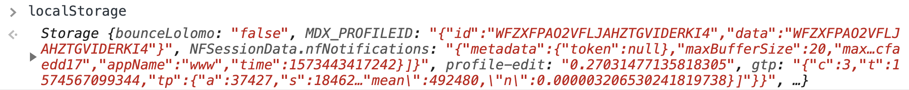

## Learning Goals

- Convert data to and from JSON
- Set and get data from localStorage
- Get data from localStorage on page load

## Technical Vocabulary

- Local Storage
- Database
- Client-side Storage
- JSON
- Persist
- Domain

## Storing User Data

Up until this point, the data in our projects has disappeared whenever we refresh our page, which is not ideal. It would be nice if we could keep our to-dos on the page without having to recreate them every time we leave the window. There are two places we could store our data to make that happen.

**Server-side storage:** This is when data is on someone else’s computer (often times one that is in a data warehouse), in a database. It is good for storing sensitive information, or any information that other users would be able to see (social media profile). This is what a back-end developer usually handles.

**Client-side storage:** This is when data is on the user’s computer. This is good for less sensitive information (shopping cart). Front-end developers write the code to make this happen.

Since we are front-end developers, we will learn how to use Local Storage, a form of client-side storage, as a database to hold our information. Once we do this, we can refresh a page after a user has added data, and the data will **persist** (still be on the page)!

<div class="try-it">
  <h2>Turn & Talk: Favorite App</h2>
  <p>What is your favorite or most go-to app? Why? Answer the following questions about the app:</p>
  <ul>
    <li>Does it store any of your information? If so, what are some examples of things it saves?</li>
    <li>Do you think that information is stored client-side or server-side?</li>
    <li>What would your experience with the app be like if it couldn't store any of your information?</li>
  </ul>
</div>

## Local Storage

Local Storage is like a local database. Each user that uses an application have have information saved to the app, on that computer. Let's say you make a to-do list app that uses Local Storage:
- You could add a to-do, refresh, and still have that to-do. You could add ten more, refresh, and now have all 11 to-dos.
- If your partner opens your to-do app, they won't see any of your to-dos. They can add to-dos, refresh, and the todo-s will still be there. You'll never see any of your partners to-dos.

Local Storage has this behavior because it is a **client-side** database. It is stored in the browser on your computer, specific to that site.

## Local Storage Syntax

`localStorage` is a variable that it built into JavaScript. It allows us to access a local storage object for persisting data.

<div class="try-it">
  <h2>Turn & Talk: Local Storage</h2>
  <p>With any site opened in the browser, open the Dev Tools and in the console, type <code class="try-it-code">localStorage</code> then press enter/return.</p>
  <ul>
    <li>What is the output?</li>
    <li>Is the output a number, string, array or object? How do you know?</li>
    <li>What do you notice about all of the values in red?</li>
  </ul>
  <p>Do the same thing on a different site and compare the outputs - are they the same or different?</p>
</div>

`localStorage` stores a JavaScript object with key/value pairs. The key is like a label and the value holds the actual data we want to be stored. `localStorage` is a database that holds information for a given **domain**, or web address.

Here's a screenshot of the `localStorage` object for Netflix on one computer. Keep in mind that if you check `localStorage` on Netflix on your computer, it may look different.



The first key/value pair is `bounceLolomo: "false"`. This means little to nothing to a user, but is probably important information for the developers at Netflix.
<br>

## Local Storage Methods

`localStorage` has the following methods:

- `localStorage.setItem();` takes two arguments—a key and value (key must be string)—and stores the given value under the provided key.
- `localStorage.getItem();` gets an item from storage based on the key provided.
- `localStorage.removeItem();` takes a key and removes that key and its associated value from storage.
- `localStorage.clear();` removes **all** items from storage for that domain.

<div class="try-it">
  <h2>Try It: Get, Set, Remove and Clear</h2>
  <p>While you are still in your Dev Tools in the browser, try running the following methods, and pay close attention to the outputs and changes in what is in your <code class="try-it-code">localStorage</code> object.</p>
  <ol>
    <li><code class="try-it-code">localStorage.clear();</code></li>
    <li><code class="try-it-code">localStorage.setItem('Karlie Kloss', 'Supermodel, Entrepreneur, Philanthropist');</code></li>
    <li><code class="try-it-code">localStorage.getItem('Karlie Kloss');</code></li>
    <li><code class="try-it-code">Refresh the page and try to get the item again.</code></li>
    <li><code class="try-it-code">localStorage.getItem('Karlie Kloss');</code></li>
    <li><code class="try-it-code">localStorage.removeItem('Karlie Kloss');</code></li>
    <li><code class="try-it-code">localStorage.getItem('Karlie Kloss');</code></li>
    <li><code class="try-it-code">localStorage.setItem('Kode With Klossy', 'inspires!');</code></li>
    <li><code class="try-it-code">localStorage.getItem('Kode With Klossy');</code></li>
    <li><code class="try-it-code">localStorage;</code></li>
    <li><code class="try-it-code">localStorage.clear();</code></li>
    <li><code class="try-it-code">localStorage;</code></li>
  </ol>
</div>

## In our JavaScript file

You may be thinking, this is great, but we're writing code in the browser; what does this look like in my codebase? Check out this CodePen to see how the use of `localStorage` fits in:

<p class="codepen" data-height="300" data-theme-id="36709" data-default-tab="js,result" data-user="turing-kwk" data-slug-hash="mYbmBQ" style="height: 300px; box-sizing: border-box; display: flex; align-items: center; justify-content: center; border: 2px solid; margin: 1em 0; padding: 1em;" data-pen-title="Check It Out: localStorage in a Project">
  <span>See the Pen <a href="https://codepen.io/turing-kwk/pen/mYbmBQ/">
  Check It Out: localStorage in a Project</a> by Turing KWK (<a href="https://codepen.io/turing-kwk">@turing-kwk</a>)
  on <a href="https://codepen.io">CodePen</a>.</span>
</p>
<script async src="https://static.codepen.io/assets/embed/ei.js"></script>

To see what it does, you'll need to open this pen in the browser, and with the Dev Tools console opened, type in your name and click submit! What logs to the console? Do you see your name in a key/value pair?

<div class="try-it">
  <h2>Try It: Color Picker</h2>
  <p>It's your turn to implement some work with <code class="try-it-code">localStorage</code> in a project.</p>
  <p><strong>Step 1:</strong> Fork <a href="https://codepen.io/turing-kwk/pen/yWBbmM">this CodePen</a>.</p>
  <p><strong>Step 2:</strong> Read through the JavaScript and make sure you understand how the current code is creating the functionality that the app currently has.</p>
  <p><strong>Step 3:</strong> The end goal is that when a user selects a color then refreshes the page, that color will still be present. Currently, when we refresh, it always changes back to black. With your partner, talk about/pseudo-code what code you would write, and where you would write it to implement localStorage.</p>
  <p>After you've talking about how you might approach this, as a class, we'll discuss everyone's ideas on how to implement localStorage.</p>
</div>

<br>
<br>

Your pseudo-code and the class discussion probably included the following ideas:
- Inside the event handler, we need to set the newly-selected color to storage
- When the page loads, we need to find out what color is in local storage and set the `div`s background color to that. If there isn't a color in local storage, we need to set it to black.

To save the color to storage, we'll add this line inside of the event handler:

```js
localStorage.setItem('color', color);
```

To get the color from local storage on page load, let's add this line of code at the top of the file:

```javascript
var currentColor = localStorage.getItem('color') || "#000000";
```

The `||` is called `or operator`. It will check the statement on the left side (in this case `localStorage.getItem('color')`). If it comes back with data, that will be used as the value for this variable. If nothing comes back, `"#000000"` will be used.

Lastly, let's set the background color of the `div` to the `currentColor`:

```javascript
newColor.css('backgroundColor', currentColor);
```

Save the CodePen, select a color, and then refresh the page. Does the color persist? It should!

## JSON

JSON stands for “JavaScript Object Notation” and is a standard for sending information back and forth over the web. It’s a subset of JavaScript’s object syntax. JSON is a language-independent data format that is easy for humans to read and write and easy for machines to parse and generate. **JSON is a means of sending data.**

JSON has the following rules:
- Keys must be double quoted.
- Values must be one of the following types, but must be wrapped in double quotes:
  * Strings
  * Numbers
  * Booleans
  * Arrays
  * Objects

There are two methods we can use on a JSON object:
- `JSON.stringify();` turns any JavaScript object into valid JSON.
- `JSON.parse();` turns any valid JSON into a JavaScript object.

Instead of wrapping everything in double quotes, we can call `JSON.stringify` and it will do that for us. This should be used before we set something into `localStorage`.

> We can think of the `.stringify()` and `.parse()` methods as translators. Imagine two people who don't speak the same language are trying to communicate. The translator is a person who speak both languages. Person A will say something in their language, but before Person B can understand it, the translator will have to say it in the language they understand. They will go back and forth until both Person A and B understand what the other has said. In this analogy, `.stringify()` is like translating from language A to B, and `.parse()` is like translating from language B to A.

```javascript
var names = ["Leta", "Brianne", "Cindy"];
JSON.stringify(names);
//-> "["Leta", "Brianne", "Cindy"]"
```

When we get something from `localStorage` and want to work with that data in JavaScript, we immediately need to take it out of JSON, like this:

```javascript
var stringifiedNames = "["Leta","Brianne","Cindy"]"
JSON.parse(stringifiedNames);
//-> ["Leta", "Brianne", "Cindy"]
```

<br>
<div class="practice">
  <h2>Practice: Local Storage</h2>
  <p>Fork <a target="blank" href="https://codepen.io/turing-kwk/pen/RwNjrjx">this CodePen</a> and implement <code class="try-it-code">localStorage</code>, so that when a user adds some to-dos and refreshes the page, to to-dos are still there!</p>
</div>
