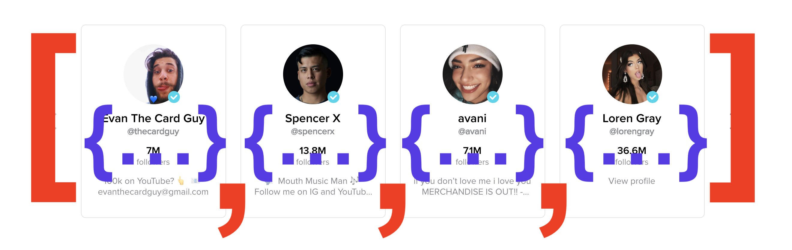

## Learning Goals

* Create an objects and access data from them
* Understand why we sometimes choose to use objects over arrays (and vice versa)

## Technical Vocabulary

- Collection
- Object
- Key/value pair
- Dot Notation

## Objects

**Objects** are another way to hold multiple pieces of data (collection). There is one big difference between them and arrays: Objects are not ordered by index (0, 1, 2, etc.), instead, each piece of data has a ‘label’ instead of a number. We call the labels `keys` and the data `values`. `key/value pairs` is a term you will hear a lot.

## When to use Objects

We just got the hang of arrays and are feeling pretty great about them - when/why do we also need objects?

- When we don’t care about the order of items (array)
- When we need an associative relationship (title for some info)

If I wanted to make a list of the handles of all my favorite creators on TikTok, I should use an array. They are all strings, they are all holding the same type of information. I don’t care about the number of followers they have, if they are verified, or anything else.

If I wanted to make a list of the handles of all my favorite creators on TikTok **and** their number of followers, I should use an object. There is an _associative_ relationship between each creator and their follower count.

<div class="try-it">
  <h2>Try It: Array or Object?</h2>
  <p>For each set of data, would an array or object be better to store it? Why?</p>
  <ul>
    <li>List of all of the students in class</li>
    <li>List of states and their capitals</li>
    <li>List of things to pack for vacation</li>
    <li>Names of all the Instagram accounts I follow</li>
    <li>List of scholar names and the school they attend</li>
    <li>Ingredients and amount of each ingredient to bake a cake</li>
    <li>All my favorite restaurants</li>
  </ul>
</div>

## Syntax

Momofuku is creating a digital version of all of their recipes, including The Perfect 10, a delicious & healthy Kookie that Karlie herself created! Each recipe has a set of ingredients with the amount needed, and a list of instructions. For now, let’s focus on organizing the ingredients and amounts.

We will store the list of ingredients in a JavaScript object, because we want to make sure that each ingredient is associated with the amount of it that we need. The key will be the ingredient name, and the value will be the amount. We can create a variable called `perfectTen` to store the data in.

```js
var perfectTen = {
  almondFlour: "3 and 1/2 cups",
  glutenFreeOats: "2 cups",
  miniChocolateChips: "1 cup"
}
```

Syntax Takeaways:
- All keys should be written in camelCase. They should not be enclosed in quotes.
- To indicate that the key name has ended and the value will be provided next, we use a colon `:`
- A value can be a string, number, boolean, array, or another object. For the most part, we will use strings and numbers. All values in one object do _not_ have to be the same data type.
- Each key/value pair is separated by a comma.

### Access a Value

To access a value in a specific object, we have to first tell the program which object to look at. Then we use a period `.`, then call the `key`, or label, associated with the value we want to access.

```js
console.log(perfectTen.almondFlour);
//-> 3 and 1/2 cups

console.log(perfectTen.miniChocolateChips);
//-> 1 cup
```

The syntax used above to access a value is called **dot notation**.

<div class="try-it">
  <h2>Try It: Creating and Accessing Objects</h2>
  <p>Declare a variable called <code>myInfo</code> that stores an object. This object should have key/value pairs for your name, birthday, and two other facts about you!</p>
  <p><code>console.log()</code> the object to verify your syntax is correct and that the object can print out. Then, use a <code>console.log()</code> to practice accessing specific pieces of data. Try to print your birthday with dot notation.</p>
</div>

### Updating, Adding & Removing Data

We won't go into detail on how to do this here as it likely won't be used during camp. If you are curious to learn more or find yourself needing a resource while working on your personal project, here are a couple resources:
- [JavaScript Info](https://javascript.info/object)
- [Free Code Camp](https://learn.freecodecamp.org/javascript-algorithms-and-data-structures/basic-javascript/add-new-properties-to-a-javascript-object/)

## Objects IRL

Similar to arrays, it's very likely that every application you've used utilized objects in the code that built it.

In the array lesson, we talked about how TikTok used an array to store info about popular creators. They probably didn't just have an array of names, since they should several pieces of information about each creator. The array probably looks more like this in the code:

```js
var trending = [
  {
    name: "Evan The Card Guy",
    handle: "@thecardguy",
    followers: 7000000,
    tagline: "100k on YouTube? 👆 insta: evanthecardguy 📧 evanthecardguy@gmail.com"
  },
  {
    name: "Spencer X",
    handle: "@Spencerx",
    followers: 13800000,
    tagline: "🗣 Mouth Music Man 🎶 Follow me on IG and YouTube :) 👇🏼👆🏼"
  },
  {
    name: "Avani",
    handle: "@avani",
    followers: 7100000,
    tagline: "if you don’t love me i love you MERCHANDISE IS OUT!! - FANJOY.CO/AVANI"
  },
  {
    name: "Loren Grey",
    handle: "@lorengrey",
    followers: 36700000,
    tagline: "No bio yet."
  },

];
```

Or, for a more visual representation:



There are still 4 elements in this array, but each element is now an object so there are many more lines of code! We may or may not need an array that has so many moving pieces; this piece of the lesson was just intended to help you make a real-life connection.

## Putting It All Together

Objects have a little more going on than strings or numbers, but you now have the information you need about them!

<div class="practice">
  <h2>Practice: Objects</h2>
  <p>Create an object with keys that are family or friend titles (i.e. "sister", "bestFriend") and values that are the name of that family member or friend. Pets are family, too!</p>
  <ul>
    <li>Aim to have at least 6 family members of friends in your 'tree'</li>
    <li>Print to the console the entire object</li>
    <li>Print to the console 3 individual names</li>
  </ul>
  <br>
  <p><strong>Medium Challenge:</strong> If you have more than one family member or friend who could have the same key, you might be back in a similar situation that we were in the Warm Up for the array lesson - with variables like <code>sister1</code>, <code>sister2</code>, etc. Instead of only having strings of names as the values in your object, write at least one array of strings for those family members or friends who share a title.</p>
  <p><strong>Spicy Challenge:</strong> Reference a site like Instagram or Twitter. Look for one card on the page and write a JavaScript object that holds all the information on that card.</p>
</div>
