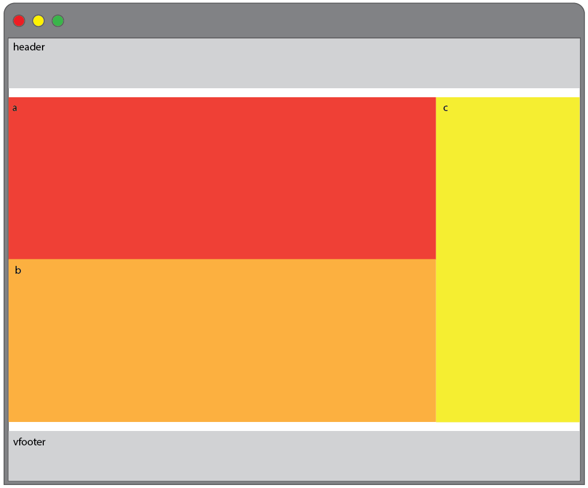
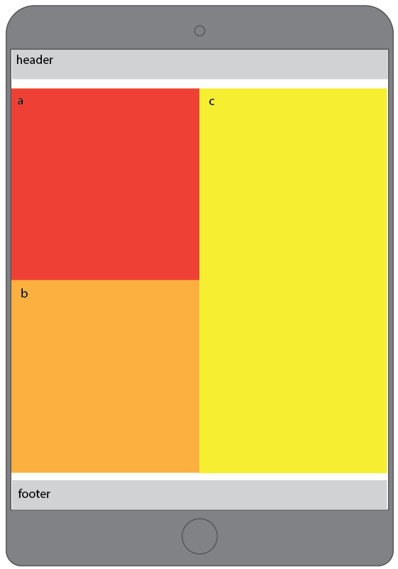
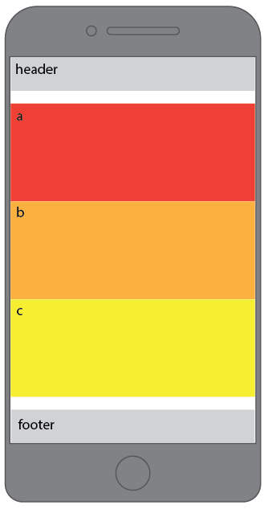

## Learning Goals

* Understand and describe page layout
* Understand and apply media queries

## Technical Vocabulary

- Media Query
- Breakpoint
- Static Layout
- Responsive Layout

## Website Traffic

In 2018, over 52% of traffic on the internet was taken place on phones. More people are looking at websites on their phones than a full-sized computer. For this reason, it's important that as developers, we have the skills to make our site readable on any device. When you hear about **responsive design**, this is what we are talking about - making our sites respond well on all devices.

## Breakpoints

One thing we can do is tell the computer to read different code when the screen is a certain width, in pixels. A **breakpoint** is the screen size that we reference in our code. We can make as many of as few breakpoints as we'd like.

<div class="try-it">
  <h2>Check It Out: Breakpoints</h2>
  <p>Go to the Estee Lauder site. Open your dev tools, and make sure the dock is on the bottom of the screen. Slowly, drag the right side of the browser window in, making the browser skinnier. Does the layout change? How many times? How many breakpoints do you think were used to build this site? (ask more specific questions one I see the site.)</p>
  <p class="to-do"> Get the details on where breakpoints are.</p>
</div>

## Media Queries

When we write additional code in our CSS to tell the browser to do something different at certain breakpoints, this code is called a **media query**. We will write all the media queries at the bottom of our CSS file. Here's an example:

```css
h1 {
  background: lime;
  color: magenta;
}

@media screen and (max-width: 900px) {
  h1 {
    background: magenta;
  }
}
```

With the code above, when the screen it full sized, it will have a lime background. When we drag the screen in to be smaller and it hits 900px, the background will change to magenta. A couple of other things to know:

- You can write CSS rules in a media query that will override old code
- You can also write rules in a media query for an element that never had that rule before
- If you don't give a property a new value, the old one stays. In the code above, the background changes, but the color of the `h1` remains lime
- You get to choose the breakpoints (max-width). There are two things to keep in ming when you decide where to create breakpoints: 1) When you squish your app, when does it start looking bad? 2) What are the widths of commonly used devices?

**NOTE:** Before we write any queries, you’ll want to add a viewport meta tag in the head of your main html file (which is often named index.html). This tag will make sure that our site works on devices. The viewport meta tag gives the browser instructions on how to control the pages dimensions and sets the width of the page based on the screen width of the device it is being viewed on. Magic! If you want to learn more, Mozilla has an [article](https://developer.mozilla.org/en-US/docs/Mozilla/Mobile/Viewport_meta_tag) that’s full of good information.

Here is what the tag would look like:

```html
<meta name="viewport" content="width=device-width, initial-scale=1">
```

<div class="try-it">
  <h2>Try It: Media Queries</h2>
  <p>Create a new CodePen.</p>
  <p>Add at least 2 pieces of text, and style them to have different colors and/or background colors.</p>
  <p>Now, write media queries for at least 2 breakpoints. When these breakpoints are hit, change the color and/or background color of your text.</p>
</div>

## Layout

Now that we know the syntax to create media queries, we are going to dig into making some bigger changes than just color.

Visit [Liquidapsive](http://www.liquidapsive.com/) and select the `static` option from the dropdown, then drag the window in - what happens? Now, select the `responsive` option and do the same thing.

At about 1050px, the blue section on the right pops under the green section, and each card in the blue section is organized differently and now has an image. At about 790px, the yellow sections pops on top of the green section.

The tricky thing about layout and responsive design is, we can't just think about it after the full-size site was built. It always has to be in the back of our minds. This is why Flexbox is a great tool - it lends itself well to media queries.

<div class="try-it">
  <h2>Try It: Layout</h2>
  <p>Create a new folder called "responsive-design", and inside of it, an HTML and CSS file. Copy and paste the code from this <a href="https://codepen.io/turing-kwk/pen/bJKzvB?editors=1100">CodePen</a> into Atom.</p>
  <p>Now, write media queries for 1 breakpoint at 900px. At 900px, the site should change so all four containers are stacked on top of each other. Each should have a little breathing room around it as well.</p>
</div>

## Flexbox and Media Queries

Just like we've been building every piece we know about HTML and CSS, this will build on top of our knowledge of margin and padding, flexbox, and more.

<div class="practice">
  <h2>Practice: Layout</h2>
  <p>In your "responsive-design" folder, create a new HTML and new CSS file. Copy and paste the code from this <a href="https://codepen.io/turing-kwk/pen/bJKzvB?editors=1100">CodePen</a> into Atom.</p>
  <p>Now, write media queries for 2 breakpoint at 900px. The three layouts you're working towards are pictured below:</p>
  
  
  
</div>
