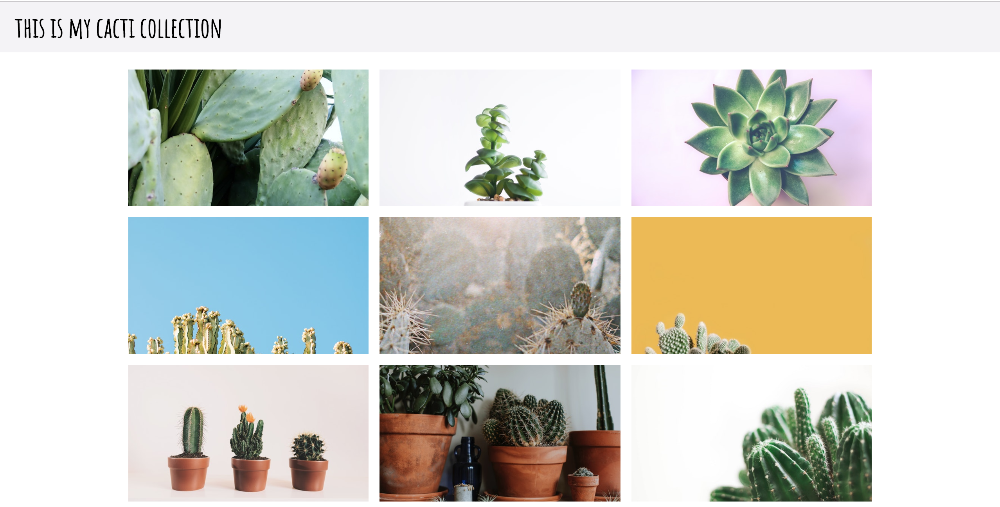
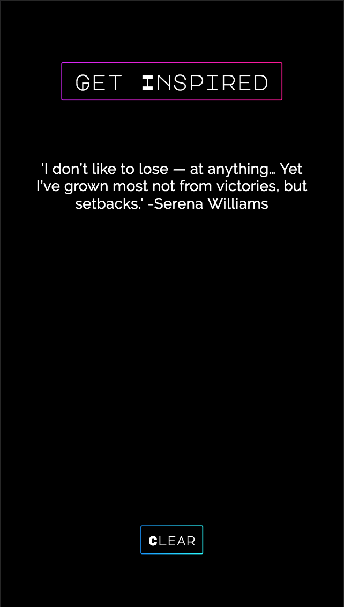
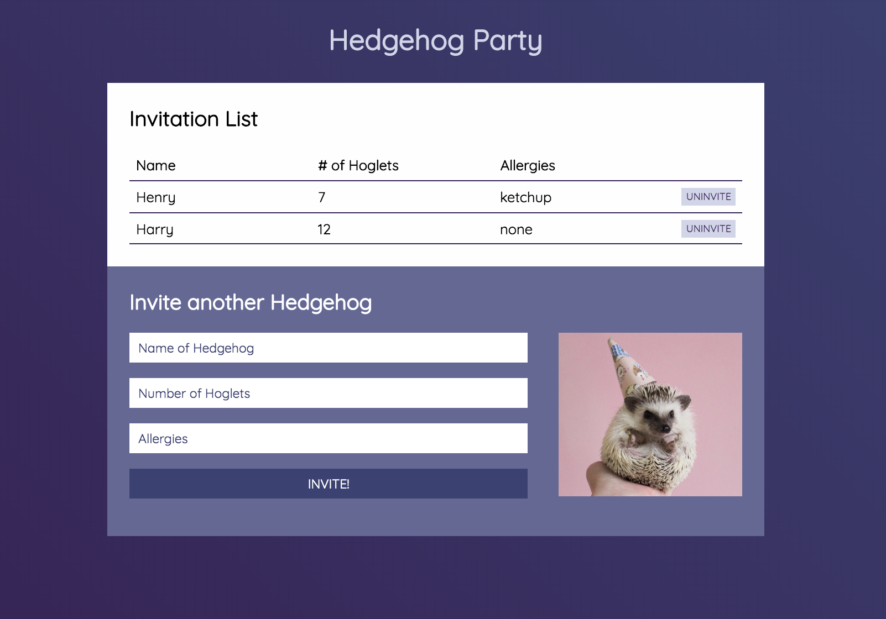

We are so excited to welcome you to the Kode With Klossy community. With over 1000 alumni and nearly 1000 scholars this summer, this is a powerful group of young women across the country.

## Your Instructors

As a class, you'll spend some time getting to know your Instructors and TAs.

## What we will build this summer

As a participant in the 2020 WebDev camp, you will learn the fundamentals of front-end development. Front-end developers work on the part of the sites and applications that users see and interact with. They build out the elements we see on the page, style them so they look clean and professional, and write code to make the page _do_ something. Front-end developers do _not_ deal with data like logging users in and storing information (that work is for back-end developers).

Front-end development consists of three main technologies:

- HTML
- CSS
- JavaScript

Using HTML, CSS, and JavaScript, we will be able to build beautiful sites that can respond to user interaction. Here are a couple of examples:

During the last few days of camp, you'll be able to brainstorm and design a project that you are passionate about building, using all the skills you have at that point!
