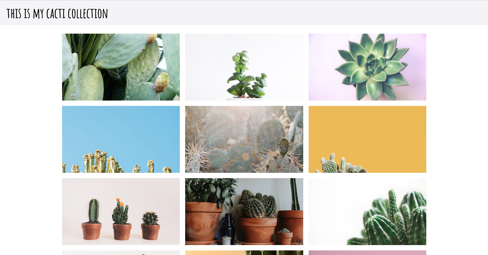

Using what you’ve learned about HTML and CSS, you are going to build a photo gallery! Below are some big-picture things to know, then you will be provided with a structure to follow to help you complete successfully.

### Must-Haves

- 30+ pictures are displayed in a visually appealing way
- The gallery is responsive - looks good on desktop computers down to an iPhone 4
- Read the requirements of the site you take any photos from on requirements to give credit to the photographer

<a target="blank" href="https://ameseee.github.io/photo-gallery-example/">Here is an example</a> of something like you will build. When you see the site in the browser, make sure to notice it's responsiveness.

### Tips

- The best galleries contain photos that follow a theme - maybe it’s about you! Maybe it’s about your favorite sport, city, animal, food, etc.
- Use Flexbox
- Use a [Google Font](https://fonts.google.com/) if you have any text
- [Pexels](https://www.pexels.com/) is a great resource for photos. You can also use your own photos! Pro-Tip: rename the photos once you drag them into your project, it's much easier to use them in HTML when they have names like "cactus-1.png" rather than "cactus-green-1g623j45y677.png"

## Iteration 1 - Wireframe & Vision

- Draw out your vision for the way your Photo Gallery will look - on a desktop, iPad size, and phone size.
- Like we did with the Twitter card, label each section with the HTML element that will be used.
- Find your inspiration! Create a folder on your desktop that you can save images to as you find ones you like. Also, decide on any colors and fonts you'd like to use.
- Make sure your wireframe and assets are approved by your instructor before moving on.

**Notice:** you haven't written any code in Atom yet. The planning process is extremely important and professional developers spend a lot of time in this phase.
 

## Iteration 2 - HTML

- Write the HTML that makes up the skeleton of your page.
- Drag the folder of images into your project. It is common to have a file inside the project called "assets" where images live.
 

## Iteration 3 - CSS for Desktop

- Write CSS to get your Photo Gallery to appear they way you desire on the full screen.
- Consider - white space, color contrasts, and content being centered (or not, if it's clearly on purpose!)
 

## Iteration 4 - Responsiveness

- Write media queries to ensure that you Photo Gallery looks great on all screen sizes.
 

## Iteration 5 - Deploy

**Note:** you will have a lesson on this during the project/before you have to do this alone.

- Create a GitHub repository
- Commit and push your work
- Deploy to GitHub pages in the Settings tab
