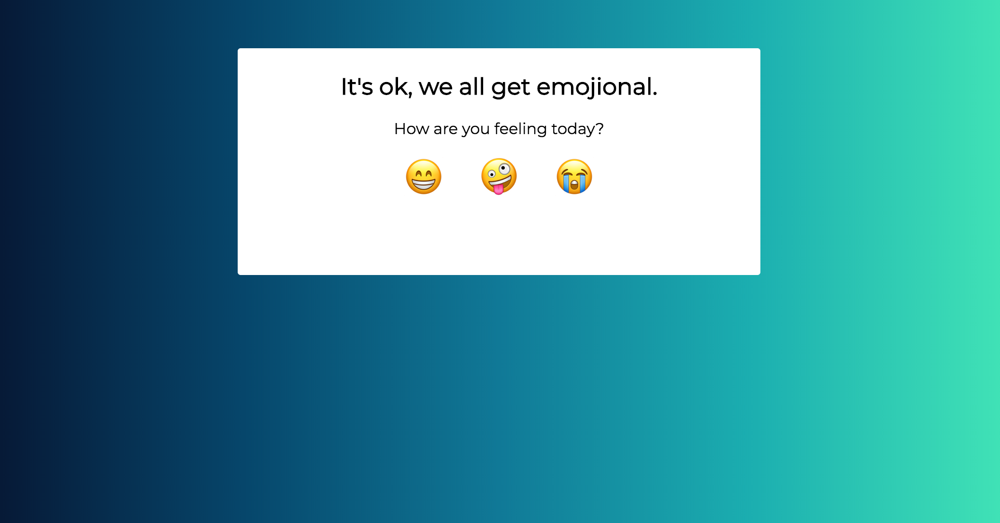

Your HTML and CSS skills will come in handy to make this look great, but the focus of this project is to give you an opportunity to use JavaScript. Specifically, you will use what you have learned about DOM Manipulation and Arrays.

### Must-Haves

- At least one button that the user clicks
- Upon the user click of the button, a message appears, related to your topic of choice
- A visually appealing, responsive site

### Tips

- Look back to the `Collections` lesson to brush up on how to randomly select an element from an array.
- Follow the iterations closely. This project brings a _lot_ of your new knowledge together; the iterations help you break down this big problem into bite-sized chunks.

[Here](https://turingschool.github.io/emojional-js/) is an example of something like you will build. When you see the site in the browser, make sure to notice it’s responsiveness.

[Here's](https://turingschool.github.io/inspire-me-js/) another example:
 

## Iteration 1 - Wireframe & Vision

- Draw out your vision for the way your site will look - on a desktop, iPad size, and phone size.
- Like we did with the Photo Gallery, label each section with the HTML element that will be used.
- Are you going to use photos? Quotes? Get your assets together. Store any images in a folder on your Desktop for now, and keep track of any text you'll want to use in a CodePen or GoogleDoc. Also, decide on your color palette. [Color Supply](https://colorsupplyyy.com/app) is a great resource for this!
- Make sure your wireframe and assets are approved by your instructor before moving on.
 

## Iteration 2 - HTML & CSS

- Now that you have wireframes, write out the HTML to make this come to life.
- Apply styles, including media queries.

## Iteration 3 - DOM Manipulation

- Write an event listener and handler for your button(s). Make sure they are working with a `console.log()`.
- Create a variable for any other HTML element you may need to access with JavaScript.

## Iteration 4 - Random Generation

- Create an array of your "messages" that will be randomly picked from
- Inside your event handler, write logic to randomly select a message from the array.
- Your event handler should also make sure that the selected message appears on the screen for your user.

## Iteration 5 - Deploy

- Create a GitHub repository
- Commit and push your work
- Deploy to GitHub pages in the Settings tab
